# Chapter 1: The Minimum Description Length Principle

> *"The best model is the one that provides the shortest description of the data."*

**Based on:** "A Tutorial Introduction to the Minimum Description Length Principle" (Peter Grünwald, 2004)

📄 **Original Paper:** [arXiv:math/0406077](https://arxiv.org/abs/math/0406077)

---

## 1.1 Why Start Here?

Before we dive into neural networks, transformers, and the architectural marvels of modern AI, we need to understand a fundamental question that has puzzled scientists for centuries:

**How do we choose the best explanation for our observations?**

Imagine you're an astronomer in ancient times, tracking the movement of planets across the sky. You could create an incredibly complex model with epicycles upon epicycles that perfectly matches every observation. Or you could propose that planets orbit the sun in ellipses—a simpler explanation that might not fit every data point perfectly but captures the underlying truth.

The Minimum Description Length (MDL) principle gives us a mathematically rigorous way to balance **model complexity** against **how well the model fits the data**. This isn't just philosophy—it's the theoretical foundation for:

- Why neural networks need regularization
- Why dropout and weight decay work
- Why simpler models often generalize better
- Why "Occam's Razor" is more than folk wisdom

---

## 1.2 The Core Intuition

### The Two-Part Code

The MDL principle can be summarized in one powerful idea:

```
The best hypothesis H for data D is the one that minimizes:
L(H) + L(D|H)
```

Where:
- **L(H)** = the length (in bits) needed to describe the hypothesis/model
- **L(D&vert;H)** = the length (in bits) needed to describe the data given the hypothesis


*Figure: The MDL principle minimizes the sum of model complexity L(H) and data encoding cost L(D|H).*

### A Simple Example: Fitting Points

Suppose you have 10 data points and want to fit a curve:


*Figure: Comparing three models for fitting 10 data points. The quadratic (Model C) achieves the optimal balance with 45 total bits—simpler than the polynomial (100 bits) and better-fitting than the line (60 bits).*

The polynomial that passes through all 10 points has **zero error** but requires specifying 10 coefficients. The straight line is simple but might miss important patterns. The quadratic often wins—it's the **sweet spot** between complexity and fit.

---

## 1.3 Information Theory Foundations

### Bits as a Universal Currency

Why measure in bits? Because bits give us a **universal, objective measure** of complexity that doesn't depend on arbitrary choices.

The key insight from information theory:

> **The optimal code length for an event with probability p is -log₂(p) bits**

This is Shannon's source coding theorem. If something is very likely (p ≈ 1), it takes few bits to encode. If something is rare (p ≈ 0), it takes many bits.

```mermaid
graph TD
    subgraph "Probability ↔ Code Length"
        P1["p = 1/2"] --> L1["-log₂(1/2) = 1 bit"]
        P2["p = 1/4"] --> L2["-log₂(1/4) = 2 bits"]
        P3["p = 1/8"] --> L3["-log₂(1/8) = 3 bits"]
        P4["p = 1/1024"] --> L4["-log₂(1/1024) = 10 bits"]
    end
```



*Figure: The relationship between probability and code length. Lower probability events require more bits to encode, following Shannon's information theory.*

### Why This Matters for Machine Learning

When a model assigns high probability to the observed data, **it takes fewer bits to encode the data using that model**. This creates a direct link:

```
Good predictions ⟺ Short code lengths ⟺ Low L(D|H)
```

---

## 1.4 The Fundamental Trade-off

### Overfitting vs Underfitting Through the MDL Lens


*Figure: The MDL trade-off spectrum. Underfitting models are too simple (high data cost), overfitting models are too complex (high model cost), while optimal models balance both costs.*

### Visualizing the Trade-off

Imagine plotting total description length against model complexity:


*Figure: Visualization of the MDL trade-off. As model complexity increases, L(H) increases while L(D|H) decreases. The optimal model minimizes the total (shown at "Medium" complexity with 90 bits).*

The **minimum of the total curve** gives us the optimal model complexity. This is MDL in action!

---

## 1.5 Two-Part Codes in Detail

### The Sender-Receiver Game

A helpful way to understand MDL is through a communication game:

**Setup:** 
- A sender observes data D
- A sender and receiver have agreed on a set of possible models/hypotheses
- The sender must transmit D to the receiver using as few bits as possible

**Strategy:**
1. First, send which model H to use (costs L(H) bits)
2. Then, send the data encoded using model H (costs L(D|H) bits)


*Figure: The sender-receiver communication game. The sender first transmits the model H (costing L(H) bits), then transmits the data encoded using that model (costing L(D|H) bits). MDL minimizes the total transmission cost.*

The MDL principle says: **choose the model that minimizes total transmission cost**.

### Example: Encoding a Sequence

Suppose we want to transmit the sequence: `0000000001111111111`

**Model 1: No pattern (raw encoding)**
- L(H) = 0 bits (no model to describe)
- L(D|H) = 19 bits (one bit per character)
- **Total = 19 bits**

**Model 2: Run-length encoding**
- L(H) = ~5 bits (describe the RLE scheme)
- L(D|H) = ~8 bits (say "9 zeros, then 10 ones")
- **Total ≈ 13 bits** ✓

**Model 3: Elaborate compression with dictionary**
- L(H) = 50 bits (complex scheme description)
- L(D|H) = 2 bits 
- **Total = 52 bits** ✗

The second model wins—it finds the right level of abstraction.

---

## 1.6 Mathematical Formulation

### Formal Definition

Given:
- A class of models M = {M₁, M₂, M₃, ...}
- Observed data D

The MDL estimate is:

$$\hat{M}_{MDL} = \arg\min_{M \in \mathcal{M}} \left[ L(M) + L(D|M) \right]$$

### For Parametric Models

When models are parameterized (like neural networks with weights θ):

$$\hat{\theta}_{MDL} = \arg\min_{\theta} \left[ L(\theta) + L(D|\theta) \right]$$

Where:
- **L(θ)** often relates to the precision needed to specify parameters
- **L(D|θ)** is typically the negative log-likelihood: $-\log P(D|\theta)$

```mermaid
graph LR
    subgraph "Connecting MDL to ML"
        A["L(θ) = Prior<br/>-log P(θ)"] 
        B["L(D|θ) = Likelihood<br/>-log P(D|θ)"]
        C["Total = -log P(θ)P(D|θ)<br/>= -log P(θ|D) + const"]
    end
    
    A --> C
    B --> C
    C --> D["This is MAP estimation!"]
    
    style D fill:#ffe66d
```



*Figure: MDL connects to Bayesian inference. The model description length L(θ) corresponds to the negative log-prior, while L(D|θ) corresponds to the negative log-likelihood. Together, they form the negative log-posterior (MAP estimation).*

### The MDL ↔ Bayesian Connection

MDL and Bayesian inference are deeply connected:

| MDL Concept | Bayesian Equivalent |
|-------------|---------------------|
| L(H) | -log P(H) = Prior |
| L(D\|H) | -log P(D\|H) = Negative log-likelihood |
| Minimize L(H) + L(D\|H) | Maximize P(H)P(D\|H) = MAP |

However, MDL has advantages:
- Doesn't require specifying priors
- Provides an objective, code-based justification
- Works even when Bayesian interpretation is unclear

---

## 1.7 Crude MDL vs Refined MDL

### Crude (Two-Part) MDL

What we've discussed so far is "crude" MDL:
- Pick the best model
- Describe model + data given model
- Simple to understand and implement

### Refined (One-Part) MDL

Modern MDL theory uses a more sophisticated approach:

Instead of separating model and data, use a **universal code** that automatically adapts to the data's complexity.


*Figure: Comparison of crude MDL (explicit model selection) versus refined MDL (universal coding that automatically adapts to complexity without explicit model choice).*

The refined version uses concepts like:
- **Normalized Maximum Likelihood (NML)**
- **Stochastic Complexity**
- **Prequential codes**

We'll keep our focus on the intuitive two-part version, which captures the essential ideas.

---

## 1.8 MDL in Practice: Machine Learning Applications

### Regularization as MDL

Every regularization technique can be viewed through the MDL lens:

```mermaid
graph TB
    subgraph "Regularization = MDL"
        L["Loss Function<br/>= L(D|θ)"]
        R["Regularization Term<br/>= L(θ)"]
        T["Total Objective<br/>= L(D|θ) + λL(θ)"]
    end
    
    L --> T
    R --> T
    
    subgraph "Examples"
        E1["L2 Regularization<br/>||θ||² ↔ Gaussian prior on weights"]
        E2["L1 Regularization<br/>||θ||₁ ↔ Laplace prior on weights"]
        E3["Dropout<br/>↔ Model averaging/compression"]
    end
    
    T --> E1
    T --> E2
    T --> E3
```



*Figure: Regularization in machine learning is equivalent to MDL. The loss function corresponds to L(D|θ), regularization to L(θ), and common techniques like L2, L1, and dropout all have MDL interpretations.*

### Neural Network Compression

The MDL perspective explains why:

1. **Pruning works**: Removing unnecessary weights reduces L(θ) without much increase in L(D|θ)

2. **Quantization works**: Using fewer bits per weight reduces L(θ)

3. **Knowledge distillation works**: A smaller model with similar predictions has lower total description length

### Model Selection

MDL provides principled model selection:

```python
# Pseudo-code for MDL model selection
def mdl_select(models, data):
    best_model = None
    best_mdl = float('inf')
    
    for model in models:
        # Fit model to data
        model.fit(data)
        
        # Compute description lengths
        L_model = compute_model_complexity(model)      # L(H)
        L_data = -model.log_likelihood(data)           # L(D|H)
        
        total_mdl = L_model + L_data
        
        if total_mdl < best_mdl:
            best_mdl = total_mdl
            best_model = model
    
    return best_model
```

---

## 1.9 Historical Context and Significance

### The Intellectual Lineage


*Figure: Historical timeline of simplicity principles, from Occam's Razor (1347) through information theory (1948), algorithmic information theory (1960s), MDL (1978), neural network applications (1993), to modern deep learning (2020s).*

### Why Ilya Included This

The MDL principle appears in Ilya's reading list because it provides:

1. **Theoretical grounding**: Understanding WHY certain techniques work
2. **Design principles**: Guiding architecture and regularization choices
3. **Generalization insight**: Explaining the bias-variance trade-off
4. **Connection to physics**: Links to thermodynamics and complexity

---

## 1.10 Connections to Other Papers in This Book

The MDL principle connects directly to several other papers in Ilya's list:


*Figure: MDL connects to multiple chapters throughout the book, providing theoretical foundations (Kolmogorov Complexity), direct applications (Keeping NNs Simple), and connections to modern topics (VLAE, Scaling Laws).*

---

## 1.11 Key Equations Summary

### The Fundamental Equation

$$\text{MDL Objective: } \min_H \left[ L(H) + L(D|H) \right]$$

### Code Length and Probability

$$L(x) = -\log_2 P(x) \text{ bits}$$

### For Continuous Parameters

$$L(\theta) \approx \frac{k}{2} \log n + \text{const}$$

Where k = number of parameters, n = number of data points

(This is the BIC/MDL approximation)

### Stochastic Complexity (Advanced)

$$SC(D) = -\log P(D|\hat{\theta}_{ML}) + \text{COMP}$$

Where COMP measures the "richness" of the model class.

---

## 1.12 Practical Takeaways

### For Practitioners

1. **When choosing between models**, prefer the one that would require fewer bits to transmit your predictions to a colleague who knows the model

2. **Regularization strength λ** can be interpreted as the relative cost of model bits vs data bits

3. **Early stopping** in training often finds the MDL-optimal point

4. **Model architecture choices** should consider description length—more parameters need more data to justify

### Mental Model


*Figure: The MDL mindset provides a practical framework for model design: always consider both model complexity and data encoding cost, and seek to minimize their sum.*

---

## 1.13 Chapter Summary


*Figure: Key takeaways from the MDL principle, showing how it formalizes Occam's Razor, connects to regularization, and provides a foundation for understanding generalization.*

### In One Sentence

> **The Minimum Description Length principle tells us that the best model is one that achieves the shortest combined description of itself and the data it explains—formalizing the intuition that good theories are both simple and accurate.**

---

## Exercises

1. **Conceptual**: You have two weather prediction models. Model A uses 50 parameters and predicts tomorrow's weather correctly 95% of the time. Model B uses 5 parameters and predicts correctly 90% of the time. Which might have lower MDL? Under what conditions?

2. **Coding**: Implement a simple MDL-based polynomial degree selection for curve fitting. Compare the selected degree to what cross-validation chooses.

3. **Thought Experiment**: How would you apply MDL thinking to decide between a decision tree and a neural network for a classification problem with 1,000 training examples?

---

## References & Further Reading

| Resource | Link |
|----------|------|
| Original Tutorial Paper (Grünwald, 2004) | [arXiv:math/0406077](https://arxiv.org/abs/math/0406077) |
| Rissanen's Original MDL Paper (1978) | [IEEE](https://ieeexplore.ieee.org/document/1055714) |
| Grünwald's MDL Book (2007) | [MIT Press](https://mitpress.mit.edu/9780262072816/the-minimum-description-length-principle/) |
| MDL Tutorial Slides | [CWI Amsterdam](https://homepages.cwi.nl/~pdg/ftp/mdlintro.pdf) |
| Wallace - Minimum Message Length (2005) | [Springer](https://link.springer.com/book/10.1007/0-387-27656-4) |
| MacKay - Information Theory (2003) | [Free Online](http://www.inference.org.uk/mackay/itila/) |
| Blier & Ollivier - DL Description Length (2018) | [arXiv:1802.07044](https://arxiv.org/abs/1802.07044) |
| Lotfi et al. - PAC-Bayes Compression (2022) | [arXiv:2211.13609](https://arxiv.org/abs/2211.13609) |

---

**Next Chapter:** [Chapter 2: Kolmogorov Complexity and Algorithmic Randomness](./02-kolmogorov-complexity.md) — We'll explore the theoretical foundation that MDL builds upon: the idea that complexity can be measured by the shortest program that produces an output.

---

[← Back to Part I](./README.md) | [Table of Contents](../../README.md)

