# Chapter 2: Kolmogorov Complexity and Algorithmic Randomness

> *"The complexity of an object is the length of the shortest program that produces it."*

**Based on:** "Kolmogorov Complexity and Algorithmic Randomness" (Shen, Uspensky, Vereshchagin)

📄 **Original Book:** [AMS Mathematical Surveys](https://bookstore.ams.org/surv-220/) | [LIRMM PDF](https://www.lirmm.fr/~ashen/kolmbook-eng-scan.pdf)

---

## 2.1 From MDL to Something Deeper

In Chapter 1, we learned that MDL measures the quality of a model by how compactly it lets us describe data. But this raises a fundamental question:

**What is the ultimate limit of compression? What is the "true" complexity of a string or object?**

Kolmogorov Complexity answers this by defining complexity in terms of **computation itself**. It's one of the most beautiful ideas in computer science—and it has profound implications for understanding intelligence, randomness, and the nature of patterns.

---

## 2.2 The Central Definition

### Kolmogorov Complexity Defined

The **Kolmogorov Complexity** K(x) of a string x is:

> **The length of the shortest program that outputs x and then halts.**

*Figure: Kolmogorov complexity K(x) is defined as the length of the shortest program p that produces string x when run on a universal Turing machine U.*

### Intuitive Examples

| String | Description | Approximate K(x) |
|--------|-------------|------------------|
| `0000000000000000` | "Print 0 sixteen times" | ~20 bits |
| `0101010101010101` | "Print 01 eight times" | ~22 bits |
| `1100100100001111...` (π digits) | "Compute π to n digits" | ~log(n) + C |
| `01101000111010001...` (random) | No pattern—must store literally | ~n bits |

The key insight: **Strings with patterns are compressible. Random strings are not.**

---

## 2.3 The Universal Turing Machine

### Why "Universal"?

Kolmogorov Complexity depends on a choice of programming language or Turing machine. But here's the remarkable fact:

> **The choice of language only changes K(x) by a constant!**

This is called the **Invariance Theorem**.

```mermaid
graph TB
    subgraph "Invariance Theorem"
        U1["Universal TM U₁<br/>(Python-like)"]
        U2["Universal TM U₂<br/>(C-like)"]
        U3["Universal TM U₃<br/>(Lisp-like)"]
        
        X["String x"]
        
        U1 -->|"K_U₁(x)"| X
        U2 -->|"K_U₂(x)"| X
        U3 -->|"K_U₃(x)"| X
    end
    
    EQ["|K_U₁(x) - K_U₂(x)| ≤ c<br/>where c is a constant<br/>independent of x"]
    
    style EQ fill:#ffe66d,color:#000
```

*Figure: The invariance theorem states that Kolmogorov complexity is universal—different universal Turing machines (U₁, U₂, U₃) give complexities that differ by at most a constant, making K(x) machine-independent.*

### Why This Matters

The constant c is just the length of a compiler/interpreter from one language to another. For any string x:

$$|K_{U_1}(x) - K_{U_2}(x)| \leq c_{12}$$

This means Kolmogorov Complexity is **essentially unique**—the choice of language doesn't matter for large strings.

---

## 2.4 Properties of Kolmogorov Complexity

### Fundamental Properties

```mermaid
graph TB
    subgraph "Key Properties of K(x)"
        P1["Upper Bound<br/>K(x) ≤ |x| + c<br/><i>Can always just store x</i>"]
        
        P2["Subadditivity<br/>K(x,y) ≤ K(x) + K(y) + c<br/><i>Combining never costs much extra</i>"]
        
        P3["Symmetry of Information<br/>K(x,y) = K(x) + K(y|x) + O(log)<br/><i>Order doesn't matter much</i>"]
        
        P4["Uncomputability<br/>K(x) is not computable!<br/><i>No algorithm can compute it</i>"]
    end
```

*Figure: Key properties of Kolmogorov complexity: it's bounded above by string length, satisfies subadditivity and symmetry of information, but is fundamentally uncomputable.*

### The Incomputability Shocker

One of the most surprising facts:

> **There is no algorithm that computes K(x) for all strings x.**

This follows from the halting problem. If we could compute K(x), we could solve the halting problem.

*Figure: Proof by contradiction that K(x) is uncomputable. If an algorithm could compute K(x), we could use it to find strings with high complexity, then describe them with short programs—a contradiction.*

This is related to the **Berry Paradox**: "The smallest positive integer not definable in under sixty letters."

---

## 2.5 Randomness as Incompressibility

### What Makes a String Random?

The deepest insight of Kolmogorov Complexity is its definition of **randomness**:

> **A string x is random if K(x) ≈ |x|**

In other words, a random string cannot be compressed—it has no patterns to exploit.

```mermaid
graph LR
    subgraph "The Compression Spectrum"
        direction LR
        A["Highly Patterned<br/>K(x) << |x|<br/>e.g., 0000...0000"]
        B["Some Structure<br/>K(x) < |x|<br/>e.g., text, code"]
        C["Random<br/>K(x) ≈ |x|<br/>e.g., noise"]
    end
    
    A -.->|"Increasing randomness"| B
    B -.->|"Increasing randomness"| C
    
    style A fill:#66ff66
    style B fill:#ffff66
    style C fill:#ff6666
```

### Most Strings Are Random

A counting argument shows:

- There are 2ⁿ strings of length n
- There are fewer than 2^(n-k) programs of length < n-k
- Therefore, **most strings cannot be compressed by more than k bits**

```mermaid
pie title "Strings of Length n"
    "Compressible by ≥10 bits" : 0.1
    "Compressible by 5-9 bits" : 3
    "Compressible by 1-4 bits" : 10
    "Incompressible (random)" : 86.9
```

*Figure: Distribution of compressibility for strings of length n. The vast majority (86.9%) are incompressible (random), while only a small fraction can be significantly compressed.*

> **Randomness is the norm. Patterns are the exception.**

---

## 2.6 Conditional Kolmogorov Complexity

### Complexity Given Side Information

We can define **conditional complexity** K(x|y):

> **K(x|y) = the length of the shortest program that outputs x given y as auxiliary input**

### Key Relationship

$$K(x,y) = K(x) + K(y|x) + O(\log(K(x,y)))$$

This says: to describe the pair (x,y), describe x, then describe y given x. The log factor is for bookkeeping.

---

## 2.7 Algorithmic Information Theory

### Shannon vs Kolmogorov

Two notions of information:

| Shannon Entropy | Kolmogorov Complexity |
|----------------|----------------------|
| Average over probability distribution | Individual object |
| Requires knowing P(x) | No probabilities needed |
| Computable | Uncomputable |
| About typical strings | About specific string |

### The Beautiful Connection

For a source with entropy H:
- **Most** strings of length n have K(x) ≈ nH
- Only **atypical** strings deviate significantly

This connects the probabilistic (Shannon) and algorithmic (Kolmogorov) views of information.

---

## 2.8 Applications in AI and Machine Learning

### Why This Matters for Deep Learning

### Solomonoff Induction

Ray Solomonoff used Kolmogorov Complexity to define the **universal prior**:

$$P(x) = \sum_{p: U(p) = x} 2^{-|p|}$$

This assigns higher probability to strings with short descriptions. It's the theoretically optimal way to predict—but uncomputable!

### Deep Learning as Compression

Modern neural networks can be viewed as finding compressed representations:

---

## 2.9 The Halting Problem Connection

### Why Computation Limits Matter

Kolmogorov Complexity is deeply connected to the halting problem:

```mermaid
graph TB
    subgraph "The Uncomputability Web"
        HP["Halting Problem<br/><i>Undecidable</i>"]
        KC["Kolmogorov Complexity<br/><i>Uncomputable</i>"]
        BP["Berry Paradox<br/><i>Self-reference</i>"]
        GT["Gödel's Theorems<br/><i>Incompleteness</i>"]
    end
    
    HP <--> KC
    KC <--> BP
    BP <--> GT
    GT <--> HP
    
    C["All stem from<br/>self-reference and<br/>diagonalization"]
    
    HP --> C
    KC --> C
    BP --> C
    GT --> C
    
    style C fill:#ff6b6b,color:#fff
```

### Practical Implication

We can't compute K(x), but we can:
- **Upper bound** it by finding any program that outputs x
- **Approximate** it using practical compressors (gzip, neural nets)
- **Use the concept** for theoretical analysis

---

## 2.10 Prefix-Free Complexity

### A Technical Refinement

The standard Kolmogorov Complexity has a subtle issue: programs aren't self-delimiting. **Prefix-free complexity** K̃(x) fixes this:

> **K̃(x) uses only prefix-free codes—no program is a prefix of another**

```mermaid
graph TB
    subgraph "Prefix-Free vs Standard"
        S["Standard K(x)<br/>Programs: 0, 1, 00, 01, 10, 11...<br/>'00' is prefix of '001'"]
        
        P["Prefix-Free K̃(x)<br/>Programs: 0, 10, 110, 1110...<br/>No program is prefix of another"]
    end
    
    A["Advantage: K̃(x) obeys<br/>Kraft inequality:<br/>Σ 2^(-K̃(x)) ≤ 1"]
    
    P --> A
    
    style A fill:#ffe66d,color:#000
```

This makes K̃(x) behave more like a proper probability distribution and is essential for Solomonoff induction.

---

## 2.11 Randomness Definitions Compared

### Multiple Views of Randomness

Kolmogorov Complexity leads to several equivalent definitions of randomness:

```mermaid
graph TB
    subgraph "Equivalent Randomness Definitions"
        ML["Martin-Löf Random<br/><i>Passes all effective<br/>statistical tests</i>"]
        
        KC["Kolmogorov Random<br/><i>K(x₁...xₙ) ≥ n - c<br/>for all prefixes</i>"]
        
        CH["Chaitin Random<br/><i>K̃(x₁...xₙ) ≥ n<br/>infinitely often</i>"]
        
        SC["Schnorr Random<br/><i>Effective martingales<br/>don't succeed</i>"]
    end
    
    ML <-->|"equivalent"| KC
    KC <-->|"equivalent"| CH
    
    EQ["All capture the same<br/>fundamental concept!"]
    
    ML --> EQ
    KC --> EQ
    CH --> EQ
    
    style EQ fill:#66ff66,color:#000
```

### The Universality is Remarkable

These definitions come from completely different perspectives:
- **Statistical** (Martin-Löf): passes all tests
- **Compressibility** (Kolmogorov): can't be compressed
- **Information** (Chaitin): high prefix-free complexity
- **Betting** (Schnorr): can't be predicted profitably

Yet they all define the **same** random sequences!

---

## 2.12 Connections to Other Chapters

---

## 2.13 The Omega Number: A Mind-Bending Consequence

### Chaitin's Constant Ω

Define Ω as the probability that a random program halts:

$$\Omega = \sum_{p \text{ halts}} 2^{-|p|}$$

This number is:
- **Well-defined** (the sum converges)
- **Uncomputable** (knowing n bits of Ω solves halting for programs up to length n)
- **Random** (its binary expansion is Kolmogorov random)
- **Algorithmically unknowable** beyond a certain point

```mermaid
graph TB
    subgraph "The Omega Number"
        O["Ω = 0.0078749969978123..."]
        P1["Encodes solution to<br/>halting problem"]
        P2["Knowing n bits solves<br/>halting for programs ≤ n"]
        P3["Maximally unknowable<br/>yet precisely defined"]
    end
    
    O --> P1
    O --> P2
    O --> P3
    
    style O fill:#ff6b6b,color:#fff
```

This shows that **there is a precise boundary** to what mathematics can know—and Kolmogorov Complexity lets us locate it.

---

## 2.14 Practical Approximations

### Since K(x) is Uncomputable...

We use approximations:

```mermaid
graph TB
    subgraph "Approximating Kolmogorov Complexity"
        G["Gzip, Bzip2, LZ77<br/><i>Standard compressors</i>"]
        N["Neural Compressors<br/><i>Learned compression</i>"]
        A["Arithmetic Coding<br/><i>Optimal for known distributions</i>"]
        B["BWT-based<br/><i>Context modeling</i>"]
    end
    
    ALL["All provide upper bounds<br/>K(x) ≤ |compressed(x)| + c"]
    
    G --> ALL
    N --> ALL
    A --> ALL
    B --> ALL
    
    style ALL fill:#ffe66d,color:#000
```

### The Normalized Compression Distance

A practical similarity measure:

$$NCD(x,y) = \frac{C(xy) - \min(C(x), C(y))}{\max(C(x), C(y))}$$

Where C is a real compressor. This approximates normalized information distance—and works for spam detection, plagiarism detection, genomics, and more!

---

## 2.15 Key Equations Summary

### The Fundamental Definition
$$K(x) = \min\{|p| : U(p) = x\}$$

### Invariance Theorem
$$|K_{U_1}(x) - K_{U_2}(x)| \leq c_{12}$$

### Upper Bound
$$K(x) \leq |x| + O(1)$$

### Chain Rule
$$K(x,y) = K(x) + K(y|x) + O(\log K(x,y))$$

### Symmetry of Information
$$K(x|y) + K(y) = K(y|x) + K(x) + O(\log K(x,y))$$

### Randomness Criterion
$$x \text{ is random} \Leftrightarrow K(x) \geq |x| - O(1)$$

---

## 2.16 Chapter Summary

### In One Sentence

> **Kolmogorov Complexity defines the absolute information content of an object as the length of the shortest program that generates it—providing the theoretical foundation for understanding patterns, randomness, and the limits of compression.**

---

## 2.17 Philosophical Implications

### For Artificial Intelligence

1. **Learning is compression**: A good model finds short descriptions of data
2. **Generalization requires patterns**: Random data cannot be learned
3. **There are fundamental limits**: Some truths are forever unknowable
4. **Simplicity is objective**: Despite different programming languages, complexity is essentially unique

### For Understanding Intelligence

---

## Exercises

1. **Estimation**: Estimate K(x) for the string "aaabbbccc" (repeated 100 times). Compare to K(y) for a random string of the same length.

2. **Proof Sketch**: Explain intuitively why K(x) cannot be computed by any algorithm.

3. **Practical**: Use a compressor (gzip, zlib) to compute the approximate Normalized Compression Distance between two text documents. Does it correlate with semantic similarity?

4. **Thought Experiment**: If an AI could compute K(x), what problems could it solve? What would this imply about P vs NP?

---

## References & Further Reading

| Resource | Link |
|----------|------|
| Original Book (Shen et al., 2017) | [LIRMM PDF](https://www.lirmm.fr/~ashen/kolmbook-eng-scan.pdf) |
| Li & Vitányi Textbook (2019) | [Springer](https://link.springer.com/book/10.1007/978-3-030-11298-1) |
| Kolmogorov's Original Paper (1965) | [Springer](https://link.springer.com/article/10.1007/BF02478259) |
| Chaitin's Omega Number | [arXiv:math/0404335](https://arxiv.org/abs/math/0404335) |
| Solomonoff Induction Original (1964) | [PDF](http://world.std.com/~rjs/1964pt1.pdf) |
| Hutter - Universal AI (2005) | [Springer](https://link.springer.com/book/10.1007/b138233) |
| Schmidhuber - Speed Prior (2002) | [arXiv:cs/0011017](https://arxiv.org/abs/cs/0011017) |
| Grünwald & Vitányi - Shannon vs Kolmogorov (2008) | [arXiv:0804.2459](https://arxiv.org/abs/0804.2459) |
| Cover & Thomas - Information Theory Ch.14 | [Wiley](https://www.wiley.com/en-us/Elements+of+Information+Theory%2C+2nd+Edition-p-9780471241959) |

---

**Next Chapter:** [Chapter 3: Keeping Neural Networks Simple](./03-keeping-nn-simple.md) — We'll see how MDL and Kolmogorov Complexity ideas directly apply to training neural networks, in Hinton & Van Camp's seminal 1993 paper.

---

[← Back to Part I](./README.md) | [Table of Contents](../../README.md)

