# Chapter 3: Keeping Neural Networks Simple

> *"The simplest network that fits the data will generalize best."*

**Based on:** "Keeping Neural Networks Simple by Minimizing the Description Length of the Weights" (Geoffrey Hinton & Drew Van Camp, 1993)

📄 **Original Paper:** [NIPS Proceedings](https://proceedings.neurips.cc/paper/1993/hash/9e3cfc48eccf81a0d57663e129aef3cb-Abstract.html) | [PDF](https://www.cs.toronto.edu/~hinton/absps/colt93.pdf)

---

## 3.1 The Bridge to Neural Networks

In Chapters 1 and 2, we explored the theoretical foundations:
- **MDL Principle**: The best model minimizes L(H) + L(D\|H)
- **Kolmogorov Complexity**: The true complexity of an object is its shortest description

Now we see these ideas **directly applied to neural networks**. This 1993 paper by Hinton and Van Camp is a landmark—it shows that training neural networks can be viewed as finding the shortest description of the data, and introduces ideas that would later become variational inference and modern Bayesian deep learning.


*Figure: The connection between MDL principle and neural networks. MDL's L(H) + L(D\|H) maps to L(weights) + L(errors), leading to regularization, Bayesian neural networks, and compression techniques.*

---

## 3.2 The Core Idea

### Neural Networks as Compression

Imagine you want to send a dataset to a colleague. You have two options:

**Option 1: Send raw data**
- Cost: L(D) bits — just the data itself

**Option 2: Send a neural network + residuals**
- Cost: L(weights) + L(D\|weights) bits
- The network compresses patterns; residuals capture what's left

```mermaid
graph TB
    subgraph "Option 1: Raw Data"
        D1["Data D"]
        C1["Cost = L(D) bits"]
    end
    
    subgraph "Option 2: Network + Residuals"
        W["Weights θ"]
        P["Predictions f(x;θ)"]
        E["Residuals D - f(x;θ)"]
        C2["Cost = L(θ) + L(residuals)"]
    end
    
    D1 --> C1
    W --> P
    P --> E
    W --> C2
    E --> C2
    
    B["If L(θ) + L(residuals) < L(D),<br/>the network has found structure!"]
    
    C2 --> B
    
    style B fill:#ffe66d,color:#000
```



*Figure: Two options for transmitting data: raw data (cost L(D)) or neural network weights plus residuals (cost L(θ) + L(residuals)). If the network approach uses fewer bits, it has discovered genuine patterns.*

If the network approach uses fewer bits, **the network has discovered genuine patterns** in the data.

---

## 3.3 Bits-Back Coding: The Key Insight

### The Problem with Point Estimates

Traditional neural network training finds a single set of weights θ*. But specifying exact real numbers requires infinite bits!

**Hinton's insight**: We don't need exact weights—we need a **distribution** over weights.

### The Bits-Back Argument

Here's the beautiful trick:

1. Instead of sending exact weights, send weights sampled from a distribution Q(θ)
2. The receiver can reconstruct Q(θ) from the data
3. The **randomness used in sampling can encode additional information**
4. This "bits-back" reduces the effective cost of the weights

```mermaid
graph TB
    subgraph "Bits-Back Coding"
        Q["Weight Distribution Q(θ)"]
        S["Sample θ ~ Q"]
        M["Message to encode"]
        
        Q --> S
        M --> S
        
        S --> T["Transmitted: θ (encodes both<br/>model AND extra message)"]
    end
    
    subgraph "At Receiver"
        T --> R["Recover Q from data"]
        R --> D["Decode extra message<br/>from sampling randomness"]
    end
    
    BB["'Bits back' = entropy of Q<br/>= information recovered"]
    
    style BB fill:#ffe66d,color:#000
```



*Figure: Bits-back coding allows sending weights sampled from distribution Q(θ) rather than exact values. The randomness used in sampling can encode additional information, reducing the effective cost of transmitting weights.*

### The Mathematical Result

The effective description length becomes:

$$L_{eff}(\theta) = \mathbb{E}_{Q(\theta)}[-\log P(D|\theta)] + KL(Q(\theta) \| P(\theta))$$

Where:
- First term: Expected negative log-likelihood (how well the network fits)
- Second term: KL divergence from prior (how "surprising" the weights are)

This is exactly the **Variational Free Energy** or **ELBO** (Evidence Lower Bound)!

---

## 3.4 The Description Length Formula

### Breaking Down the Costs

```mermaid
graph LR
    subgraph "Total Description Length"
        A["L(weights)<br/>= KL(Q||P)"]
        B["L(data|weights)<br/>= E[-log P(D|θ)]"]
    end
    
    A --> T["Total MDL Cost"]
    B --> T
    
    T --> M["MINIMIZE THIS<br/>= Train the network"]
    
    style A fill:#ff6b6b,color:#fff
    style B fill:#4ecdc4,color:#fff
    style M fill:#ffe66d,color:#000
```



*Figure: Total description length for neural networks: L(weights) = KL(Q\|\|P) measures weight complexity, L(data\|weights) = E[-log P(D\|θ)] measures prediction errors. The goal is to minimize their sum.*

### What Each Term Means

**L(weights) = KL(Q\|\|P)**
- Measures how different the learned weight distribution Q is from the prior P
- High KL = complex model = many bits to describe weights
- If Q = P, this term is zero (weights are "expected")

**L(data|weights) = E[-log P(D\|θ)]**
- Expected reconstruction/prediction error
- Low error = fewer bits to describe residuals
- This is the standard training loss!

### The Trade-off Visualized


*Figure: MDL trade-off during neural network training. Initially, both weight complexity and errors are high. As training progresses, errors decrease but weights may become more complex. The optimal point minimizes the total.*

The optimal stopping point is where **total MDL is minimized**—not where training loss is lowest!

---

## 3.5 Connection to Regularization

### Weight Decay as MDL

Standard L2 regularization:

$$\mathcal{L} = \text{Loss}(D, \theta) + \lambda \|\theta\|^2$$

This is MDL with a Gaussian prior!

```mermaid
graph TB
    subgraph "L2 Regularization = Gaussian Prior"
        L2["λ||θ||²"]
        G["Prior P(θ) = N(0, 1/λ)"]
        KL["KL divergence term"]
    end
    
    L2 --> KL
    G --> KL
    
    E["L2 weight decay is<br/>equivalent to assuming<br/>weights come from<br/>a Gaussian prior"]
    
    KL --> E
    
    style E fill:#ffe66d,color:#000
```



*Figure: L2 regularization (λ\|\|θ\|\|²) is equivalent to a Gaussian prior on weights in the MDL/Bayesian framework. This connection shows that regularization is fundamentally about minimizing description length.*

### Different Priors = Different Regularizers

| Prior Distribution | Regularization | Effect |
|-------------------|----------------|--------|
| Gaussian N(0, σ²) | L2 (weight decay) | Smooth, small weights |
| Laplace | L1 (LASSO) | Sparse weights |
| Spike-and-slab | L0 (pruning) | Some weights exactly zero |
| Mixture of Gaussians | Soft weight sharing | Quantized weights |

---

## 3.6 Soft Weight Sharing

### Beyond Simple Priors

The paper introduces **soft weight sharing**: instead of a single Gaussian prior, use a **mixture of Gaussians**.

```mermaid
graph TB
    subgraph "Soft Weight Sharing"
        W["Weights θ"]
        M1["Cluster 1<br/>μ₁, σ₁"]
        M2["Cluster 2<br/>μ₂, σ₂"]
        M3["Cluster 3<br/>μ₃, σ₃"]
        
        W --> M1
        W --> M2
        W --> M3
    end
    
    P["Prior P(θ) = Σ πₖ N(μₖ, σₖ²)"]
    
    M1 --> P
    M2 --> P
    M3 --> P
    
    E["Weights cluster around<br/>learned centers → compression!"]
    
    P --> E
    
    style E fill:#ffe66d,color:#000
```



*Figure: Soft weight sharing encourages weights to cluster around learned centers, reducing description length. Weights are penalized for being far from cluster centers, naturally compressing the network.*

### Why This Works

1. **Fewer unique values**: Weights cluster around mixture centers
2. **Natural quantization**: Each weight effectively becomes "which cluster?"
3. **Learned clusters**: The centers μₖ are learned, not fixed
4. **Smooth optimization**: Unlike hard quantization, this is differentiable

### The Description Length Savings

If weights cluster into K groups:
- Instead of describing N independent weights
- Describe K centers + N assignments
- Savings when K << N and weights naturally cluster

---

## 3.7 The Variational Interpretation

### Birth of Variational Bayes for Neural Networks

The paper's framework is exactly **variational inference**:

```mermaid
graph TB
    subgraph "Variational Inference Framework"
        TRUE["True Posterior<br/>P(θ|D) ∝ P(D|θ)P(θ)"]
        APPROX["Approximate<br/>Q(θ)"]
        
        APPROX -->|"Minimize KL"| TRUE
    end
    
    ELBO["ELBO = E_Q[log P(D|θ)] - KL(Q||P)<br/>= -MDL Cost"]
    
    APPROX --> ELBO
    
    MAX["Maximize ELBO<br/>= Minimize MDL<br/>= Train the network"]
    
    ELBO --> MAX
    
    style MAX fill:#ffe66d,color:#000
```



*Figure: Variational inference framework. The true posterior P(θ\|D) is intractable, so we approximate it with Q(θ). The KL divergence KL(Q\|\|P) measures how good the approximation is, and minimizing it is equivalent to MDL.*

### Modern Implications

This 1993 paper laid groundwork for:
- **Variational Autoencoders (VAEs)** - Chapter 23
- **Bayesian Neural Networks**
- **Variational Dropout**
- **Weight Uncertainty in Neural Networks**

---

## 3.8 Practical Algorithm

### The Training Procedure

```mermaid
graph TD
    subgraph "Training Loop"
        I["Initialize Q(θ) = N(μ, σ²)"]
        S["Sample θ ~ Q"]
        F["Forward pass with θ"]
        L["Compute:<br/>Loss = -log P(D|θ) + KL(Q||P)"]
        G["Backprop through<br/>reparameterization trick"]
        U["Update μ, σ"]
    end
    
    I --> S --> F --> L --> G --> U
    U -->|"Repeat"| S
```



*Figure: Training loop for variational neural networks. Initialize weight distribution Q(θ), sample weights, compute loss, update distribution parameters (mean and variance), and repeat until convergence.*

### The Reparameterization Trick

To backpropagate through sampling:

$$\theta = \mu + \sigma \cdot \epsilon, \quad \epsilon \sim N(0, 1)$$

```mermaid
graph LR
    subgraph "Reparameterization"
        E["ε ~ N(0,1)<br/>(no gradient needed)"]
        M["μ (learnable)"]
        S["σ (learnable)"]
        
        E --> T["θ = μ + σε"]
        M --> T
        S --> T
    end
    
    T --> G["Gradients flow<br/>through μ and σ"]
    
    style G fill:#ffe66d,color:#000
```



*Figure: The reparameterization trick allows backpropagation through random sampling. Instead of sampling directly from Q(θ), we sample ε from a standard normal and transform it, making the sampling process differentiable.*

---

## 3.9 Minimum Description Length in Practice

### Practical MDL Training

```python
# Pseudocode for MDL-based neural network training

class MDLNetwork:
    def __init__(self):
        # Initialize weight means and log-variances
        self.mu = initialize_weights()
        self.log_var = initialize_log_variances()
    
    def sample_weights(self):
        # Reparameterization trick
        epsilon = torch.randn_like(self.mu)
        sigma = torch.exp(0.5 * self.log_var)
        return self.mu + sigma * epsilon
    
    def kl_divergence(self):
        # KL(Q || P) where P = N(0, 1)
        sigma_sq = torch.exp(self.log_var)
        return 0.5 * torch.sum(
            self.mu**2 + sigma_sq - self.log_var - 1
        )
    
    def mdl_loss(self, data, targets):
        weights = self.sample_weights()
        predictions = forward(data, weights)
        
        # L(data | weights)
        reconstruction_loss = F.mse_loss(predictions, targets)
        
        # L(weights)
        weight_cost = self.kl_divergence()
        
        # Total MDL
        return reconstruction_loss + beta * weight_cost
```

### Choosing β (The Trade-off Parameter)

The parameter β controls the trade-off:
- **β = 1**: Principled MDL/variational bound
- **β < 1**: Prioritize fit over simplicity (underregularized)
- **β > 1**: Prioritize simplicity over fit (overregularized)

This connects to **β-VAE** for disentangled representations!

---

## 3.10 Why This Paper Matters

### Historical Significance


### Key Contributions

1. **Theoretical framework**: Connected MDL to neural network training
2. **Bits-back coding**: Novel way to think about weight encoding
3. **Soft weight sharing**: Practical compression technique
4. **Variational perspective**: Laid foundation for VAEs

---

## 3.11 Connections to Other Chapters


---

## 3.12 Key Equations Summary

### The MDL Objective for Neural Networks

$$\mathcal{L}_{MDL} = \underbrace{\mathbb{E}_{Q(\theta)}[-\log P(D|\theta)]}_{\text{Data cost}} + \underbrace{KL(Q(\theta) \| P(\theta))}_{\text{Weight cost}}$$

### KL Divergence for Gaussian Q and P

$$KL(N(\mu, \sigma^2) \| N(0, 1)) = \frac{1}{2}\left(\mu^2 + \sigma^2 - \log\sigma^2 - 1\right)$$

### Reparameterization Trick

$$\theta = \mu + \sigma \odot \epsilon, \quad \epsilon \sim N(0, I)$$

### Effective Description Length

$$L_{eff} = -\text{ELBO} = -\log P(D) + KL(Q(\theta) \| P(\theta|D))$$

---

## 3.13 Chapter Summary


### In One Sentence

> **Training a neural network can be viewed as finding the shortest description of the data through the network's weights and residual errors—and this MDL perspective naturally leads to regularization, Bayesian methods, and compression.**

---

## Exercises

1. **Mathematical**: Derive the KL divergence between two univariate Gaussians N(μ₁, σ₁²) and N(μ₂, σ₂²). What happens when the prior is N(0, 1)?

2. **Conceptual**: A neural network with 1 million parameters achieves 95% accuracy. A network with 100,000 parameters achieves 93% accuracy. Using MDL thinking, when would you prefer the smaller network?

3. **Implementation**: Implement a simple variational linear regression using the reparameterization trick. Compare the learned weight uncertainties for features that are vs. aren't predictive.

4. **Thought Experiment**: How does dropout relate to the MDL framework presented here? (Hint: Think about implicit ensembles and description length.)

---

## References & Further Reading

| Resource | Link |
|----------|------|
| Original Paper (Hinton & Van Camp, 1993) | [PDF](https://www.cs.toronto.edu/~hinton/absps/colt93.pdf) |
| NIPS Proceedings | [NeurIPS](https://proceedings.neurips.cc/paper/1993/hash/9e3cfc48eccf81a0d57663e129aef3cb-Abstract.html) |
| Weight Uncertainty in NNs (Blundell, 2015) | [arXiv:1505.05424](https://arxiv.org/abs/1505.05424) |
| Variational Dropout (Kingma, 2015) | [arXiv:1506.02557](https://arxiv.org/abs/1506.02557) |
| Practical Variational Inference (Graves, 2011) | [NeurIPS](https://papers.nips.cc/paper/2011/hash/7eb3c8be3d411e8ebfab08eba5f49632-Abstract.html) |
| Bayesian Compression (Louizos, 2017) | [arXiv:1705.08665](https://arxiv.org/abs/1705.08665) |
| VAE Tutorial (Kingma & Welling) | [arXiv:1906.02691](https://arxiv.org/abs/1906.02691) |
| Bits-Back Coding Explained | [arXiv:1901.04866](https://arxiv.org/abs/1901.04866) |

---

**Next Chapter:** [Chapter 4: The Coffee Automaton](./04-coffee-automaton.md) — We explore how complexity rises and falls in physical systems, providing deep insights into why the universe produces interesting structures—and what this means for AI.

---

[← Back to Part I](./README.md) | [Table of Contents](../../README.md)

