# Chapter 4: The Coffee Automaton

> *"Complexity rises, peaks, and falls—even in a cup of coffee."*

**Based on:** "Quantifying the Rise and Fall of Complexity in Closed Systems: The Coffee Automaton" (Scott Aaronson, Sean Carroll, Lauren Ouellette, 2014)

📄 **Original Paper:** [arXiv:1405.6903](https://arxiv.org/abs/1405.6903)

---

## 4.1 Why Coffee in an AI Reading List?

This might seem like the strangest entry in Ilya's reading list. What does a cup of coffee have to do with artificial intelligence?

The answer is profound: **the same forces that make cream swirl beautifully in coffee before mixing completely are the forces that make intelligence, life, and interesting structures possible in our universe.**

This paper asks a fundamental question: In a universe governed by simple physical laws, **why do complex, interesting structures ever arise at all?**

*Figure: The mystery of complexity: systems start simple (cream and coffee separate), become complex (beautiful swirls), then return to simple (uniform mixture). Why does complexity rise before falling?*

---

## 4.2 The Second Law and the Puzzle of Complexity

### Entropy Always Increases... But

The Second Law of Thermodynamics tells us:
> **In a closed system, entropy always increases (or stays the same).**

Entropy measures disorder. So everything should just become more disordered over time. But look around you—the universe is full of incredibly complex structures: galaxies, stars, planets, life, brains, cities.

**How can complexity exist in an entropy-increasing universe?**

```mermaid
graph TB
    subgraph "The Puzzle"
        E["Entropy: Always increases"]
        C["Complexity: Rises then falls"]
    end
    
    E --> P["Entropy ≠ Complexity!"]
    C --> P
    
    P --> I["This is the key insight"]
    
    style I fill:#ffe66d,color:#000
```

*Figure: The key puzzle: entropy always increases (monotonic), but complexity rises then falls. This reveals that entropy and complexity are fundamentally different measures—entropy measures disorder, complexity measures structure.*

### Entropy vs. Complexity

| Entropy | Complexity |
|---------|------------|
| Monotonically increases | Rises then falls |
| Measures disorder/randomness | Measures structure/pattern |
| High at equilibrium | Low at equilibrium |
| Simple to define | Hard to define precisely |

---

## 4.3 The Coffee Automaton Model

### A Simple Model of a Complex Phenomenon

The authors create a toy model to study complexity dynamics:

**Setup:**
- A grid of cells (like a checkerboard)
- Each cell is either "cream" (1) or "coffee" (0)
- Start with cream on one side, coffee on the other
- Apply simple local mixing rules
- Watch what happens over time

```mermaid
graph TB
    subgraph "Time 0: Initial"
        I["████████<br/>████████<br/>░░░░░░░░<br/>░░░░░░░░"]
    end
    
    subgraph "Time 5: Mixing"
        M["██░█░███<br/>░██░██░█<br/>░░██░█░░<br/>█░░░░█░░"]
    end
    
    subgraph "Time ∞: Equilibrium"
        E["▒▒▒▒▒▒▒▒<br/>▒▒▒▒▒▒▒▒<br/>▒▒▒▒▒▒▒▒<br/>▒▒▒▒▒▒▒▒"]
    end
    
    I -->|"mixing"| M
    M -->|"mixing"| E
    
    L["Low Complexity"] --> I
    H["HIGH Complexity"] --> M
    L2["Low Complexity"] --> E
    
    style M fill:#ffe66d,color:#000
```

*Figure: Evolution of the coffee automaton over time. Initial state (Time 0) is simple (cream and coffee separate), intermediate state (Time 5) shows high complexity (intricate mixing patterns), and final state (Time ∞) returns to simplicity (uniform mixture).*

### The Rules

The "coffee automaton" uses simple deterministic rules:
1. Each cell's next state depends only on its neighbors
2. Rules conserve the total amount of cream
3. Rules are reversible (time-symmetric)

This mimics real physics: local, conservative, reversible.

---

## 4.4 Measuring Complexity: The Challenge

### What IS Complexity?

The paper grapples with a fundamental problem: **how do you measure complexity?**

Candidates considered:

### The Problem with Kolmogorov Complexity

Remember from Chapter 2: K(x) = length of shortest program for x.

But for complexity dynamics, K(x) has issues:

| State | Intuitive Complexity | K(x) |
|-------|---------------------|------|
| All cream | LOW | LOW ✓ |
| Beautiful swirls | HIGH | MEDIUM |
| Uniform mixture | LOW | HIGH ✗ |

A uniform random-looking mixture has HIGH Kolmogorov complexity (can't be compressed) but LOW intuitive complexity (no interesting structure)!

---

## 4.5 The Sophistication Measure

### Separating Randomness from Structure

The paper uses **sophistication**, an idea from algorithmic information theory:

> **Sophistication** measures the "meaningful" complexity—the structural part—while ignoring the random noise.

```mermaid
graph LR
    subgraph "Decomposing Complexity"
        K["Kolmogorov Complexity<br/>K(x)"]
        S["Sophistication<br/>(structure)"]
        R["Randomness<br/>(noise)"]
    end
    
    K --> D["K(x) ≈ Sophistication + Noise"]
    S --> D
    R --> D
    
    style S fill:#4ecdc4,color:#fff
    style R fill:#ff6b6b,color:#fff
```

### Formal Definition

**Sophistication** of x at significance level c:

$$\text{soph}_c(x) = \min\{K(S) : x \in S, K(x|S) \geq \log|S| - c\}$$

In words: The sophistication is the complexity of the simplest "pattern" or "set" S that:
1. Contains x
2. Doesn't over-specify x (leaves room for randomness)

---

## 4.6 The Rise and Fall of Complexity

### The Key Result

When the coffee automaton runs:

*Figure: Complexity over time in the coffee automaton. Entropy monotonically increases (as required by thermodynamics), while sophistication rises, peaks at an intermediate time, then falls. The peak occurs when interesting patterns are most pronounced.*

**Observations:**
1. **Entropy** monotonically increases (as required by thermodynamics)
2. **Sophistication** rises, peaks, then falls
3. The peak occurs at an intermediate time—not at the start, not at equilibrium

### Why Does This Happen?

---

## 4.7 Implications for the Universe

### The Cosmological Connection

Our universe follows the same pattern!

### Why We Exist

This provides a profound insight into why complex beings like us exist:

1. The universe started simple (low entropy Big Bang)
2. Entropy has been increasing ever since
3. But complexity had to RISE before falling
4. We exist during the rising/peak phase
5. Eventually, complexity will fall and the universe will be boring

> **We are coffee swirls—temporary complex structures that emerge during the mixing of the cosmic coffee.**

---

## 4.8 Connection to Intelligence and AI

### Why This Matters for AI

### For Machine Learning

1. **Learning is pattern finding**: ML finds the "sophisticated" structure in data
2. **Generalization requires structure**: Random data can't be learned
3. **Compression = Understanding**: Finding short descriptions (low K) of high-sophistication patterns

---

## 4.9 The Formal Framework

### Coarse-Graining and Macrostates

The paper uses **coarse-graining**: grouping microstates into macrostates.

```mermaid
graph TB
    subgraph "Microstates"
        M1["░██░█░██"]
        M2["█░░█░██░"]
        M3["░█░██░█░"]
    end
    
    subgraph "Macrostate"
        MA["'About 50% mixed'"]
    end
    
    M1 --> MA
    M2 --> MA
    M3 --> MA
    
    E["Entropy = log(# microstates<br/>compatible with macrostate)"]
    
    MA --> E
```

*Figure: Multiple microstates (specific configurations) can correspond to the same macrostate (coarse-grained description). Entropy measures the number of microstates per macrostate, while complexity measures the structure within the macrostate.*

### The Apparent Complexity

**Apparent Complexity** = Sophistication at a given coarse-graining level

This captures: "How complex does the system look when you're not looking too closely?"

---

## 4.10 Mathematical Details

### Entropy of the Macrostate

$$H(t) = \log_2 |\{x : f^t(x_0) \text{ compatible with macrostate}\}|$$

Where f^t is the t-step evolution of the automaton.

### Sophistication Evolution

$$\text{soph}(t) \approx K(\text{macrostate}_t) - K(\text{macrostate}_0) - K(\text{rules})$$

This measures: How much "interesting" information has been generated?

### The Complexity Peak Theorem (Informal)

> For almost all initial conditions that start simple and evolve to equilibrium, sophistication must rise before falling. The peak occurs at intermediate times.

---

## 4.11 Analogies and Intuitions

### The Life of a Pattern

*Figure: The life cycle of complexity: birth (simple initial conditions), growth (patterns emerge), peak (maximum meaningful structure), decay (patterns dissolve), and end (featureless equilibrium). This cycle applies to many systems.*

### Examples in Real Life

| System | Start | Peak Complexity | End |
|--------|-------|-----------------|-----|
| Coffee | Cream + coffee separate | Swirls | Uniform brown |
| Universe | Hot plasma | Galaxies, life | Heat death |
| Fire | Wood + oxygen | Flames, smoke patterns | Ash, CO2 |
| Economy | Resources | Complex markets | ??? |
| Life | Simple chemicals | Ecosystems | ??? |

---

## 4.12 Philosophical Implications

### Why Is There Something Rather Than Nothing?

This paper suggests a partial answer:

> Complex structures don't require explanation—they're **inevitable** during the transition from order to disorder.

*Figure: The inevitability of complexity. The Second Law drives systems from order to disorder, but complexity is an inevitable intermediate stage. We cannot go directly from order to disorder without passing through complexity.*

### The Anthropic Connection

We find ourselves in a complex universe because:
1. Simple universes have nothing interesting (no observers)
2. Equilibrium universes have nothing interesting (no observers)
3. Only during the complexity peak can observers exist

---

## 4.13 Connections to Other Chapters

*Figure: The Coffee Automaton connects to multiple chapters: Kolmogorov complexity (sophistication measure), complexodynamics (philosophical implications), superintelligence (why intelligence emerges), and MDL (structure vs randomness).*

---

## 4.14 Key Equations Summary

### Entropy (Boltzmann)
$$S = k_B \log W$$
Where W = number of microstates compatible with macrostate.

### Kolmogorov Complexity
$$K(x) = \min\{|p| : U(p) = x\}$$

### Sophistication
$$\text{soph}_c(x) = \min\{K(S) : x \in S, K(x|S) \geq \log|S| - c\}$$

### Complexity Peak (Schematic)
$$\text{Complexity}(t) \sim t^\alpha e^{-\beta t}$$
Rises polynomially, falls exponentially.

---

## 4.15 Chapter Summary

```mermaid
graph TB
    subgraph "Key Takeaways"
        T1["Entropy ≠ Complexity<br/>They behave differently"]
        T2["Complexity must rise<br/>before falling in<br/>any mixing process"]
        T3["'Interesting' structures<br/>are inevitable during<br/>entropy increase"]
        T4["Intelligence exists at<br/>the complexity peak<br/>of cosmic evolution"]
    end
    
    T1 --> C["The universe isn't just<br/>getting more random—<br/>it's on a journey through<br/>maximum complexity,<br/>and we're along for the ride"]
    T2 --> C
    T3 --> C
    T4 --> C
    
    style C fill:#ffe66d,color:#000,stroke:#000,stroke-width:2px
```

*Figure: Key takeaways from the Coffee Automaton: entropy and complexity behave differently, complexity must rise before falling in mixing processes, interesting structures are inevitable during entropy increase, and intelligence exists at the complexity peak.*

### In One Sentence

> **As closed systems evolve from order to disorder, complexity must rise before it falls—explaining why interesting structures like life and intelligence inevitably emerge during the universe's journey toward thermal equilibrium.**

---

## Exercises

1. **Conceptual**: Explain in your own words why a random-looking string has high Kolmogorov complexity but low sophistication.

2. **Thought Experiment**: Consider a cellular automaton like Conway's Game of Life. At what phase of its evolution would you expect complexity to peak? How would you measure this?

3. **Connection**: How does the "rise and fall of complexity" relate to the Hinton paper (Chapter 3) about finding short descriptions of neural network weights?

4. **Philosophical**: If the universe will eventually reach heat death (maximum entropy, zero complexity), does this have implications for the long-term future of artificial intelligence?

---

## References & Further Reading

| Resource | Link |
|----------|------|
| Original Paper (Aaronson et al., 2014) | [arXiv:1405.6903](https://arxiv.org/abs/1405.6903) |
| Scott Aaronson's Blog Post | [Shtetl-Optimized](https://scottaaronson.blog/?p=1820) |
| Sean Carroll - The Big Picture (Book) | [Amazon](https://www.amazon.com/Big-Picture-Origins-Meaning-Universe/dp/0525954821) |
| Kolmogorov Sophistication (Original) | [Springer](https://link.springer.com/chapter/10.1007/3-540-48523-6_50) |
| Thermodynamic Depth (Lloyd & Pagels) | [Paper](https://www.sciencedirect.com/science/article/abs/pii/0003491688900947) |
| Why Complexity Is Different from Entropy | [Quanta Magazine](https://www.quantamagazine.org/) |
| The Arrow of Time | [Stanford Encyclopedia](https://plato.stanford.edu/entries/time-thermo/) |

---

**Next Chapter:** [Chapter 5: The First Law of Complexodynamics](./05-complexodynamics.md) — Scott Aaronson's blog post exploring the philosophical implications of complexity dynamics and what it means for understanding "interestingness" in the universe.

---

[← Back to Part I](./README.md) | [Table of Contents](../../README.md)

