# Chapter 5: The First Law of Complexodynamics

> *"Interesting things happen on the way from order to chaos."*

**Based on:** "The First Law of Complexodynamics" (Scott Aaronson, Blog Post)

📄 **Original Post:** [Shtetl-Optimized Blog](https://scottaaronson.blog/?p=762)

---

## 5.1 From Physics to Philosophy

Chapter 4 gave us the mathematical machinery—the coffee automaton and sophistication measures. Now we step back to explore the **philosophical implications** of these ideas.

Scott Aaronson's blog post "The First Law of Complexodynamics" asks a deceptively simple question:

> **Why is the universe interesting?**

This isn't mysticism—it's a precise scientific question with surprising answers.

*Figure: The fundamental question: why isn't the universe just boring equilibrium? Possible answers include teleological (designed), anthropic (we wouldn't be here otherwise), or complexodynamic (interestingness is inevitable).*

---

## 5.2 Stating the First Law

### The Law

Aaronson proposes what he calls (somewhat tongue-in-cheek) the **First Law of Complexodynamics**:

> **"If a system starts in a low-entropy state and evolves according to simple, reversible dynamics, then its apparent complexity will increase before it decreases."**

Or more simply:

> **"On the road from simple to random, you must pass through interesting."**

*Figure: The First Law of Complexodynamics: systems must pass through an "interesting" phase (medium entropy, high complexity) when evolving from simple (low entropy, low complexity) to random (high entropy, low complexity).*

---

## 5.3 What Makes Something "Interesting"?

### The Goldilocks Zone

Aaronson argues that "interestingness" lives in a **Goldilocks zone** between order and chaos:

*Figure: The Goldilocks zone of interestingness. Too simple (all zeros, perfect crystal) is easy to describe but has nothing to discover. Just right (natural language, living organisms) has rich structure and patterns. Too random (noise, equilibrium) has no patterns to describe.*

### Formal Characterization

Interestingness requires:
1. **Non-trivial patterns** (high sophistication)
2. **Compressibility** (structure exists)
3. **Not too compressible** (not trivial)

$$\text{Interesting} \approx \text{High Sophistication} = K(\text{structure}) \gg 0$$

---

## 5.4 The Inevitability Argument

### Why Must Complexity Rise?

Here's the key insight:

*Figure: The inevitability argument. Starting from a simple state (describable in few bits), evolving with simple reversible rules, and ending at random-looking equilibrium. Reversibility means information is conserved, so the structure in the initial state must transform into intermediate complexity before disappearing.*

### The Conservation of Information

Because physics is reversible:
- You can always (in principle) run the movie backward
- Information is never truly destroyed, just spread out
- The initial "simplicity" must transform into intermediate "complexity"

---

## 5.5 Why Isn't Everything Already Boring?

### The Deep Question

If entropy always increases and complexity eventually falls, why isn't the universe already at thermal equilibrium?

*Figure: Two possible answers to why the universe isn't boring yet. The anthropic answer: the universe is young and hasn't reached equilibrium. The complexodynamic answer: the universe started in a special low-entropy state (the Past Hypothesis), which is the source of all structure.*

### The Past Hypothesis

This is one of the deepest mysteries in physics:
- The universe began in an extraordinarily unlikely state
- This initial "ordered" state is the source of ALL structure we see
- The Second Law is really about evolution FROM that special beginning

---

## 5.6 Complexity vs. Entropy: A Deeper Look

### Different Curves, Different Meanings

*Figure: Entropy vs various complexity measures over time. Entropy monotonically increases, Kolmogorov complexity increases to maximum, while sophistication and logical depth rise then fall. This demonstrates that different measures capture different aspects of complexity.*

| Measure | Behavior | What It Captures |
|---------|----------|------------------|
| Entropy | Monotonic increase | Disorder, uncertainty |
| Kolmogorov Complexity | Increases to max | Incompressibility |
| Sophistication | Rise then fall | Meaningful structure |
| Logical Depth | Rise then fall | Computational history |

---

## 5.7 Aaronson's Philosophical Insights

### On the Nature of Interestingness

Aaronson makes several profound observations:

**1. Interestingness is not subjective**

*Figure: Contrasting views of interestingness. The common view sees it as subjective ("in the eye of the beholder"), while Aaronson's view provides an objective component based on high sophistication—measurable structure in the pattern.*

**2. We are complexity appreciators**
> "We evolved to notice patterns, to find compressed descriptions. We ARE the universe looking at itself and finding structure."

**3. The universe is self-sampling**
> "Any observer will necessarily find themselves in a complex region—simple regions have no observers to appreciate them."

---

## 5.8 Implications for AI and Intelligence

### Intelligence as Sophistication Detection

*Figure: What intelligence does: finds patterns (compression), builds models (short descriptions), and predicts (uses structure). Intelligence is fundamentally a sophistication detector—it identifies and exploits meaningful structure in data.*

### For Machine Learning

The implications for ML are profound:

1. **Learnable data has high sophistication**
   - Random data → nothing to learn
   - Simple data → trivial to learn
   - Interesting data → the sweet spot

2. **Learning = finding the sophisticated part**
   - Neural nets extract structure from noise
   - The learned representation IS the sophistication

3. **Generalization requires sophistication**
   - If the test set has the same structure as training
   - The model can generalize
   - Random test data → no generalization possible

---

## 5.9 The Computational Lens

### Complexity Requires Computation

Aaronson emphasizes a computational perspective:

> **Complex structures are "frozen accidents" of computation.**

*Figure: Creating complexity requires initial conditions plus simple rules, which through computation (time evolution) produce complex output with high sophistication. The complexity is in the process itself, not just the final state.*

### Logical Depth

**Logical depth** (from Charles Bennett) measures:
> How much computation is needed to produce a state from its shortest description?

- Random strings: SHORT depth (just output random bits)
- Simple patterns: SHORT depth (trivial to generate)
- Interesting structures: LONG depth (required computation)

---

## 5.10 The Broader Picture

### A New Framework for Understanding Reality

*Figure: Complexodynamics provides a new framework for understanding reality, complementing traditional physics (fundamental laws) and thermodynamics (entropy). It answers a different question: why do interesting things happen, focusing on the emergence of structure.*

### The Three Regimes

| Regime | Entropy | Complexity | Examples |
|--------|---------|------------|----------|
| Ordered | Low | Low | Crystal, empty space |
| Complex | Medium | High | Life, galaxies, brains |
| Chaotic | High | Low | Thermal equilibrium, noise |

---

## 5.11 Criticisms and Limitations

### What the Theory Doesn't Explain

Aaronson is careful to note limitations:

*Figure: Limitations of complexodynamics. It doesn't explain why the universe started ordered, the specific form of complexity, consciousness, or quantitative predictions. However, it does explain why complexity is possible, inevitable, and temporary.*

### Open Questions

1. Can we precisely measure sophistication for real-world systems?
2. What's the relationship between complexity and consciousness?
3. How does quantum mechanics affect these arguments?
4. Can we engineer systems to maximize complexity duration?

---

## 5.12 Connections to Other Chapters

*Figure: The First Law of Complexodynamics connects to multiple chapters: the Coffee Automaton (mathematical model), Kolmogorov complexity (sophistication definitions), MDL (finding structure), superintelligence (intelligence emergence), and scaling laws (optimal complexity).*

---

## 5.13 Synthesis: What Part I Has Taught Us

### The Complete Picture

We can now synthesize all of Part I:

*Figure: Synthesis of Part I foundations. MDL provides the framework (minimize description length), Kolmogorov complexity provides the measure (shortest program), keeping NNs simple applies it (regularization), the Coffee Automaton shows the dynamics (complexity rises and falls), and Complexodynamics provides the philosophy (interestingness is inevitable).*

### The Meta-Lesson

> **The same principles that govern cream mixing in coffee govern the emergence of intelligence in the universe—and the training of neural networks on your laptop.**

---

## 5.14 Key Equations Summary

### The First Law (Informal)
$$\text{Simple} \xrightarrow{\text{time}} \text{Complex} \xrightarrow{\text{time}} \text{Random}$$

### Sophistication (Reminder)
$$\text{soph}(x) = \min\{K(S) : x \in S, \text{ S is a "pattern"}\}$$

### Interestingness Condition
$$\text{Interesting} \Leftrightarrow \text{soph}(x) \gg 0 \text{ AND } K(x) - \text{soph}(x) \gg 0$$

### The Information Conservation
$$I(\text{past} : \text{future}) = \text{constant}$$
(In reversible dynamics, mutual information is conserved)

---

## 5.15 Chapter Summary

```mermaid
graph TB
    subgraph "Key Takeaways"
        T1["'Interesting' has an<br/>objective definition:<br/>high sophistication"]
        T2["Complexity rising then<br/>falling is INEVITABLE,<br/>not accidental"]
        T3["Intelligence evolved to<br/>detect sophistication—<br/>we are pattern finders"]
        T4["The universe isn't<br/>designed to be interesting—<br/>it CAN'T HELP but be"]
    end
    
    T1 --> C["The First Law of Complexodynamics:<br/>On the road from order to chaos,<br/>you must pass through interesting.<br/>We are the universe's way of<br/>noticing itself."]
    T2 --> C
    T3 --> C
    T4 --> C
    
    style C fill:#ffe66d,color:#000,stroke:#000,stroke-width:2px
```

*Figure: Key takeaways from the First Law of Complexodynamics: interestingness is inevitable (not just possible), it's objective (measurable via sophistication), it's temporary (rises then falls), and it enables intelligence (which thrives at the complexity peak).*

### In One Sentence

> **The First Law of Complexodynamics tells us that interesting, complex structures are not accidental but inevitable—any system evolving from order toward disorder must pass through a phase of high complexity, explaining why the universe produces galaxies, life, and minds.**

---

## 🎉 Part I Complete!

You've finished the **Foundations** section. You now understand:
- How to measure the quality of explanations (MDL)
- What complexity really means (Kolmogorov)
- How neural networks relate to compression (Hinton)
- Why complexity rises and falls (Coffee Automaton)
- Why interestingness is inevitable (Complexodynamics)

**Next up: Part II - Convolutional Neural Networks**, where we apply these theoretical foundations to the practical revolution in computer vision.

---

## Exercises

1. **Reflection**: In your own words, explain why "random" and "simple" are both "uninteresting" while structured patterns in between are "interesting."

2. **Application**: Consider a language model like GPT. How does the First Law of Complexodynamics relate to what these models learn?

3. **Critique**: What are the weaknesses of defining "interestingness" in terms of sophistication? Can you think of things that are intuitively interesting but might have low sophistication?

4. **Speculation**: If the universe is heading toward heat death (maximum entropy, zero complexity), what does this imply for the very long-term future of intelligence?

---

## References & Further Reading

| Resource | Link |
|----------|------|
| Original Blog Post (Aaronson) | [Shtetl-Optimized](https://scottaaronson.blog/?p=762) |
| Coffee Automaton Paper | [arXiv:1405.6903](https://arxiv.org/abs/1405.6903) |
| Logical Depth (Bennett) | [Springer](https://link.springer.com/chapter/10.1007/978-1-4612-1080-7_11) |
| The Past Hypothesis (Carroll) | [arXiv:physics/0210022](https://arxiv.org/abs/physics/0210022) |
| Sophistication & Depth (Antunes et al.) | [Paper](https://www.sciencedirect.com/science/article/pii/S0304397506004282) |
| Complexity in Physics (Crutchfield) | [arXiv:nlin/0508006](https://arxiv.org/abs/nlin/0508006) |
| Why Now? (Livio & Rees) | [arXiv:astro-ph/0503166](https://arxiv.org/abs/astro-ph/0503166) |

---

**Next Chapter:** [Chapter 6: AlexNet - The ImageNet Breakthrough](../part-2-cnns/06-alexnet.md) — We begin Part II by exploring the paper that ignited the deep learning revolution: Krizhevsky, Sutskever, and Hinton's game-changing CNN that dominated ImageNet 2012.

---

[← Back to Part I](./README.md) | [Table of Contents](../../README.md)

