# Chapter 6: AlexNet - The ImageNet Breakthrough

> *"We trained a large, deep convolutional neural network to classify the 1.2 million images in the ImageNet LSVRC-2010 contest into the 1000 different classes."*

**Based on:** "ImageNet Classification with Deep Convolutional Neural Networks" (Alex Krizhevsky, Ilya Sutskever, Geoffrey Hinton, 2012)

📄 **Original Paper:** [NeurIPS 2012](https://papers.nips.cc/paper/2012/hash/c399862d3b9d6b76c8436e924a68c45b-Abstract.html) | [PDF](https://www.cs.toronto.edu/~hinton/absps/imagenet.pdf)

---

## 6.1 The Day Deep Learning Changed Everything

**December 2012.** A neural network crushes the ImageNet competition, beating the second place by an unprecedented margin. The error rate drops from 26% to 15%—a leap that would normally take years of incremental progress.

This was AlexNet. And one of its authors was **Ilya Sutskever**.


*Figure: AlexNet achieved a dramatic 11% improvement over the second-place entry, demonstrating the power of deep convolutional networks.*

This paper launched:
- The modern deep learning era
- GPU-based neural network training
- The careers of countless AI researchers
- Multi-billion dollar companies
- A fundamental shift in how we think about AI

---

## 6.2 The ImageNet Challenge

### What Is ImageNet?

ImageNet is a massive dataset of labeled images:
- **1.2 million** training images
- **1,000** object categories
- Categories from "goldfish" to "laptop" to "volcano"
- The benchmark that defined computer vision progress

```mermaid
graph TB
    subgraph "ImageNet Scale"
        I["1.2 Million Images"]
        C["1,000 Categories"]
        V["Variable sizes<br/>(resized to 256×256)"]
    end
    
    subgraph "Example Categories"
        E1["🐕 Dogs (120 breeds)"]
        E2["🚗 Vehicles"]
        E3["🍎 Food items"]
        E4["🏠 Buildings"]
    end
    
    I --> E1
    I --> E2
    I --> E3
    I --> E4
```



*Figure: The scale of ImageNet dataset—1.2 million images across 1,000 categories, including diverse examples like dog breeds, vehicles, food items, and buildings.*

### Why ImageNet Mattered

Before ImageNet, researchers used small datasets (MNIST: 60K images, CIFAR: 60K images). ImageNet was **20x larger** and far more challenging—real photographs with cluttered backgrounds, occlusions, and variations.

---

## 6.3 The AlexNet Architecture

### The Full Network

```mermaid
graph TD
    subgraph "AlexNet Architecture"
        I["Input<br/>224×224×3"]
        
        C1["Conv1<br/>96 filters, 11×11, stride 4<br/>→ 55×55×96"]
        P1["MaxPool<br/>3×3, stride 2<br/>→ 27×27×96"]
        N1["Local Response Norm"]
        
        C2["Conv2<br/>256 filters, 5×5<br/>→ 27×27×256"]
        P2["MaxPool<br/>3×3, stride 2<br/>→ 13×13×256"]
        N2["Local Response Norm"]
        
        C3["Conv3<br/>384 filters, 3×3<br/>→ 13×13×384"]
        
        C4["Conv4<br/>384 filters, 3×3<br/>→ 13×13×384"]
        
        C5["Conv5<br/>256 filters, 3×3<br/>→ 13×13×256"]
        P3["MaxPool<br/>3×3, stride 2<br/>→ 6×6×256"]
        
        F1["FC6: 4096 neurons"]
        D1["Dropout 0.5"]
        
        F2["FC7: 4096 neurons"]
        D2["Dropout 0.5"]
        
        F3["FC8: 1000 neurons<br/>(softmax output)"]
    end
    
    I --> C1 --> P1 --> N1 --> C2 --> P2 --> N2 --> C3 --> C4 --> C5 --> P3 --> F1 --> D1 --> F2 --> D2 --> F3
```



*Figure: Complete AlexNet architecture showing 5 convolutional layers (with max pooling and local response normalization), followed by 3 fully connected layers with dropout. The network processes 224×224×3 images and outputs 1000 class probabilities.*

### Key Statistics

| Property | Value |
|----------|-------|
| Total parameters | ~60 million |
| Convolutional layers | 5 |
| Fully connected layers | 3 |
| Input size | 224 × 224 × 3 |
| Output | 1000 class probabilities |
| Training time | ~6 days on 2 GPUs |

---

## 6.4 Key Innovation #1: ReLU Activation

### The Problem with Sigmoid/Tanh

Traditional activations (sigmoid, tanh) suffer from **vanishing gradients**:

```mermaid
graph LR
    subgraph "Sigmoid Problem"
        S["σ(x) = 1/(1+e^(-x))"]
        G["Gradient max ≈ 0.25"]
        V["Deep networks:<br/>gradients → 0"]
    end
    
    S --> G --> V
    
    style V fill:#ff6b6b,color:#fff
```



*Figure: The problem with sigmoid activation: its gradient is bounded (max ≈ 0.25), causing vanishing gradients in deep networks where gradients multiply through layers and approach zero.*

### ReLU: Simple but Revolutionary

$$\text{ReLU}(x) = \max(0, x)$$



```mermaid
graph TB
    subgraph "ReLU Advantages"
        A1["No vanishing gradient<br/>for positive inputs"]
        A2["Computationally cheap<br/>(just a threshold)"]
        A3["Sparse activation<br/>(many zeros)"]
        A4["6× faster training<br/>than tanh"]
    end
    
    R["ReLU"]
    
    R --> A1
    R --> A2
    R --> A3
    R --> A4
    
    style R fill:#4ecdc4,color:#fff
```

*Figure: ReLU advantages: no vanishing gradient for positive inputs (gradient = 1), computationally cheap (just a threshold), sparse activation (many zeros), and 6× faster training than tanh.*

### Comparison


*Figure: Comparison of activation functions. Sigmoid and tanh saturate (flatten) for large inputs, while ReLU is linear for positive inputs, avoiding saturation and enabling faster training.*

---

## 6.5 Key Innovation #2: Dropout

### The Overfitting Problem

With 60 million parameters, AlexNet could easily memorize the training data.

### Dropout: Random "Brain Damage"

During training, randomly set neurons to zero with probability p (typically 0.5):

```mermaid
graph TB
    subgraph "Without Dropout"
        N1a["○"] --> N2a["○"]
        N1a --> N3a["○"]
        N1b["○"] --> N2a
        N1b --> N3a
        N1c["○"] --> N2a
        N1c --> N3a
    end
    
    subgraph "With Dropout (p=0.5)"
        N1d["○"] --> N2d["○"]
        N1d --> N3d["✗"]
        N1e["✗"] --> N2d
        N1f["○"] --> N2d
        N1f --> N3d
    end
    
    E["Each forward pass uses<br/>a different 'thinned' network"]
    
    style N1e fill:#ff6b6b
    style N3d fill:#ff6b6b
```



*Figure: Dropout comparison. Without dropout, all neurons are active and can co-adapt. With dropout, random neurons are set to zero during training, preventing co-adaptation and improving generalization.*

### Why Dropout Works


*Figure: Dropout interpretations. It can be viewed as training an ensemble of exponentially many networks (2^n for n neurons), as model averaging, or as regularization that prevents overfitting by reducing co-adaptation.*

### Connection to Chapter 3

Remember the MDL perspective from Chapter 3? Dropout can be viewed as:
- Reducing the effective model complexity
- Averaging over many simpler models
- A form of approximate Bayesian inference

---

## 6.6 Key Innovation #3: GPU Training

### The Computational Challenge

AlexNet required **massive computation**:
- 60 million parameters
- 1.2 million training images
- Multiple epochs
- Would take months on CPUs

### Two-GPU Architecture


*Figure: AlexNet's two-GPU architecture. The model is split across two GPUs, with layers 1, 2, and 5 on GPU 0, and layers 3, 4 on GPU 1. GPUs communicate only at specific layers, enabling training of models larger than a single GPU's memory.*

The network was split across two GTX 580 GPUs (3GB each):
- Each GPU handles half the feature maps
- Communication only at specific layers
- Reduced memory requirements

---

## 6.7 Key Innovation #4: Data Augmentation

### Artificial Dataset Expansion

The paper used aggressive data augmentation:

```mermaid
graph TB
    subgraph "Original Image"
        O["256×256 image"]
    end
    
    subgraph "Augmentations"
        A1["Random 224×224 crops<br/>(and horizontal flips)<br/>→ 2048× more images"]
        A2["PCA color augmentation<br/>(fancy color jittering)"]
    end
    
    O --> A1
    O --> A2
    
    R["Effectively 2048× training data<br/>+ color robustness"]
    
    A1 --> R
    A2 --> R
    
    style R fill:#ffe66d,color:#000
```



*Figure: Data augmentation process. Original 256×256 images are randomly cropped to 224×224, horizontally flipped, and color jittered, creating variations that improve generalization and reduce overfitting.*

### At Test Time

```mermaid
graph LR
    subgraph "Test-Time Augmentation"
        I["Original image"]
        C["10 crops:<br/>4 corners + center<br/>× 2 (flips)"]
        A["Average predictions"]
        P["Final prediction"]
    end
    
    I --> C --> A --> P
```



*Figure: Test-time augmentation. Multiple augmented versions of the same image are passed through the network, and predictions are averaged. This reduces variance and improves test accuracy by ~1-2%.*

---

## 6.8 Key Innovation #5: Local Response Normalization

### Lateral Inhibition

Inspired by neuroscience—neurons inhibit their neighbors:

$$b_{x,y}^i = a_{x,y}^i / \left(k + \alpha \sum_{j=\max(0,i-n/2)}^{\min(N-1,i+n/2)} (a_{x,y}^j)^2 \right)^\beta$$


*Figure: Local Response Normalization (LRN) normalizes activations across nearby feature maps at the same spatial location. This creates competition between neurons, encouraging diverse feature detection, though it's largely replaced by batch normalization in modern networks.*

**Note:** LRN is now rarely used—Batch Normalization (2015) proved more effective.

---

## 6.9 The Training Details

### Optimization Setup

| Component | Choice |
|-----------|--------|
| Optimizer | SGD with momentum (0.9) |
| Learning rate | 0.01, divided by 10 when validation error plateaus |
| Weight decay | 0.0005 |
| Batch size | 128 |
| Epochs | ~90 |
| Weight initialization | N(0, 0.01) for conv, N(0, 1) for FC |

### The Training Curve


*Figure: Conceptual training progress of AlexNet. Training error decreases steadily, while validation error decreases then plateaus, showing the model's learning and generalization behavior over 90 epochs.*

---

## 6.10 Results That Changed History

### ImageNet 2012 Results


*Figure: Top-5 error rates comparison. AlexNet achieved 15.3% error, dramatically outperforming previous methods (26.2% for second place), demonstrating the power of deep convolutional networks.*

### What The Network Learned

The paper included famous visualizations of learned features:


*Figure: What AlexNet learns at different layers. Layer 1 detects edges and color blobs (Gabor-like filters), layer 2 detects textures and patterns, and layer 3 detects object parts, showing hierarchical feature learning.*

### GPU 1 vs GPU 2 Learned Different Things

Remarkably, without explicit programming:
- **GPU 0**: Learned color-agnostic features (edges, shapes)
- **GPU 1**: Learned color-specific features

---

## 6.11 The Historical Impact

### What AlexNet Proved

```mermaid
graph TB
    subgraph "Pre-AlexNet Beliefs"
        B1["Neural nets don't scale"]
        B2["Hand-crafted features are needed"]
        B3["More data doesn't help much"]
        B4["Deep networks can't be trained"]
    end
    
    subgraph "Post-AlexNet Reality"
        R1["Neural nets scale beautifully"]
        R2["End-to-end learning wins"]
        R3["More data → better performance"]
        R4["Depth is achievable with tricks"]
    end
    
    B1 -->|"WRONG"| R1
    B2 -->|"WRONG"| R2
    B3 -->|"WRONG"| R3
    B4 -->|"WRONG"| R4
```



*Figure: Pre-AlexNet beliefs that were proven wrong. Neural networks were thought not to scale, require feature engineering, and be too slow. AlexNet showed they can scale, learn features automatically, and train efficiently with GPUs.*

### The Cascade of Progress


*Figure: Timeline of the post-AlexNet revolution. From AlexNet (2012) through VGG, ResNet, attention mechanisms, Vision Transformers, to modern multimodal models, showing the rapid evolution of computer vision.*

---

## 6.12 Understanding Convolutions

### Why Convolutions Work


*Figure: Key properties of convolution: local connectivity (each output depends on a small local region), weight sharing (same filter applied everywhere), and translation equivariance (shifting input shifts output). These properties make CNNs efficient and effective for images.*

### The Convolution Operation


*Figure: The convolution operation. A filter (kernel) slides over the input, computing dot products at each position. This extracts local features while maintaining spatial relationships, with weight sharing making it parameter-efficient.*

---

## 6.13 Connection to Earlier Chapters

### AlexNet Through the MDL Lens


*Figure: MDL view of AlexNet. While it has ~60M parameters (L(weights)), weight sharing in convolutions dramatically reduces the effective description length. The network finds compressed representations of images, minimizing L(weights) + L(errors).*

### Why CNNs Find "Good" Features

From Chapter 2 (Kolmogorov) and Chapter 5 (Complexodynamics):
- Natural images have **structure** (high sophistication)
- CNNs learn to **compress** this structure into useful features
- The hierarchy (edges → parts → objects) mirrors the structure in nature

---

## 6.14 Key Equations Summary

### Convolution

$$y_{i,j} = \sum_{m,n} x_{i+m, j+n} \cdot w_{m,n} + b$$

### ReLU

$$\text{ReLU}(x) = \max(0, x)$$

### Softmax (Output)

$$P(y=k|x) = \frac{e^{z_k}}{\sum_{j=1}^{1000} e^{z_j}}$$

### Cross-Entropy Loss

$$\mathcal{L} = -\sum_{k=1}^{1000} y_k \log P(y=k|x)$$

### Dropout (Training)

$$\tilde{h} = h \odot m, \quad m_i \sim \text{Bernoulli}(p)$$

---

## 6.15 Chapter Summary

```mermaid
graph TB
    subgraph "Key Takeaways"
        T1["ReLU enables<br/>deep training"]
        T2["Dropout prevents<br/>overfitting"]
        T3["GPUs make it<br/>computationally feasible"]
        T4["Data augmentation<br/>expands effective data"]
        T5["Deep CNNs learn<br/>hierarchical features"]
    end
    
    T1 --> C["AlexNet proved that<br/>deep learning works at scale.<br/>The recipe: big data + GPUs +<br/>careful engineering = success"]
    T2 --> C
    T3 --> C
    T4 --> C
    T5 --> C
    
    style C fill:#ffe66d,color:#000,stroke:#000,stroke-width:2px
```

### In One Sentence

> **AlexNet demonstrated that deep convolutional neural networks, trained on GPUs with ReLU activations and dropout regularization, could dramatically outperform traditional computer vision—launching the modern deep learning revolution.**

---

## Exercises

1. **Calculation**: AlexNet's first convolutional layer has 96 filters of size 11×11×3. How many parameters does this layer have (including biases)?

2. **Conceptual**: Why does weight sharing in convolutions reduce overfitting compared to fully connected layers?

3. **Implementation**: Implement a simplified AlexNet in PyTorch and train it on CIFAR-10. How does your accuracy compare to the original paper's ImageNet results?

4. **Historical**: The paper reports that training took 5-6 days on two GTX 580 GPUs. Estimate how long the same training would take on a modern GPU (e.g., RTX 4090).

---

## References & Further Reading

| Resource | Link |
|----------|------|
| Original Paper (Krizhevsky et al., 2012) | [PDF](https://www.cs.toronto.edu/~hinton/absps/imagenet.pdf) |
| NeurIPS 2012 Proceedings | [NeurIPS](https://papers.nips.cc/paper/2012/hash/c399862d3b9d6b76c8436e924a68c45b-Abstract.html) |
| ImageNet Dataset | [image-net.org](https://www.image-net.org/) |
| Dropout Paper (Srivastava et al., 2014) | [JMLR](https://jmlr.org/papers/v15/srivastava14a.html) |
| CS231n ConvNets Notes | [Stanford](https://cs231n.github.io/convolutional-networks/) |
| PyTorch AlexNet Implementation | [torchvision](https://pytorch.org/vision/stable/models/alexnet.html) |
| Visualizing CNNs (Zeiler & Fergus) | [arXiv:1311.2901](https://arxiv.org/abs/1311.2901) |

---

**Next Chapter:** [Chapter 7: CS231n - Convolutional Neural Networks for Visual Recognition](./07-cs231n.md) — Stanford's legendary course that taught a generation of engineers how CNNs actually work, providing the comprehensive foundation for understanding visual recognition.

---

[← Back to Part II](./README.md) | [Table of Contents](../../README.md)

