# Chapter 7: CS231n - Convolutional Neural Networks for Visual Recognition

> *"The course that taught a generation how deep learning actually works."*

**Based on:** CS231n: Convolutional Neural Networks for Visual Recognition (Stanford University)

📄 **Course Materials:** [CS231n Website](https://cs231n.stanford.edu/) | [Course Notes](https://cs231n.github.io/) | [Video Lectures](https://www.youtube.com/playlist?list=PL3FW7Lu3i5JvHM8ljYj-zLfQRF3EO8sYv)

---

## 7.1 Why a Course in Ilya's List?

While most entries in the 30u30 are research papers, CS231n is a **Stanford course**. Its inclusion tells us something important: understanding deep learning requires not just reading papers, but building comprehensive mental models.

CS231n, originally taught by Fei-Fei Li and later by Andrej Karpathy (who worked with Ilya at OpenAI), became the definitive resource for understanding CNNs from the ground up.


*Figure: CS231n course coverage. The course builds from foundations (image classification basics) through backpropagation, CNNs, training techniques, to modern architectures, providing complete understanding of visual recognition.*

---

## 7.2 Image Classification: The Core Problem

### The Challenge

Given an image, assign it to one of several categories.

```mermaid
graph LR
    subgraph "Input"
        I["Image<br/>224×224×3<br/>= 150,528 numbers"]
    end
    
    subgraph "Output"
        O["Category<br/>'cat' or 'dog' or ..."]
    end
    
    I -->|"???"| O
    
    C["The 'semantic gap':<br/>Pixels → Meaning"]
    
    style C fill:#ff6b6b,color:#fff
```

*Figure: The image classification challenge. An input image (224×224×3 = 150,528 numbers) must be mapped to a category label, bridging the semantic gap between pixels and meaning.*

### Why It's Hard


*Figure: Challenges in image classification. Viewpoint, scale, deformation, occlusion, illumination, background clutter, and intra-class variation mean the same object can look completely different, making classification difficult.*

### The Data-Driven Approach

Instead of writing rules, **learn from examples**:

1. Collect a dataset of images with labels
2. Train a classifier using machine learning
3. Evaluate on new images

---

## 7.3 From Pixels to Features

### The Naive Approach: Compare Pixels

**Nearest Neighbor**: Find the training image most similar to the test image.

```mermaid
graph LR
    subgraph "L1 Distance"
        T["Test image"]
        TR["Training images"]
        D["d(I₁,I₂) = Σ|I₁ - I₂|"]
    end
    
    T --> D
    TR --> D
    D --> N["Nearest neighbor<br/>label"]
```

*Figure: L1 distance (Manhattan distance) measures pixel-wise differences between images. While simple, it's sensitive to small shifts and doesn't capture semantic similarity, making it poor for image classification.*

**Problems:**
- Slow at test time (compare to ALL training images)
- Pixel distance ≠ semantic similarity
- Curse of dimensionality

### The Solution: Learn Features


*Figure: Feature learning approach. Instead of comparing raw pixels, learn features that capture semantic information. Neural networks automatically learn hierarchical features from low-level (edges) to high-level (object parts).*

---

## 7.4 Linear Classifiers: The Building Block

### The Score Function

A linear classifier computes:

$$f(x, W) = Wx + b$$

Where:
- x is the image (flattened to a vector)
- W is the weight matrix
- b is the bias vector


*Figure: Linear classifier architecture. Input features x are multiplied by weight matrix W and added to bias b, producing class scores. This is the simplest learnable classifier, serving as a building block for neural networks.*

### Geometric Interpretation

Each row of W is a **template** for a class:


*Figure: What the weight matrix W learns. Each row of W acts as a template for one class. The classifier computes how well the input matches each template via dot product, with higher scores indicating better matches.*

### Limitations of Linear Classifiers

```mermaid
graph TB
    subgraph "Linear = One Template Per Class"
        L["Cannot handle:<br/>• Multiple modes (car from front vs side)<br/>• Complex decision boundaries<br/>• Compositional structure"]
    end
    
    S["Solution: Stack multiple layers<br/>→ Neural Networks"]
    
    L --> S
    
    style S fill:#4ecdc4,color:#fff
```

*Figure: Linear classifier limitation. A linear classifier can only learn one template per class, making it unable to handle multiple modes or complex decision boundaries. This motivates the need for non-linear neural networks.*

---

## 7.5 Loss Functions: Measuring "Badness"

### The Goal

Quantify how wrong our predictions are so we can improve.

### Softmax Loss (Cross-Entropy)

The most common loss for classification:

$$L_i = -\log\left(\frac{e^{s_{y_i}}}{\sum_j e^{s_j}}\right)$$


*Figure: Softmax pipeline. Raw class scores are passed through softmax to convert them into probabilities (summing to 1). This provides a probabilistic interpretation of the classifier's predictions.*

### Intuition

- **High score for correct class** → Low loss
- **Low score for correct class** → High loss
- Forces probabilities to be **calibrated**

### Regularization

Add penalty to prevent overfitting:

$$L = \frac{1}{N}\sum_i L_i + \lambda R(W)$$

Common choices:
- **L2**: $R(W) = \sum W^2$ (prefer smaller weights)
- **L1**: $R(W) = \sum |W|$ (prefer sparse weights)

---

## 7.6 Optimization: Finding Good Weights

### The Core Problem

$$W^* = \arg\min_W L(W)$$

Find weights that minimize loss.

### Gradient Descent

```mermaid
graph TB
    subgraph "Gradient Descent Loop"
        I["Initialize W randomly"]
        C["Compute loss L(W)"]
        G["Compute gradient ∇L"]
        U["Update: W ← W - η∇L"]
        CH["Check convergence"]
    end
    
    I --> C --> G --> U --> CH
    CH -->|"Not done"| C
    CH -->|"Done"| F["Final W*"]
```

*Figure: Gradient descent training loop. Forward pass computes predictions and loss, backward pass computes gradients, then weights are updated. This iterative process minimizes the loss function.*

### Learning Rate: The Critical Hyperparameter


*Figure: Effect of learning rate on training. Too low: slow convergence. Just right: smooth convergence to minimum. Too high: overshooting and divergence. Learning rate is the most important hyperparameter.*

### Stochastic Gradient Descent (SGD)

Instead of computing gradient on ALL data:
- Sample a **mini-batch** (e.g., 32 or 64 images)
- Compute gradient on mini-batch
- Update weights

```mermaid
graph LR
    subgraph "SGD"
        D["Full Dataset<br/>50,000 images"]
        B["Mini-batch<br/>64 images"]
        G["Gradient estimate"]
    end
    
    D -->|"sample"| B
    B --> G
    
    A["Advantages:<br/>• Much faster per update<br/>• Noise helps escape local minima<br/>• Works for huge datasets"]
    
    G --> A
```

*Figure: Stochastic Gradient Descent (SGD). Instead of computing gradients on the full dataset (expensive), compute gradients on small random batches. This is faster, uses less memory, and often generalizes better.*

---

## 7.7 Backpropagation: The Magic Behind Learning

### The Chain Rule

For a composition of functions:

$$\frac{\partial L}{\partial x} = \frac{\partial L}{\partial y} \cdot \frac{\partial y}{\partial x}$$


*Figure: Computational graph representation. Operations are nodes, data flows as edges. Backpropagation computes gradients by traversing the graph backward, applying the chain rule at each node.*

### Local Gradients

Each operation has simple local gradients:

| Operation | Forward | Local Gradient |
|-----------|---------|----------------|
| Add: x + y | z = x + y | ∂z/∂x = 1, ∂z/∂y = 1 |
| Multiply: x × y | z = x × y | ∂z/∂x = y, ∂z/∂y = x |
| Max: max(x, y) | z = max(x,y) | ∂z/∂x = 1 if x>y else 0 |
| ReLU: max(0, x) | z = max(0,x) | ∂z/∂x = 1 if x>0 else 0 |

### Backprop in Action

```mermaid
graph LR
    subgraph "Example: f = (x + y) × z"
        X["x=−2"] --> ADD["q = x+y<br/>= 1"]
        Y["y=3"] --> ADD
        ADD --> MUL["f = q×z<br/>= −4"]
        Z["z=−4"] --> MUL
    end
    
    subgraph "Backward"
        MUL -->|"∂f/∂f = 1"| BM["∂f/∂q = z = −4<br/>∂f/∂z = q = 1"]
        BM -->|"∂f/∂q = −4"| BA["∂f/∂x = 1×(−4) = −4<br/>∂f/∂y = 1×(−4) = −4"]
    end
```

*Figure: Example computational graph for f = (x + y) × z. Forward pass computes the function value, backward pass computes gradients using the chain rule, propagating gradients from output to inputs.*

---

## 7.8 Neural Networks: Stacking Layers

### From Linear to Non-linear

A 2-layer neural network:

$$f = W_2 \cdot \max(0, W_1 x + b_1) + b_2$$

```mermaid
graph LR
    subgraph "2-Layer Network"
        X["Input x"]
        H["Hidden layer<br/>h = ReLU(W₁x + b₁)"]
        O["Output<br/>s = W₂h + b₂"]
    end
    
    X --> H --> O
    
    N["Non-linearity is ESSENTIAL<br/>Without it: W₂W₁x = Wx<br/>(still linear!)"]
    
    H --> N
    
    style N fill:#ffe66d,color:#000
```

*Figure: Two-layer neural network. Input x passes through a hidden layer with ReLU activation, then to output. The non-linearity (ReLU) is essential—without it, the network would still be linear (W₂W₁x = Wx).*

### Universal Approximation

With enough hidden units, a 2-layer network can approximate **any continuous function**.

But: "Can approximate" ≠ "Easy to learn"

---

## 7.9 Convolutional Neural Networks

### The Key Ideas

```mermaid
graph TB
    subgraph "CNN Principles"
        L["Local connectivity<br/>Each neuron sees small region"]
        S["Spatial hierarchy<br/>Build up from simple to complex"]
        W["Weight sharing<br/>Same filter across image"]
        T["Translation equivariance<br/>Shift input → shift output"]
    end
    
    L --> I["Inspired by visual cortex"]
    S --> I
    W --> I
    T --> I
```

*Figure: CNN principles. Local connectivity (each neuron sees a small region), spatial hierarchy (build from simple to complex), weight sharing (same filter across image), and translation equivariance (shift input shifts output). These are inspired by the visual cortex.*

### The Convolution Operation

```mermaid
graph TB
    subgraph "Convolution"
        I["Input volume<br/>H × W × C"]
        F["Filter<br/>k × k × C"]
        O["Output<br/>(H-k+1) × (W-k+1) × 1"]
    end
    
    I --> C["Slide filter,<br/>compute dot products"]
    F --> C
    C --> O
    
    M["Multiple filters<br/>→ Multiple output channels"]
    
    O --> M
```

*Figure: The convolution operation. An input volume (H×W×C) is convolved with a filter (k×k×C) by sliding the filter and computing dot products. Multiple filters produce multiple output channels.*

### Convolution Arithmetic

For input size N, filter size F, stride S, padding P:

$$\text{Output size} = \frac{N - F + 2P}{S} + 1$$

```mermaid
graph LR
    subgraph "Example"
        I["Input: 32×32<br/>Filter: 5×5<br/>Stride: 1<br/>Padding: 2"]
        O["Output: (32-5+4)/1+1<br/>= 32×32"]
    end
    
    I --> O
    
    N["'Same' padding<br/>preserves spatial size"]
    
    O --> N
```

*Figure: Convolution arithmetic example. With input 32×32, filter 5×5, stride 1, and padding 2, the output is 32×32 (same size). This "same" padding preserves spatial dimensions.*

### Pooling

Reduce spatial dimensions:

```mermaid
graph TB
    subgraph "Max Pooling (2×2, stride 2)"
        I["4×4 input"]
        P["Take max in each 2×2 region"]
        O["2×2 output"]
    end
    
    I --> P --> O
    
    E["• Reduces computation<br/>• Provides invariance<br/>• Increases receptive field"]
    
    O --> E
```

*Figure: Max pooling operation. A 4×4 input is divided into 2×2 regions, and the maximum value in each region is taken, producing a 2×2 output. This reduces computation, provides invariance, and increases the receptive field.*

---

## 7.10 CNN Architectures in Detail

### Common Pattern


*Figure: Typical CNN architecture. Input passes through convolutional layers (CONV-ReLU), pooling layers (POOL), fully connected layers (FC-ReLU), and finally softmax for classification. This pattern extracts hierarchical features.*

### Layer-by-Layer Understanding

| Layer Type | Purpose | Parameters |
|------------|---------|------------|
| CONV | Extract local features | Filter weights |
| ReLU | Add non-linearity | None |
| POOL | Downsample, add invariance | None |
| FC | Combine features for classification | Weight matrix |
| Softmax | Convert to probabilities | None |

### Receptive Field

```mermaid
graph TB
    subgraph "Receptive Field Growth"
        L1["Layer 1: 3×3 filter<br/>RF = 3×3"]
        L2["Layer 2: 3×3 filter<br/>RF = 5×5"]
        L3["Layer 3: 3×3 filter<br/>RF = 7×7"]
    end
    
    L1 --> L2 --> L3
    
    I["Deeper layers 'see'<br/>larger image regions"]
    
    L3 --> I
    
    style I fill:#ffe66d,color:#000
```

*Figure: Receptive field growth through layers. Layer 1 with 3×3 filters has a 3×3 receptive field. Layer 2 has 5×5, Layer 3 has 7×7. Deeper layers "see" larger image regions, enabling hierarchical feature learning.*

---

## 7.11 Training Neural Networks

### Weight Initialization

```mermaid
graph TB
    subgraph "Initialization Matters!"
        Z["All zeros?<br/>→ All neurons identical<br/>→ No learning"]
        L["Too large?<br/>→ Activations explode<br/>→ Gradients explode"]
        S["Too small?<br/>→ Activations vanish<br/>→ Gradients vanish"]
    end
    
    G["Xavier/He initialization:<br/>Scale by 1/√n or 2/√n"]
    
    Z --> G
    L --> G
    S --> G
    
    style G fill:#4ecdc4,color:#fff
```

*Figure: Weight initialization matters. All zeros makes all neurons identical (no learning). Too large causes activations and gradients to explode. Too small causes them to vanish. Xavier/He initialization scales by 1/√n or 2/√n to maintain proper activation variance.*

### Batch Normalization

Normalize activations within each mini-batch:

$$\hat{x}_i = \frac{x_i - \mu_B}{\sqrt{\sigma_B^2 + \epsilon}}$$

Then scale and shift:

$$y_i = \gamma \hat{x}_i + \beta$$

```mermaid
graph LR
    subgraph "Batch Norm Benefits"
        B1["Faster training"]
        B2["Higher learning rates"]
        B3["Less sensitive to initialization"]
        B4["Regularization effect"]
    end
    
    BN["Batch<br/>Normalization"]
    
    BN --> B1
    BN --> B2
    BN --> B3
    BN --> B4
```

*Figure: Batch normalization benefits. It enables faster training, higher learning rates, less sensitivity to initialization, and has a regularization effect. It normalizes activations within each mini-batch.*

### Dropout (Revisited)

During training: Randomly zero neurons with probability p
During testing: Scale activations by p (or use inverted dropout)

---

## 7.12 Hyperparameter Tuning

### The Key Hyperparameters

```mermaid
graph TB
    subgraph "Hyperparameters to Tune"
        LR["Learning rate<br/>(most important!)"]
        REG["Regularization strength"]
        BS["Batch size"]
        ARCH["Architecture choices<br/>(layers, filters, etc.)"]
    end
    
    subgraph "Strategy"
        C["Coarse-to-fine search"]
        L["Log-scale for LR, reg"]
        V["Validate on held-out set"]
    end
    
    LR --> C
    REG --> L
    BS --> V
```

*Figure: Key hyperparameters to tune. Learning rate is most important. Use coarse-to-fine search, log-scale for learning rate and regularization, and validate on a held-out set. Architecture choices (layers, filters) also matter significantly.*

### Learning Rate Schedules

```mermaid
xychart-beta
    title "Learning Rate Schedules"
    x-axis "Epoch" [0, 20, 40, 60, 80, 100]
    y-axis "Learning Rate" 0 --> 0.1
    line "Step decay" [0.1, 0.1, 0.01, 0.01, 0.001, 0.001]
    line "Cosine annealing" [0.1, 0.08, 0.05, 0.02, 0.005, 0.001]
    line "Warmup + decay" [0.01, 0.1, 0.08, 0.04, 0.01, 0.001]
```

*Figure: Learning rate schedules. Step decay reduces LR at fixed intervals. Cosine annealing smoothly decreases following a cosine curve. Warmup + decay starts low, increases, then decreases. Different schedules work better for different problems.*

---

## 7.13 Transfer Learning

### The Power of Pre-trained Models

```mermaid
graph TB
    subgraph "Transfer Learning"
        P["Pre-trained CNN<br/>(on ImageNet)"]
        R["Remove last layer"]
        A["Add new classifier<br/>(for your task)"]
        F["Fine-tune"]
    end
    
    P --> R --> A --> F
    
    W["Works because early layers<br/>learn generic features:<br/>edges, textures, shapes"]
    
    R --> W
    
    style W fill:#ffe66d,color:#000
```

*Figure: Transfer learning process. Start with a pre-trained CNN (on ImageNet), remove the last layer, add a new classifier for your task, and fine-tune. This works because early layers learn generic features (edges, textures, shapes) that transfer across tasks.*

### When to Use

| Your Data Size | Strategy |
|----------------|----------|
| Very small (<1K) | Use CNN as fixed feature extractor |
| Small (1K-10K) | Fine-tune top layers |
| Medium (10K-100K) | Fine-tune more layers |
| Large (>100K) | Fine-tune all or train from scratch |

---

## 7.14 Visualizing and Understanding CNNs

### What Do CNNs Learn?

```mermaid
graph TB
    subgraph "Visualization Techniques"
        V1["Visualize filters<br/>(layer 1: Gabor-like)"]
        V2["Visualize activations<br/>(what fires for an image)"]
        V3["Gradient-based saliency<br/>(what pixels matter)"]
        V4["Occlusion experiments<br/>(block parts, see effect)"]
        V5["Feature inversion<br/>(reconstruct from features)"]
    end
    
    I["Understanding what<br/>the network sees"]
    
    V1 --> I
    V2 --> I
    V3 --> I
    V4 --> I
    V5 --> I
```

*Figure: Visualization techniques for understanding CNNs. Visualize filters (layer 1 shows Gabor-like patterns), activations (what fires for an image), gradient-based saliency (what pixels matter), occlusion experiments (block parts to see effect), and feature inversion (reconstruct from features).*

### The Hierarchy of Features

| Layer | Typical Features |
|-------|-----------------|
| Conv1 | Edges, colors, simple textures |
| Conv2 | Corners, contours, textures |
| Conv3 | Parts (eyes, wheels, windows) |
| Conv4 | Object parts, more abstract |
| Conv5 | Whole objects, scenes |
| FC | Class-specific combinations |

---

## 7.15 Connections to Other Chapters

```mermaid
graph TB
    CH7["Chapter 7<br/>CS231n"]
    
    CH7 --> CH6["Chapter 6: AlexNet<br/><i>The breakthrough that<br/>CS231n explains</i>"]
    CH7 --> CH8["Chapter 8: ResNet<br/><i>Going deeper with<br/>skip connections</i>"]
    CH7 --> CH3["Chapter 3: Simple NNs<br/><i>Theoretical foundation<br/>for regularization</i>"]
    CH7 --> CH16["Chapter 16: Transformers<br/><i>Attention mechanisms<br/>in vision</i>"]
    
    style CH7 fill:#ff6b6b,color:#fff
```

*Figure: CS231n connects to multiple chapters: AlexNet (the breakthrough it explains), ResNet (going deeper with skip connections), Keeping NNs Simple (theoretical foundation for regularization), and Transformers (attention mechanisms in vision).*

---

## 7.16 Key Equations Summary

### Linear Classifier
$$f(x, W, b) = Wx + b$$

### Softmax Loss
$$L_i = -\log\left(\frac{e^{s_{y_i}}}{\sum_j e^{s_j}}\right)$$

### SGD Update
$$W \leftarrow W - \eta \nabla_W L$$

### Convolution Output Size
$$O = \frac{N - F + 2P}{S} + 1$$

### Batch Normalization
$$\hat{x} = \frac{x - \mu}{\sqrt{\sigma^2 + \epsilon}}, \quad y = \gamma\hat{x} + \beta$$

---

## 7.17 Chapter Summary

```mermaid
graph TB
    subgraph "Key Takeaways"
        T1["CNNs learn hierarchical<br/>features automatically"]
        T2["Backprop + SGD enable<br/>training deep networks"]
        T3["Architecture matters:<br/>depth, normalization, etc."]
        T4["Transfer learning:<br/>reuse pre-trained features"]
        T5["Visualization helps<br/>understand what CNNs learn"]
    end
    
    T1 --> C["CS231n provides the<br/>complete mental model<br/>for understanding CNNs—<br/>from pixels to predictions"]
    T2 --> C
    T3 --> C
    T4 --> C
    T5 --> C
    
    style C fill:#ffe66d,color:#000,stroke:#000,stroke-width:2px
```

*Figure: Key takeaways from CS231n. CNNs learn hierarchical features automatically, backpropagation and SGD enable training deep networks, architecture matters (depth, normalization), and transfer learning leverages pre-trained models for new tasks.*

### In One Sentence

> **CS231n provides the complete foundation for understanding convolutional neural networks—from the mathematics of backpropagation to the practical techniques that make modern computer vision possible.**

---

## Exercises

1. **Calculation**: For a 224×224×3 input with a 7×7 conv layer (96 filters, stride 2, no padding), what is the output size? How many parameters?

2. **Implementation**: Implement forward and backward pass for a fully-connected layer from scratch in NumPy.

3. **Visualization**: Train a small CNN on CIFAR-10 and visualize the first-layer filters. What patterns do you see?

4. **Transfer Learning**: Use a pre-trained ResNet to classify a custom dataset. Compare fine-tuning vs. feature extraction.

---

## References & Further Reading

| Resource | Link |
|----------|------|
| CS231n Course Website | [cs231n.stanford.edu](https://cs231n.stanford.edu/) |
| Course Notes (GitHub) | [cs231n.github.io](https://cs231n.github.io/) |
| Video Lectures (2017) | [YouTube Playlist](https://www.youtube.com/playlist?list=PL3FW7Lu3i5JvHM8ljYj-zLfQRF3EO8sYv) |
| Assignment Solutions | [GitHub](https://github.com/cs231n) |
| PyTorch Tutorial | [pytorch.org/tutorials](https://pytorch.org/tutorials/) |
| Visualizing CNNs (Zeiler & Fergus) | [arXiv:1311.2901](https://arxiv.org/abs/1311.2901) |
| Batch Normalization Paper | [arXiv:1502.03167](https://arxiv.org/abs/1502.03167) |

---

**Next Chapter:** [Chapter 8: Deep Residual Learning (ResNet)](./08-resnet.md) — We explore the breakthrough that enabled training networks with 100+ layers through skip connections, fundamentally changing how we think about network depth.

---

[← Back to Part II](./README.md) | [Table of Contents](../../README.md)

