# Chapter 8: Deep Residual Learning for Image Recognition

> *"We present a residual learning framework to ease the training of networks that are substantially deeper than those used previously."*

**Based on:** "Deep Residual Learning for Image Recognition" (Kaiming He, Xiangyu Zhang, Shaoqing Ren, Jian Sun, 2015)

📄 **Original Paper:** [arXiv:1512.03385](https://arxiv.org/abs/1512.03385) | [CVPR 2016 Best Paper](https://www.cv-foundation.org/openaccess/content_cvpr_2016/html/He_Deep_Residual_Learning_CVPR_2016_paper.html)

---

## 8.1 The Depth Revolution

After AlexNet's 8 layers (Chapter 6), researchers raced to go deeper. VGGNet reached 19 layers. But then something strange happened:

**Adding more layers made performance WORSE.**

This wasn't overfitting—even training error increased! There was something fundamentally limiting about deep networks.


ResNet solved this problem and enabled training networks with **152 layers**—and even 1000+ layers in experiments.

---

## 8.2 The Degradation Problem

### Not Overfitting—Something Deeper


Key observation: The 56-layer network has **higher training error** than the 20-layer network. This rules out overfitting!

### The Identity Mapping Argument

Theoretically, a deeper network should never be worse:

> If a shallow network achieves some accuracy, a deeper network could just learn **identity mappings** for the extra layers and match it.


**The problem**: Stacked nonlinear layers have difficulty learning identity mappings.

---

## 8.3 The Residual Learning Framework

### The Key Insight

Instead of learning H(x) directly, learn the **residual** F(x) = H(x) - x:

$$H(x) = F(x) + x$$


### Why Residuals Are Easier to Learn


If the optimal function is close to identity, the residual F(x) is close to zero—which is easy to learn.

---

## 8.4 The Residual Block Architecture

### Basic Building Block


### Bottleneck Block (For Deeper Networks)

For ResNet-50 and beyond, use a bottleneck design:

```mermaid
graph TB
    subgraph "Bottleneck Block"
        X["x (256 channels)"]
        C1["1×1 Conv, 64<br/>(reduce)"]
        BN1["BN + ReLU"]
        C2["3×3 Conv, 64<br/>(process)"]
        BN2["BN + ReLU"]
        C3["1×1 Conv, 256<br/>(expand)"]
        BN3["Batch Norm"]
        ADD["⊕"]
        R["ReLU"]
        OUT["output (256 channels)"]
    end
    
    X --> C1 --> BN1 --> C2 --> BN2 --> C3 --> BN3 --> ADD
    X -->|"identity"| ADD
    ADD --> R --> OUT
    
    E["1×1 convs reduce/expand channels<br/>3×3 conv works in low dimension<br/>→ Saves computation"]
    
    style E fill:#ffe66d,color:#000
```



### Handling Dimension Changes

When spatial dimensions or channels change:


---

## 8.5 The Full ResNet Architecture

### ResNet Variants

| Model | Layers | Parameters | Top-5 Error |
|-------|--------|------------|-------------|
| ResNet-18 | 18 | 11.7M | 10.92% |
| ResNet-34 | 34 | 21.8M | 9.46% |
| ResNet-50 | 50 | 25.6M | 7.48% |
| ResNet-101 | 101 | 44.5M | 6.58% |
| ResNet-152 | 152 | 60.2M | 6.16% |

### ResNet-34 Architecture

```mermaid
graph TB
    subgraph "ResNet-34 Structure"
        I["Input 224×224×3"]
        C0["7×7 Conv, 64, stride 2"]
        P0["3×3 MaxPool, stride 2"]
        
        subgraph "Stage 1 (56×56)"
            S1["3 Basic Blocks<br/>64 filters"]
        end
        
        subgraph "Stage 2 (28×28)"
            S2["4 Basic Blocks<br/>128 filters"]
        end
        
        subgraph "Stage 3 (14×14)"
            S3["6 Basic Blocks<br/>256 filters"]
        end
        
        subgraph "Stage 4 (7×7)"
            S4["3 Basic Blocks<br/>512 filters"]
        end
        
        GAP["Global Avg Pool"]
        FC["FC 1000"]
        SM["Softmax"]
    end
    
    I --> C0 --> P0 --> S1 --> S2 --> S3 --> S4 --> GAP --> FC --> SM
```



### The Numbers: ResNet-50

```mermaid
graph LR
    subgraph "ResNet-50 Layer Count"
        C1["conv1: 1 layer"]
        B1["Stage 1: 3 blocks × 3 = 9"]
        B2["Stage 2: 4 blocks × 3 = 12"]
        B3["Stage 3: 6 blocks × 3 = 18"]
        B4["Stage 4: 3 blocks × 3 = 9"]
        FC["FC: 1 layer"]
    end
    
    T["Total: 1 + 9 + 12 + 18 + 9 + 1 = 50"]
    
    C1 --> T
    B1 --> T
    B2 --> T
    B3 --> T
    B4 --> T
    FC --> T
```



---

## 8.6 Why Skip Connections Work

### Gradient Flow

The key benefit is improved **gradient flow** during backpropagation:


### Mathematical View

For a residual block:
$$y = F(x) + x$$

The gradient:
$$\frac{\partial \mathcal{L}}{\partial x} = \frac{\partial \mathcal{L}}{\partial y} \cdot \frac{\partial y}{\partial x} = \frac{\partial \mathcal{L}}{\partial y} \cdot \left(\frac{\partial F}{\partial x} + 1\right)$$

The **+1** ensures gradients always flow, even if ∂F/∂x is small!

```mermaid
graph LR
    subgraph "Gradient Highway"
        L["Loss"]
        Y["y = F(x) + x"]
        X["x"]
        
        L -->|"∂L/∂y"| Y
        Y -->|"∂L/∂y × (∂F/∂x + 1)"| X
    end
    
    P["The '+1' prevents<br/>gradient vanishing!"]
    
    Y --> P
    
    style P fill:#ffe66d,color:#000
```



---

## 8.7 Ensemble Interpretation

### ResNets as Implicit Ensembles

A remarkable insight: ResNets can be viewed as an **ensemble of shallow networks**.

```mermaid
graph TB
    subgraph "Unrolled View"
        X["x"]
        B1["Block 1: F₁(x)"]
        B2["Block 2: F₂(·)"]
        B3["Block 3: F₃(·)"]
        OUT["Output"]
    end
    
    X --> B1
    X --> OUT
    B1 --> B2
    B1 --> OUT
    B2 --> B3
    B2 --> OUT
    B3 --> OUT
    
    E["Each possible path through<br/>skip connections = one 'sub-network'<br/>ResNet-20 has 2^20 paths!"]
    
    style E fill:#ffe66d,color:#000
```



With n blocks, there are 2^n paths. The network is implicitly averaging over exponentially many sub-networks!

---

## 8.8 Experimental Results

### ImageNet Performance


### The Depth Experiment


Without skip connections: deeper = worse
With skip connections: deeper = better!

### Going Extremely Deep

The paper trained a **1202-layer** ResNet on CIFAR-10:
- It worked! (no optimization issues)
- But performance was slightly worse than 110-layer (overfitting)

---

## 8.9 Design Choices and Ablations

### Identity vs. Projection Shortcuts


### Pre-activation vs. Post-activation

The original ResNet uses "post-activation":
- Conv → BN → ReLU → Conv → BN → Add → ReLU

Chapter 9 will explore "pre-activation" which is even better:
- BN → ReLU → Conv → BN → ReLU → Conv → Add

---

## 8.10 Beyond Image Classification

### ResNet for Other Tasks


### Transfer Learning with ResNet

Pre-trained ResNets are the foundation of transfer learning in vision:

```python
# Common pattern (pseudocode)
model = resnet50(pretrained=True)

# Replace final layer for new task
model.fc = nn.Linear(2048, num_classes)

# Fine-tune
train(model, your_dataset)
```

---

## 8.11 The Broader Impact

### What ResNet Changed


### The Skip Connection Legacy

Skip connections appeared everywhere after ResNet:

| Architecture | Skip Connection Variant |
|--------------|------------------------|
| DenseNet | Connect to ALL previous layers |
| U-Net | Skip connections across encoder-decoder |
| Highway Networks | Learned gating |
| Transformers | Residual connections after attention |

---

## 8.12 Connection to Earlier Chapters


---

## 8.13 Implementation Details

### Key Training Settings

| Hyperparameter | Value |
|----------------|-------|
| Optimizer | SGD with momentum 0.9 |
| Learning rate | 0.1, divided by 10 at epochs 30, 60 |
| Weight decay | 0.0001 |
| Batch size | 256 |
| Epochs | 90 |
| Data augmentation | Random crop, horizontal flip |

### Weight Initialization

He initialization for ReLU networks:

$$W \sim \mathcal{N}\left(0, \sqrt{\frac{2}{n_{in}}}\right)$$

This accounts for ReLU zeroing half the activations.

---

## 8.14 Key Equations Summary

### Residual Learning

$$y = F(x, \{W_i\}) + x$$

### Gradient Through Residual Block

$$\frac{\partial \mathcal{L}}{\partial x} = \frac{\partial \mathcal{L}}{\partial y} \left(1 + \frac{\partial F}{\partial x}\right)$$

### Bottleneck Computation

$$F(x) = W_3 \cdot \sigma(W_2 \cdot \sigma(W_1 \cdot x))$$

Where W₁ is 1×1 (reduce), W₂ is 3×3, W₃ is 1×1 (expand)

### He Initialization

$$\text{Var}(W) = \frac{2}{n_{in}}$$

---

## 8.15 Chapter Summary


### In One Sentence

> **ResNet introduced skip connections that let networks learn residual functions, solving the degradation problem and enabling training of 100+ layer networks that achieved superhuman performance on ImageNet.**

---

## Exercises

1. **Conceptual**: Explain in your own words why learning F(x) = 0 is easier than learning H(x) = x for a stack of nonlinear layers.

2. **Calculation**: In a bottleneck block with 256 input channels, the middle 3×3 conv has 64 channels. How many parameters does this block have? Compare to a basic block with 256 channels.

3. **Implementation**: Implement a ResNet-18 from scratch and train it on CIFAR-10. Plot training curves for with and without skip connections.

4. **Analysis**: ResNet-1202 works but is worse than ResNet-110 on CIFAR. Why might this be? What does this tell us about the limits of depth?

---

## References & Further Reading

| Resource | Link |
|----------|------|
| Original Paper (He et al., 2015) | [arXiv:1512.03385](https://arxiv.org/abs/1512.03385) |
| Identity Mappings Paper (He et al., 2016) | [arXiv:1603.05027](https://arxiv.org/abs/1603.05027) |
| ResNeXt Paper | [arXiv:1611.05431](https://arxiv.org/abs/1611.05431) |
| DenseNet Paper | [arXiv:1608.06993](https://arxiv.org/abs/1608.06993) |
| PyTorch ResNet Implementation | [torchvision](https://pytorch.org/vision/stable/models/resnet.html) |
| Residual Networks as Ensembles | [arXiv:1605.06431](https://arxiv.org/abs/1605.06431) |
| He Initialization Paper | [arXiv:1502.01852](https://arxiv.org/abs/1502.01852) |

---

**Next Chapter:** [Chapter 9: Identity Mappings in Deep Residual Networks](./09-identity-mappings.md) — We explore how to improve ResNet further by rethinking the order of operations within residual blocks.

---

[← Back to Part II](./README.md) | [Table of Contents](../../README.md)

