# Chapter 9: Identity Mappings in Deep Residual Networks

> *"When the identity shortcut is truly identity, information flows freely."*

**Based on:** "Identity Mappings in Deep Residual Networks" (Kaiming He, Xiangyu Zhang, Shaoqing Ren, Jian Sun, 2016)

📄 **Original Paper:** [arXiv:1603.05027](https://arxiv.org/abs/1603.05027) | [ECCV 2016](https://link.springer.com/chapter/10.1007/978-3-319-46493-0_38)

---

## 9.1 Improving on a Breakthrough

Just months after ResNet revolutionized deep learning, the same team asked a crucial question:

> **Is the original residual unit design optimal?**

The answer was no. By carefully analyzing information flow in residual networks, they discovered a superior design that further improved training and generalization.


---

## 9.2 Analyzing Information Flow

### The Ideal: Pure Identity Shortcuts

The key insight: for optimal gradient flow, the shortcut should be a **pure identity mapping**—no modifications.

```mermaid
graph TB
    subgraph "Original ResNet (v1)"
        X1["x"]
        F1["F(x)"]
        ADD1["⊕"]
        R1["ReLU"]
        OUT1["output"]
        
        X1 --> F1 --> ADD1
        X1 --> ADD1
        ADD1 --> R1 --> OUT1
    end
    
    subgraph "Problem"
        P["ReLU after addition<br/>modifies the skip path!"]
    end
    
    ADD1 --> P
    
    style P fill:#ff6b6b,color:#fff
```



The ReLU after addition means the shortcut path is **not** a pure identity—information gets modified.

### Mathematical Analysis

For a series of residual units, if shortcuts are identity:

$$x_L = x_l + \sum_{i=l}^{L-1} F(x_i, W_i)$$

The gradient becomes:

$$\frac{\partial \mathcal{L}}{\partial x_l} = \frac{\partial \mathcal{L}}{\partial x_L} \left(1 + \frac{\partial}{\partial x_l}\sum_{i=l}^{L-1} F(x_i, W_i)\right)$$

```mermaid
graph LR
    subgraph "Gradient Flow"
        G["∂L/∂x_l = ∂L/∂x_L × (1 + ...)"]
    end
    
    I["The '1' ensures gradients<br/>propagate directly from any<br/>layer to any other layer!"]
    
    G --> I
    
    style I fill:#ffe66d,color:#000
```



If the shortcut is NOT identity, this beautiful property breaks down.

---

## 9.3 The Pre-activation Design

### Moving BN and ReLU Before Convolutions

The solution: rearrange operations so the shortcut is truly identity.

```mermaid
graph TB
    subgraph "Original (Post-activation)"
        direction TB
        X1["x"]
        C1a["Conv"]
        B1a["BN"]
        R1a["ReLU"]
        C1b["Conv"]
        B1b["BN"]
        ADD1["⊕"]
        R1c["ReLU"]
        O1["output"]
        
        X1 --> C1a --> B1a --> R1a --> C1b --> B1b --> ADD1
        X1 --> ADD1
        ADD1 --> R1c --> O1
    end
    
    subgraph "Pre-activation (This Paper)"
        direction TB
        X2["x"]
        B2a["BN"]
        R2a["ReLU"]
        C2a["Conv"]
        B2b["BN"]
        R2b["ReLU"]
        C2b["Conv"]
        ADD2["⊕"]
        O2["output"]
        
        X2 --> B2a --> R2a --> C2a --> B2b --> R2b --> C2b --> ADD2
        X2 --> ADD2
        ADD2 --> O2
    end
    
    K["Now the shortcut is<br/>PURE IDENTITY!"]
    
    ADD2 --> K
    
    style K fill:#4ecdc4,color:#fff
```



### The Key Difference

| Aspect | Post-activation | Pre-activation |
|--------|-----------------|----------------|
| Shortcut | Modified by ReLU | Pure identity |
| BN location | After conv | Before conv |
| ReLU location | After addition | Before conv |
| Gradient flow | Slightly impeded | Completely free |

---

## 9.4 Why Pre-activation Works Better

### Gradient Highway

With pre-activation, gradients flow through an uninterrupted highway:


### Regularization Effect of BN

Placing BN before convolution has a subtle benefit:

```mermaid
graph LR
    subgraph "BN as Regularizer"
        I["Input x"]
        B["BN normalizes"]
        C["Conv sees normalized input"]
    end
    
    I --> B --> C
    
    E["Weights don't need to<br/>adapt to input scale<br/>→ Better optimization"]
    
    C --> E
```



---

## 9.5 Experimental Comparison

### Comparing Unit Designs

The paper systematically tests different arrangements:


### Deeper Networks Benefit More


The deeper the network, the more pre-activation helps!

### Results on CIFAR-10/100

| Model | Original | Pre-activation | Improvement |
|-------|----------|----------------|-------------|
| ResNet-110 | 6.61% | 6.37% | 0.24% |
| ResNet-164 | 5.93% | 5.46% | 0.47% |
| ResNet-1001 | 7.61% | 4.92% | 2.69% |

The 1001-layer pre-activation network achieves **4.92%** error—remarkable!

---

## 9.6 Shortcut Connection Analysis

### What Happens with Non-Identity Shortcuts?

The paper analyzes various shortcut modifications:

```mermaid
graph TB
    subgraph "Shortcut Variants"
        I["(a) Identity<br/>h(x) = x"]
        S["(b) Scaling<br/>h(x) = λx"]
        G["(c) Gating<br/>h(x) = g(x)⊙x"]
        C["(d) 1×1 Conv<br/>h(x) = Wx"]
        D["(e) Dropout<br/>h(x) = dropout(x)"]
    end
    
    R["Identity is best!<br/>Any modification hurts."]
    
    I --> R
    S --> R
    G --> R
    C --> R
    D --> R
    
    style I fill:#4ecdc4,color:#fff
```



### Why Non-Identity Hurts

For a scaling shortcut h(x) = λx, the forward pass becomes:

$$x_L = \lambda^{L-l} x_l + \text{residuals}$$

- If λ > 1: activations explode
- If λ < 1: activations vanish

Even learned scaling (gating) performs worse than simple identity!

---

## 9.7 The Information Flow Perspective

### Clean Signal Propagation


### Connection to Unrolled View

Remember from Chapter 8: ResNets can be viewed as ensembles. Pre-activation makes each path cleaner:

```mermaid
graph TB
    subgraph "Each Path"
        P1["Path 1: Identity only"]
        P2["Path 2: Identity + F₁"]
        P3["Path 3: Identity + F₂"]
        P4["Path 4: Identity + F₁ + F₂"]
    end
    
    E["All paths share the same<br/>clean identity baseline"]
    
    P1 --> E
    P2 --> E
    P3 --> E
    P4 --> E
```



---

## 9.8 Implementation Details

### Pre-activation Residual Block Code

```python
# Pseudocode for pre-activation block
class PreActBlock(nn.Module):
    def __init__(self, in_channels, out_channels, stride=1):
        self.bn1 = nn.BatchNorm2d(in_channels)
        self.conv1 = nn.Conv2d(in_channels, out_channels, 3, stride, 1)
        self.bn2 = nn.BatchNorm2d(out_channels)
        self.conv2 = nn.Conv2d(out_channels, out_channels, 3, 1, 1)
        
        # Shortcut for dimension change
        if stride != 1 or in_channels != out_channels:
            self.shortcut = nn.Conv2d(in_channels, out_channels, 1, stride)
        else:
            self.shortcut = nn.Identity()
    
    def forward(self, x):
        # Pre-activation
        out = F.relu(self.bn1(x))
        
        # Shortcut from PRE-activated input
        shortcut = self.shortcut(out)
        
        # Residual path
        out = self.conv1(out)
        out = self.conv2(F.relu(self.bn2(out)))
        
        # Addition (pure identity shortcut)
        return out + shortcut
```

### Key Implementation Note

When dimensions change, apply the projection to the **pre-activated** input:

```mermaid
graph TB
    subgraph "Dimension Change"
        X["x"]
        BN["BN-ReLU"]
        PROJ["1×1 projection"]
        CONV["Conv path"]
        ADD["⊕"]
    end
    
    X --> BN
    BN --> PROJ --> ADD
    BN --> CONV --> ADD
    
    N["Projection applied to<br/>pre-activated features"]
    
    BN --> N
    
    style N fill:#ffe66d,color:#000
```



---

## 9.9 Impact on Modern Architectures

### Pre-activation Became Standard


### Connection to Transformers

Interestingly, Transformers use a similar pattern:

```mermaid
graph TB
    subgraph "Transformer Block"
        X["x"]
        LN["LayerNorm"]
        ATT["Attention"]
        ADD["⊕"]
    end
    
    X --> LN --> ATT --> ADD
    X --> ADD
    
    P["Pre-LN Transformer<br/>= Same principle as<br/>Pre-activation ResNet!"]
    
    ADD --> P
    
    style P fill:#ffe66d,color:#000
```



---

## 9.10 Deeper Analysis: Why 1001 Layers Work

### Training Ultra-Deep Networks

The paper trains a **1001-layer** ResNet on CIFAR-10:


### Gradient Analysis

For ResNet-1001 with pre-activation:


Without pre-activation, early layer gradients are much smaller.

---

## 9.11 Comparison Summary

### The Full Picture

```mermaid
graph TB
    subgraph "Original vs Pre-activation"
        O["Original ResNet<br/>• ReLU after addition<br/>• Shortcut slightly modified<br/>• Works well for 150 layers"]
        
        P["Pre-activation ResNet<br/>• BN-ReLU before conv<br/>• Pure identity shortcut<br/>• Works for 1000+ layers"]
    end
    
    O --> C["Choose based on depth<br/>and optimization needs"]
    P --> C
```



### When to Use Which

| Scenario | Recommendation |
|----------|----------------|
| Standard vision (50-152 layers) | Either works |
| Very deep (200+ layers) | Pre-activation preferred |
| Training instability | Try pre-activation |
| Following recent papers | Check what they use |

---

## 9.12 Connection to Other Chapters


---

## 9.13 Key Equations Summary

### Identity Shortcut Forward Pass

$$x_{l+1} = x_l + F(x_l, W_l)$$

### Gradient with Identity Shortcut

$$\frac{\partial \mathcal{L}}{\partial x_l} = \frac{\partial \mathcal{L}}{\partial x_L} + \frac{\partial \mathcal{L}}{\partial x_L} \cdot \frac{\partial}{\partial x_l}\sum_{i=l}^{L-1} F_i$$

### Direct Signal Propagation

$$x_L = x_0 + \sum_{i=0}^{L-1} F(x_i, W_i)$$

The output is input plus sum of residuals—no multiplicative factors!

---

## 9.14 Chapter Summary


### In One Sentence

> **By moving batch normalization and ReLU before the convolutions, pre-activation ResNets achieve pure identity shortcuts that enable cleaner gradient flow and successful training of networks with over 1000 layers.**

---

## Exercises

1. **Conceptual**: Draw the computational graph for both post-activation and pre-activation residual blocks. Trace the gradient flow and identify where it gets "impeded" in the original design.

2. **Mathematical**: For a scaling shortcut h(x) = 0.9x stacked 100 times, what fraction of the original signal remains? What does this mean for gradient flow?

3. **Implementation**: Modify a ResNet-50 implementation to use pre-activation blocks. Compare training curves on CIFAR-10.

4. **Analysis**: Why do you think the improvement from pre-activation is larger for deeper networks? Connect this to the gradient flow analysis.

---

## References & Further Reading

| Resource | Link |
|----------|------|
| Original Paper (He et al., 2016) | [arXiv:1603.05027](https://arxiv.org/abs/1603.05027) |
| ResNet v1 Paper | [arXiv:1512.03385](https://arxiv.org/abs/1512.03385) |
| Wide Residual Networks | [arXiv:1605.07146](https://arxiv.org/abs/1605.07146) |
| ResNet-RS (Revisiting ResNets) | [arXiv:2103.07579](https://arxiv.org/abs/2103.07579) |
| Pre-LN Transformer Analysis | [arXiv:2002.04745](https://arxiv.org/abs/2002.04745) |
| PyTorch Pre-act ResNet | [GitHub](https://github.com/kuangliu/pytorch-cifar) |

---

**Next Chapter:** [Chapter 10: Dilated Convolutions for Multi-Scale Context](./10-dilated-convolutions.md) — We explore how dilated (atrous) convolutions enable exponentially increasing receptive fields without losing resolution, crucial for dense prediction tasks.

---

[← Back to Part II](./README.md) | [Table of Contents](../../README.md)

