# Chapter 10: Multi-Scale Context Aggregation by Dilated Convolutions

> *"Dilated convolutions support exponentially expanding receptive fields without losing resolution."*

**Based on:** "Multi-Scale Context Aggregation by Dilated Convolutions" (Fisher Yu, Vladlen Koltun, 2015)

📄 **Original Paper:** [arXiv:1511.07122](https://arxiv.org/abs/1511.07122) | [ICLR 2016](https://openreview.net/forum?id=HJGOHx8l)

---

## 10.1 The Dense Prediction Problem

So far we've focused on **image classification**: one label per image. But many vision tasks require **dense prediction**: a label for every pixel.


Dense prediction creates a fundamental tension:
- **Large receptive field**: Need to see global context
- **High resolution**: Need to preserve spatial detail

Standard CNNs sacrifice one for the other.

---

## 10.2 The Resolution Problem

### What Happens in Classification CNNs


### Naive Solutions and Their Problems

| Approach | Problem |
|----------|---------|
| Remove pooling | Receptive field too small |
| Upsampling at end | Information already lost |
| Larger filters | Too many parameters |
| Skip connections (U-Net) | Complex, still loses some info |

---

## 10.3 Dilated Convolutions: The Key Idea

### What Is Dilation?

A **dilated convolution** (also called **atrous convolution**) spreads out the filter:

```mermaid
graph TB
    subgraph "Standard 3×3 Conv (dilation=1)"
        S["■ ■ ■<br/>■ ■ ■<br/>■ ■ ■"]
        SR["Receptive field: 3×3"]
    end
    
    subgraph "Dilated 3×3 Conv (dilation=2)"
        D2["■ · ■ · ■<br/>· · · · ·<br/>■ · ■ · ■<br/>· · · · ·<br/>■ · ■ · ■"]
        D2R["Receptive field: 5×5"]
    end
    
    subgraph "Dilated 3×3 Conv (dilation=4)"
        D4["■ · · · ■ · · · ■<br/>· · · · · · · · ·<br/>· · · · · · · · ·<br/>· · · · · · · · ·<br/>■ · · · ■ · · · ■<br/>..."]
        D4R["Receptive field: 9×9"]
    end
    
    K["Same number of parameters,<br/>MUCH larger receptive field!"]
    
    D4 --> K
    
    style K fill:#ffe66d,color:#000
```



### The Formula

For a 1D signal with filter w and dilation rate r:

$$(F *_r w)(p) = \sum_{s} F(p + r \cdot s) \cdot w(s)$$

The filter samples the input at intervals of r instead of 1.

---

## 10.4 Exponentially Growing Receptive Fields

### The Power of Stacked Dilations

Stack dilated convolutions with exponentially increasing rates:


### Comparison: Standard vs Dilated

| Layers | Standard Conv RF | Dilated Conv RF |
|--------|------------------|-----------------|
| 1 | 3 | 3 |
| 2 | 5 | 7 |
| 3 | 7 | 15 |
| 4 | 9 | 31 |
| 5 | 11 | 63 |
| 6 | 13 | 127 |

With the same depth and parameters, dilated convolutions achieve **10× larger** receptive fields!

---

## 10.5 The Context Module

### Architecture

The paper proposes a **context module** that can be appended to any CNN:

```mermaid
graph TB
    subgraph "Context Module"
        I["Input feature map<br/>(from base network)"]
        C1["3×3 Conv, dilation=1"]
        C2["3×3 Conv, dilation=2"]
        C3["3×3 Conv, dilation=4"]
        C4["3×3 Conv, dilation=8"]
        C5["3×3 Conv, dilation=16"]
        C6["3×3 Conv, dilation=1"]
        C7["1×1 Conv (output)"]
        O["Dense prediction"]
    end
    
    I --> C1 --> C2 --> C3 --> C4 --> C5 --> C6 --> C7 --> O
    
    N["7 layers capture context<br/>at exponentially increasing scales"]
    
    C5 --> N
```



### Module Variants

| Variant | Description |
|---------|-------------|
| Basic | All layers have same channels |
| Large | More channels in middle layers |
| Front-end | VGG-16 adapted with dilations |

---

## 10.6 Adapting Classification Networks

### Removing Pooling, Adding Dilation

The key insight: you can convert a classification CNN to a dense prediction network by:

1. Remove the last pooling layers
2. Replace subsequent convolutions with dilated convolutions
3. Maintain resolution throughout


---

## 10.7 Why Dilation Works

### Theoretical Justification


### Information Aggregation

Each output pixel aggregates information from:
- **Nearby pixels**: Fine-grained appearance
- **Medium distance**: Object parts and structure  
- **Far away**: Scene context and global semantics

---

## 10.8 The Gridding Problem

### What Is Gridding?

A subtle issue: dilated convolutions can cause **gridding artifacts**:

```mermaid
graph TB
    subgraph "Gridding Problem"
        D["Dilation = 2"]
        G["Grid pattern in activations:<br/>■ · ■ · ■<br/>· · · · ·<br/>■ · ■ · ■"]
        P["Not all pixels equally<br/>contribute to output"]
    end
    
    D --> G --> P
    
    style P fill:#ff6b6b,color:#fff
```



### Solutions

1. **Hybrid Dilated Convolution (HDC)**: Use non-uniform dilation rates
2. **Return to dilation=1**: Final layers with standard convolution
3. **Multi-scale fusion**: Combine different dilation branches

```mermaid
graph LR
    subgraph "HDC Pattern"
        H["1, 2, 3 instead of 1, 2, 4"]
        E["No common divisor > 1<br/>→ All pixels covered"]
    end
    
    H --> E
```



---

## 10.9 Results and Applications

### Semantic Segmentation Results


### Where Dilated Convolutions Are Used


---

## 10.10 WaveNet: Dilated Convolutions for Audio

### A Surprising Application

Google's WaveNet used dilated **1D** convolutions for audio generation:


This allows modeling long-range dependencies in sequential data—a precursor to the attention mechanisms we'll see in Part IV!

---

## 10.11 Comparison with Other Approaches

### Dense Prediction Methods


### Modern Best Practice

Most state-of-the-art models **combine** these approaches:
- Dilated convolutions in backbone
- Multi-scale pooling
- Skip connections
- Sometimes attention

---

## 10.12 Implementation Details

### Dilated Convolution in Code

```python
# PyTorch dilated convolution
import torch.nn as nn

# Standard convolution
conv_standard = nn.Conv2d(
    in_channels=64, 
    out_channels=64,
    kernel_size=3, 
    padding=1,
    dilation=1  # default
)

# Dilated convolution (rate=2)
conv_dilated = nn.Conv2d(
    in_channels=64,
    out_channels=64, 
    kernel_size=3,
    padding=2,      # padding = dilation for 'same'
    dilation=2
)

# Both have same number of parameters!
```

### Padding for Dilated Convolutions

For "same" padding with dilation rate r and kernel size k:

$$\text{padding} = \frac{(k - 1) \cdot r}{2}$$

For 3×3 kernel:
- dilation=1 → padding=1
- dilation=2 → padding=2
- dilation=4 → padding=4

---

## 10.13 Connection to Other Chapters


---

## 10.14 Key Equations Summary

### Dilated Convolution (1D)

$$(F *_r w)(p) = \sum_{s} F(p + r \cdot s) \cdot w(s)$$

### Receptive Field Growth

For L layers with dilation rates $r_1, r_2, ..., r_L$ and kernel size k:

$$RF = 1 + \sum_{i=1}^{L} (k-1) \cdot r_i$$

### Exponential Dilation Schedule

$$r_i = 2^{i-1}$$

Gives receptive field: $RF = 2^L \cdot (k-1) + 1$

### Output Size (with 'same' padding)

$$H_{out} = H_{in} \quad \text{(resolution preserved!)}$$

---

## 10.15 Chapter Summary


### In One Sentence

> **Dilated convolutions expand the receptive field exponentially by sampling inputs at regular intervals, enabling dense prediction networks to capture multi-scale context without sacrificing spatial resolution.**

---

## 🎉 Part II Complete!

You've finished the **Convolutional Neural Networks** section. You now understand:
- How AlexNet started the revolution (Chapter 6)
- The complete CNN foundations from CS231n (Chapter 7)
- How ResNet enabled training 100+ layers (Chapter 8)
- Why identity mappings matter (Chapter 9)
- How dilated convolutions solve dense prediction (Chapter 10)

**Next up: Part III - Sequence Models and Recurrent Networks**, where we tackle sequential data with RNNs and LSTMs.

---

## Exercises

1. **Calculation**: Calculate the receptive field of a network with 5 layers of 3×3 convolutions with dilation rates [1, 2, 4, 8, 16].

2. **Implementation**: Implement a context module as described in the paper and apply it to a semantic segmentation task.

3. **Comparison**: Compare the number of parameters and receptive field for (a) 7 standard 3×3 convs and (b) 7 dilated 3×3 convs with exponential dilation.

4. **Analysis**: Why might dilated convolutions cause gridding artifacts? Propose and test a solution.

---

## References & Further Reading

| Resource | Link |
|----------|------|
| Original Paper (Yu & Koltun, 2015) | [arXiv:1511.07122](https://arxiv.org/abs/1511.07122) |
| DeepLab (Uses Atrous Conv) | [arXiv:1606.00915](https://arxiv.org/abs/1606.00915) |
| WaveNet (Dilated 1D Conv) | [arXiv:1609.03499](https://arxiv.org/abs/1609.03499) |
| PSPNet (Multi-scale) | [arXiv:1612.01105](https://arxiv.org/abs/1612.01105) |
| Understanding Dilated Convolutions | [Blog Post](https://towardsdatascience.com/understanding-dilated-convolutions-cc70eb79e6b6) |
| Hybrid Dilated Convolution | [arXiv:1702.08502](https://arxiv.org/abs/1702.08502) |

---

**Next Chapter:** [Chapter 11: The Unreasonable Effectiveness of RNNs](../part-3-rnns/11-rnn-effectiveness.md) — We begin Part III by exploring Andrej Karpathy's famous blog post on how recurrent neural networks can generate surprisingly coherent text, code, and more.

---

[← Back to Part II](./README.md) | [Table of Contents](../../README.md)

