# Chapter 11: The Unreasonable Effectiveness of Recurrent Neural Networks

> *"There's something magical about Recurrent Neural Networks."*

**Based on:** "The Unreasonable Effectiveness of Recurrent Neural Networks" (Andrej Karpathy, 2015)

📄 **Original Blog Post:** [karpathy.github.io](http://karpathy.github.io/2015/05/21/rnn-effectiveness/)

---

## 11.1 A Blog Post That Changed Everything

In May 2015, Andrej Karpathy (who would later become Director of AI at Tesla and work at OpenAI with Ilya) published a blog post that captured the imagination of the machine learning community.

With simple character-level RNNs, he generated:
- Shakespeare plays
- Wikipedia articles  
- LaTeX mathematics
- Linux source code
- Baby names

The results were surprisingly coherent—and deeply fascinating.


---

## 11.2 What Are Recurrent Neural Networks?

### The Core Idea

Unlike feedforward networks, RNNs have **loops**:


### Unrolling Through Time

The loop means the network processes sequences step by step:

```mermaid
graph LR
    subgraph "Unrolled RNN"
        X0["x₀"] --> H0["h₀"]
        H0 --> Y0["y₀"]
        
        X1["x₁"] --> H1["h₁"]
        H0 --> H1
        H1 --> Y1["y₁"]
        
        X2["x₂"] --> H2["h₂"]
        H1 --> H2
        H2 --> Y2["y₂"]
        
        X3["x₃"] --> H3["h₃"]
        H2 --> H3
        H3 --> Y3["y₃"]
    end
    
    K["Same weights used at every step!"]
    
    H1 --> K
    
    style K fill:#ffe66d,color:#000
```



### The Equations

$$h_t = \tanh(W_{hh} h_{t-1} + W_{xh} x_t + b_h)$$
$$y_t = W_{hy} h_t + b_y$$

The hidden state $h_t$ is the network's **memory**—it carries information from past inputs.

---

## 11.3 Sequence Modeling Tasks

### The Power of Flexible I/O


### Specific Examples

| Configuration | Task | Input | Output |
|--------------|------|-------|--------|
| One-to-Many | Image Captioning | Image | "A cat sitting on a couch" |
| Many-to-One | Sentiment | Review text | Positive/Negative |
| Many-to-Many | Translation | English | French |
| Synced M-to-M | Video tagging | Video frames | Labels per frame |

---

## 11.4 Character-Level Language Models

### The Training Setup

Karpathy's key insight: train at the **character level**.


### Why Character-Level?

| Aspect | Word-Level | Character-Level |
|--------|-----------|-----------------|
| Vocabulary | ~50,000 words | ~100 characters |
| Unknown words | Problem | No problem |
| Spelling/structure | Can't learn | Learns naturally |
| Model size | Larger | Smaller |

---

## 11.5 Training an RNN

### The Algorithm: Backpropagation Through Time (BPTT)


### Truncated BPTT

For long sequences, truncate the backward pass:


---

## 11.6 Sampling from the Model

### Temperature-Controlled Generation

At test time, sample characters from the output distribution:

$$P(x_i) = \frac{\exp(y_i / T)}{\sum_j \exp(y_j / T)}$$



```mermaid
graph TB
    subgraph "Temperature Effect"
        TL["T → 0 (low)<br/>More confident<br/>More repetitive"]
        TM["T = 1 (normal)<br/>Balanced<br/>Natural diversity"]
        TH["T → ∞ (high)<br/>More random<br/>Less coherent"]
    end
    
    TL --> S["Sampled text"]
    TM --> S
    TH --> S
```

### Example Outputs at Different Temperatures

```
T=0.5 (conservative):
"The little house was a great way to the rest of the 
 company and the same time the same time..."

T=1.0 (balanced):
"The little boat was floating down the river when 
 suddenly a strange sound came from the forest..."

T=1.5 (creative):
"The jrkled boat was fringly down the xiver, 
 poppingly strantz sounds..."
```

---

## 11.7 Shakespeare Generation

### Training Data

~1MB of Shakespeare's complete works.

### Generated Output

```
PANDARUS:
Alas, I think he shall be come approached and the day
When little sorrow sits and death makes all the same,
And thou art weeping in the gentle wind,
With nature's tears that morning yet doth move.

LUCETTA:
I would the gods had made thee a piece of virtue!
```

Not real Shakespeare—but captures:
- Character names
- Dialogue structure
- Iambic-ish rhythm
- Shakespearean vocabulary


---

## 11.8 Wikipedia Generation

### Generated Article

```
Naturalism and decision for the fundamental unity of the 
science of religion and history of the present century...

The game was played on October 1, 2011, and the team 
finished with a 4-3 record in the season...
```

The RNN learned:
- Wiki article structure
- Factual-sounding (but fabricated) content
- Citations and references
- Date formats

---

## 11.9 Code Generation

### LaTeX

```latex
\begin{theorem}
Let $\mathcal{M}$ be a maximal subgroup of $G$ and let 
$\alpha$ be a $p$-group. Then the following are equivalent:
\end{theorem}
```

The RNN learned LaTeX syntax, mathematical notation, and theorem structure!

### Linux Source Code

```c
static int __init request_resource(struct resource *root,
                                   struct resource *new)
{
    struct resource *conflict;
    write_lock(&resource_lock);
    conflict = __request_resource(root, new);
    write_unlock(&resource_lock);
    return conflict ? -EBUSY : 0;
}
```

Valid C syntax, proper indentation, realistic function names!

---

## 11.10 Visualizing Hidden States

### What Do the Hidden Units Learn?

Karpathy visualized individual hidden units:


### The Quote Detector

```
He said "hello there" to her.
        ^^^^^^^^^^^^
        Unit activates!
```

One hidden unit learned to track whether the current position is inside a quotation—purely from predicting the next character!

---

## 11.11 The Vanishing Gradient Problem

### Why Vanilla RNNs Struggle

```mermaid
graph LR
    subgraph "Gradient Flow"
        H0["h₀"] -->|"×W"| H1["h₁"]
        H1 -->|"×W"| H2["h₂"]
        H2 -->|"×W"| H3["h₃"]
        H3 -->|"×W"| HN["h_n"]
    end
    
    P["Gradient = W^n<br/>If ||W|| < 1: vanishes<br/>If ||W|| > 1: explodes"]
    
    HN --> P
    
    style P fill:#ff6b6b,color:#fff
```



### Practical Impact

- **Short-term**: RNNs work well
- **Long-term**: Information gets lost
- **~10-20 steps**: Practical limit for vanilla RNNs

This is why Chapter 12 (LSTMs) is so important!

---

## 11.12 Implementation Insights

### Minimal RNN in NumPy

```python
# Forward pass for one step
def rnn_step(x, h_prev, W_xh, W_hh, W_hy, b_h, b_y):
    # Update hidden state
    h = np.tanh(W_xh @ x + W_hh @ h_prev + b_h)
    # Compute output
    y = W_hy @ h + b_y
    return h, y

# Full forward pass
def rnn_forward(inputs, h0, params):
    h = h0
    outputs = []
    for x in inputs:
        h, y = rnn_step(x, h, **params)
        outputs.append(y)
    return outputs, h
```

### Key Hyperparameters

| Parameter | Typical Value |
|-----------|---------------|
| Hidden size | 128-512 |
| Layers | 1-3 |
| Learning rate | 0.001-0.01 |
| Sequence length | 25-100 |
| Gradient clipping | 1-5 |

---

## 11.13 Why This Blog Post Matters

### Impact on the Field


### The Demonstration Effect

The blog post showed that:
1. **RNNs are accessible**: Simple to implement and understand
2. **Character-level works**: Don't need complex tokenization
3. **Structure emerges**: Networks learn syntax, format, style
4. **Visualization matters**: Seeing hidden states builds intuition

---

## 11.14 Connection to Other Chapters


---

## 11.15 Key Equations Summary

### RNN Hidden State Update

$$h_t = \tanh(W_{xh} x_t + W_{hh} h_{t-1} + b_h)$$

### Output Computation

$$y_t = W_{hy} h_t + b_y$$

### Softmax with Temperature

$$P(x_i) = \frac{\exp(y_i / T)}{\sum_j \exp(y_j / T)}$$

### Cross-Entropy Loss

$$L = -\sum_t \log P(x_{t+1} | x_1, ..., x_t)$$

---

## 11.16 Chapter Summary

```mermaid
graph TB
    subgraph "Key Takeaways"
        T1["RNNs process sequences<br/>by maintaining hidden state"]
        T2["Character-level models<br/>learn structure automatically"]
        T3["Generated text captures<br/>syntax, style, and patterns"]
        T4["Hidden units develop<br/>interpretable features"]
        T5["Vanishing gradients limit<br/>vanilla RNN memory"]
    end
    
    T1 --> C["Karpathy's blog showed that<br/>simple RNNs can generate<br/>surprisingly coherent text,<br/>code, and structured data—<br/>inspiring a generation of<br/>sequence modeling research."]
    T2 --> C
    T3 --> C
    T4 --> C
    T5 --> C
    
    style C fill:#ffe66d,color:#000,stroke:#000,stroke-width:2px
```



### In One Sentence

> **Karpathy's blog post demonstrated that character-level RNNs can generate surprisingly coherent Shakespeare, Wikipedia, and source code—revealing the unreasonable effectiveness of recurrence for sequence modeling.**

---

## Exercises

1. **Implementation**: Implement a minimal character-level RNN in NumPy and train it on a small text corpus. Generate samples at different temperatures.

2. **Visualization**: Train an RNN and visualize the activation of hidden units over a sequence. Can you find interpretable features?

3. **Comparison**: Compare character-level and word-level language models on the same dataset. What are the trade-offs?

4. **Analysis**: Why does the RNN learn to close parentheses and quotes correctly? What does this tell us about what it's learning?

---

## References & Further Reading

| Resource | Link |
|----------|------|
| Original Blog Post (Karpathy) | [karpathy.github.io](http://karpathy.github.io/2015/05/21/rnn-effectiveness/) |
| min-char-rnn.py | [GitHub Gist](https://gist.github.com/karpathy/d4dee566867f8291f086) |
| Understanding LSTM Networks | [Colah's Blog](http://colah.github.io/posts/2015-08-Understanding-LSTMs/) |
| Visualizing RNNs | [Karpathy Thesis](https://cs.stanford.edu/people/karpathy/visc/) |
| Sequence to Sequence Learning | [arXiv:1409.3215](https://arxiv.org/abs/1409.3215) |
| Deep Learning Book Ch. 10 | [deeplearningbook.org](https://www.deeplearningbook.org/contents/rnn.html) |

---

**Next Chapter:** [Chapter 12: Understanding LSTM Networks](./12-lstm-networks.md) — We explore how Long Short-Term Memory networks solve the vanishing gradient problem with gated memory cells, enabling learning over much longer sequences.

---

[← Back to Part III](./README.md) | [Table of Contents](../../README.md)

