# Chapter 12: Understanding LSTM Networks

> *"LSTMs are explicitly designed to avoid the long-term dependency problem."*

**Based on:** "Understanding LSTM Networks" (Christopher Olah, 2015)

📄 **Original Blog Post:** [colah.github.io](http://colah.github.io/posts/2015-08-Understanding-LSTMs/)

---

## 12.1 The Most Influential Blog Post in Deep Learning

If Karpathy's RNN post (Chapter 11) showed what RNNs can do, Colah's LSTM post showed **how they work**. Published in August 2015, it became perhaps the most-read technical blog post in deep learning history.

Why? Because it made LSTMs **intuitive**.


---

## 12.2 The Problem of Long-Term Dependencies

### When Context Is Far Away

Consider predicting the last word:

> "I grew up in **France**... [many sentences later]... I speak fluent ____."

The answer ("French") depends on information from far back!

```mermaid
graph LR
    subgraph "Short Gap (Easy)"
        W1["'The clouds are in the'"]
        P1["→ 'sky'"]
    end
    
    subgraph "Long Gap (Hard)"
        W2["'I grew up in France...<br/>[100 words]...<br/>I speak fluent'"]
        P2["→ 'French'"]
    end
    
    W1 --> P1
    W2 -->|"Need to remember 'France'"| P2
    
    style P2 fill:#ff6b6b,color:#fff
```

### Why Vanilla RNNs Fail

Recall from Chapter 11: gradients flow through repeated matrix multiplications.

$$\frac{\partial h_T}{\partial h_0} = \prod_{t=1}^{T} W_{hh}$$

```mermaid
graph LR
    subgraph "Gradient Flow"
        G0["∂L/∂h₀"]
        G1["×W"]
        G2["×W"]
        G3["×W"]
        GT["×W^T"]
    end
    
    G0 --> G1 --> G2 --> G3 --> GT
    
    P["If ||W|| < 1: gradient → 0<br/>If ||W|| > 1: gradient → ∞"]
    
    GT --> P
    
    style P fill:#ff6b6b,color:#fff
```

---

## 12.3 LSTM: The Core Idea

### The Cell State: A Conveyor Belt

LSTMs add a **cell state** that runs through time with minimal modification:

```mermaid
graph LR
    subgraph "Cell State Flow"
        C0["C₀"] -->|"+"| C1["C₁"]
        C1 -->|"+"| C2["C₂"]
        C2 -->|"+"| C3["C₃"]
    end
    
    K["Cell state = 'conveyor belt'<br/>Information flows with<br/>only linear interactions"]
    
    C1 --> K
    
    style K fill:#4ecdc4,color:#fff
```

The key insight: **additive** updates (not multiplicative) preserve gradients!

### The Four Components


---

## 12.4 The Forget Gate

### "What Should We Forget?"

The forget gate decides what information to **remove** from the cell state.

```mermaid
graph LR
    subgraph "Forget Gate"
        H["h_{t-1}"]
        X["x_t"]
        CONCAT["[h,x]"]
        SIG["σ(W_f·[h,x] + b_f)"]
        F["f_t ∈ (0,1)"]
    end
    
    H --> CONCAT
    X --> CONCAT
    CONCAT --> SIG --> F
    
    F -->|"×"| CPREV["C_{t-1}"]
    
    E["f_t = 0: forget completely<br/>f_t = 1: remember completely"]
    
    F --> E
```

### The Equation

$$f_t = \sigma(W_f \cdot [h_{t-1}, x_t] + b_f)$$

### Example

When we see a new subject in a sentence:
- Old subject: "The **cat**, which was sitting on the mat, ..."
- New subject: "The **dogs** ran..."
- Forget gate: Clear the "singular" information, prepare for "plural"

---

## 12.5 The Input Gate

### "What New Information Should We Store?"

Two parts:
1. **Input gate**: Which values to update
2. **Candidate values**: What the new values are

```mermaid
graph TB
    subgraph "Input Gate Layer"
        H1["h_{t-1}"]
        X1["x_t"]
        SIG1["σ(W_i·[h,x] + b_i)"]
        I["i_t (what to update)"]
    end
    
    subgraph "Candidate Values"
        H2["h_{t-1}"]
        X2["x_t"]
        TANH["tanh(W_C·[h,x] + b_C)"]
        CT["C̃_t (candidates)"]
    end
    
    H1 --> SIG1 --> I
    X1 --> SIG1
    
    H2 --> TANH --> CT
    X2 --> TANH
    
    I -->|"×"| MUL["i_t × C̃_t"]
    CT --> MUL
    
    style MUL fill:#ffe66d,color:#000
```

### The Equations

$$i_t = \sigma(W_i \cdot [h_{t-1}, x_t] + b_i)$$
$$\tilde{C}_t = \tanh(W_C \cdot [h_{t-1}, x_t] + b_C)$$

---

## 12.6 Updating the Cell State

### Forget Old + Add New

```mermaid
graph LR
    subgraph "Cell State Update"
        COLD["C_{t-1}"]
        F["f_t"]
        FORGET["f_t × C_{t-1}<br/>(forget)"]
        
        I["i_t"]
        CT["C̃_t"]
        ADD["i_t × C̃_t<br/>(add new)"]
        
        CNEW["C_t"]
    end
    
    COLD --> FORGET
    F --> FORGET
    
    I --> ADD
    CT --> ADD
    
    FORGET -->|"+"| CNEW
    ADD --> CNEW
    
    style CNEW fill:#4ecdc4,color:#fff
```

### The Equation

$$C_t = f_t \odot C_{t-1} + i_t \odot \tilde{C}_t$$

This is the **heart of the LSTM**: additive update to the cell state!

---

## 12.7 The Output Gate

### "What Should We Output?"

The output gate controls what part of the cell state becomes the hidden state.

```mermaid
graph TB
    subgraph "Output Gate"
        H["h_{t-1}"]
        X["x_t"]
        SIG["σ(W_o·[h,x] + b_o)"]
        O["o_t"]
    end
    
    subgraph "Hidden State"
        C["C_t"]
        TANH["tanh(C_t)"]
        MUL["o_t × tanh(C_t)"]
        HT["h_t"]
    end
    
    H --> SIG --> O
    X --> SIG
    
    C --> TANH --> MUL
    O --> MUL --> HT
    
    style HT fill:#ffe66d,color:#000
```

### The Equations

$$o_t = \sigma(W_o \cdot [h_{t-1}, x_t] + b_o)$$
$$h_t = o_t \odot \tanh(C_t)$$

---

## 12.8 The Complete LSTM Cell

### All Together

```mermaid
graph TB
    subgraph "Complete LSTM"
        INPUT["x_t, h_{t-1}"]
        
        FG["Forget Gate<br/>f_t = σ(W_f·[h,x]+b)"]
        IG["Input Gate<br/>i_t = σ(W_i·[h,x]+b)"]
        CAND["Candidate<br/>C̃_t = tanh(W_C·[h,x]+b)"]
        OG["Output Gate<br/>o_t = σ(W_o·[h,x]+b)"]
        
        CUPDATE["C_t = f_t⊙C_{t-1} + i_t⊙C̃_t"]
        HUPDATE["h_t = o_t⊙tanh(C_t)"]
        
        OUTPUT["h_t, C_t"]
    end
    
    INPUT --> FG
    INPUT --> IG
    INPUT --> CAND
    INPUT --> OG
    
    FG --> CUPDATE
    IG --> CUPDATE
    CAND --> CUPDATE
    
    CUPDATE --> HUPDATE
    OG --> HUPDATE
    
    HUPDATE --> OUTPUT
```

### Summary of Gates

| Gate | Symbol | Function | Activation |
|------|--------|----------|------------|
| Forget | f_t | What to erase | Sigmoid (0-1) |
| Input | i_t | What to write | Sigmoid (0-1) |
| Candidate | C̃_t | New values | Tanh (-1 to 1) |
| Output | o_t | What to output | Sigmoid (0-1) |

---

## 12.9 Why LSTMs Solve Vanishing Gradients

### The Gradient Highway

The cell state provides a path for gradients to flow unchanged:

```mermaid
graph LR
    subgraph "Gradient Flow Through Cell State"
        CT["∂L/∂C_T"]
        C2["∂L/∂C_{T-1}"]
        C1["∂L/∂C_{T-2}"]
        C0["∂L/∂C_0"]
    end
    
    CT -->|"× f_{T}"| C2
    C2 -->|"× f_{T-1}"| C1
    C1 -->|"×..."| C0
    
    K["If f ≈ 1, gradients flow!<br/>Network learns when to forget."]
    
    C1 --> K
    
    style K fill:#ffe66d,color:#000
```

### The Key Difference

| Vanilla RNN | LSTM |
|-------------|------|
| Multiplicative: h_{t} = tanh(Wh_{t-1}) | Additive: C_t = f⊙C_{t-1} + i⊙C̃ |
| Gradient: ∏W (vanishes/explodes) | Gradient: ∏f (controlled by gates) |
| No control over memory | Explicit forget/remember |

---

## 12.10 Variants of LSTM

### Peephole Connections

Let gates look at the cell state directly:


### Coupled Forget and Input Gates

Instead of separate forget and input decisions:

$$C_t = f_t \odot C_{t-1} + (1 - f_t) \odot \tilde{C}_t$$

"What we forget = what we add" (simpler!)

### GRU (Gated Recurrent Unit)

A popular simplification:

```mermaid
graph TB
    subgraph "GRU (Simpler Alternative)"
        Z["Update gate z_t"]
        R["Reset gate r_t"]
        H["h̃_t = tanh(W·[r⊙h,x])"]
        OUT["h_t = (1-z)⊙h + z⊙h̃"]
    end
    
    Z --> OUT
    R --> H
    H --> OUT
    
    K["Only 2 gates (vs 3 in LSTM)<br/>No separate cell state<br/>Often similar performance"]
    
    OUT --> K
```

---

## 12.11 LSTM in Practice

### Stacked LSTMs

Multiple LSTM layers for more capacity:


### Bidirectional LSTMs

Process sequence in both directions:

```mermaid
graph LR
    subgraph "Bidirectional"
        X1["x₁"]
        X2["x₂"]
        X3["x₃"]
        
        F1["→"]
        F2["→"]
        F3["→"]
        
        B1["←"]
        B2["←"]
        B3["←"]
    end
    
    X1 --> F1 --> F2 --> F3
    X3 --> B3 --> B2 --> B1
    
    O["Outputs combine<br/>forward and backward"]
    
    F2 --> O
    B2 --> O
```

---

## 12.12 When to Use LSTMs

### Good For

| Task | Why LSTM Works |
|------|----------------|
| Language Modeling | Long-range syntax dependencies |
| Speech Recognition | Acoustic patterns over time |
| Machine Translation | Encoder needs full sentence |
| Time Series | Long-term trends and patterns |
| Music Generation | Musical structure and motifs |

### When to Consider Alternatives

| Situation | Alternative |
|-----------|-------------|
| Very long sequences (1000+) | Transformers (Chapter 16) |
| Need parallelization | Transformers |
| Simple patterns | Vanilla RNN or 1D CNN |
| Real-time requirements | Lightweight architectures |

---

## 12.13 Implementation

### PyTorch LSTM

```python
import torch.nn as nn

# Single layer LSTM
lstm = nn.LSTM(
    input_size=256,      # Dimension of input
    hidden_size=512,     # Dimension of hidden state
    num_layers=2,        # Stacked layers
    bidirectional=True,  # Both directions
    dropout=0.5          # Between layers
)

# Usage
output, (h_n, c_n) = lstm(input_sequence, (h_0, c_0))
# output: all hidden states
# h_n: final hidden state
# c_n: final cell state
```

### Key Hyperparameters

| Parameter | Typical Range | Notes |
|-----------|---------------|-------|
| hidden_size | 128-1024 | Larger = more capacity |
| num_layers | 1-4 | More layers, more dropout |
| dropout | 0.2-0.5 | Between layers only |
| learning_rate | 1e-4 to 1e-2 | Often lower than CNNs |

---

## 12.14 Connection to Other Chapters


---

## 12.15 Key Equations Summary

### Forget Gate
$$f_t = \sigma(W_f \cdot [h_{t-1}, x_t] + b_f)$$

### Input Gate
$$i_t = \sigma(W_i \cdot [h_{t-1}, x_t] + b_i)$$

### Candidate Values
$$\tilde{C}_t = \tanh(W_C \cdot [h_{t-1}, x_t] + b_C)$$

### Cell State Update
$$C_t = f_t \odot C_{t-1} + i_t \odot \tilde{C}_t$$

### Output Gate
$$o_t = \sigma(W_o \cdot [h_{t-1}, x_t] + b_o)$$

### Hidden State
$$h_t = o_t \odot \tanh(C_t)$$

---

## 12.16 Chapter Summary


### In One Sentence

> **LSTMs solve the vanishing gradient problem through gated memory cells—with forget, input, and output gates—that maintain a cell state "highway" enabling information and gradients to flow across hundreds of time steps.**

---

## Exercises

1. **Conceptual**: Explain in your own words why additive updates to the cell state help with gradient flow, compared to multiplicative updates in vanilla RNNs.

2. **Trace Through**: Given f_t = 0.9, i_t = 0.3, C_{t-1} = [1, 2, 3], C̃_t = [0.5, 0.5, 0.5], compute C_t.

3. **Implementation**: Implement an LSTM cell from scratch in NumPy and verify it matches PyTorch's output.

4. **Comparison**: Train both a vanilla RNN and an LSTM on a task requiring memory of 50+ time steps (e.g., adding problem). Compare learning curves.

---

## References & Further Reading

| Resource | Link |
|----------|------|
| Original Blog Post (Colah) | [colah.github.io](http://colah.github.io/posts/2015-08-Understanding-LSTMs/) |
| Original LSTM Paper (Hochreiter & Schmidhuber) | [Paper](https://www.bioinf.jku.at/publications/older/2604.pdf) |
| GRU Paper (Cho et al.) | [arXiv:1406.1078](https://arxiv.org/abs/1406.1078) |
| LSTM: A Search Space Odyssey | [arXiv:1503.04069](https://arxiv.org/abs/1503.04069) |
| Deep Learning Book Ch. 10 | [deeplearningbook.org](https://www.deeplearningbook.org/contents/rnn.html) |
| PyTorch LSTM Documentation | [PyTorch](https://pytorch.org/docs/stable/generated/torch.nn.LSTM.html) |

---

**Next Chapter:** [Chapter 13: Recurrent Neural Network Regularization](./13-rnn-regularization.md) — We explore how to apply dropout to RNNs correctly, preventing overfitting while maintaining the benefits of recurrence.

---

[← Back to Part III](./README.md) | [Table of Contents](../../README.md)

