# Chapter 13: Recurrent Neural Network Regularization

> *"We apply dropout to the non-recurrent connections of LSTM units."*

**Based on:** "Recurrent Neural Network Regularization" (Wojciech Zaremba, Ilya Sutskever, Oriol Vinyals, 2014)

📄 **Original Paper:** [arXiv:1409.2329](https://arxiv.org/abs/1409.2329) | [arXiv PDF](https://arxiv.org/pdf/1409.2329.pdf)

---

## 13.1 The Regularization Challenge for RNNs

We know from Chapter 6 (AlexNet) that dropout is crucial for preventing overfitting in deep networks. But applying dropout to RNNs is **tricky**.


This 2014 paper by Ilya Sutskever and colleagues solved the problem—and became the standard approach for regularizing RNNs.

---

## 13.2 Why Standard Dropout Fails in RNNs

### The Temporal Dependency Problem

In RNNs, the hidden state carries information across time:

```mermaid
graph LR
    subgraph "Information Flow"
        H0["h₀"] --> H1["h₁"]
        H1 --> H2["h₂"]
        H2 --> H3["h₃"]
    end
    
    P["If we dropout h₁ randomly,<br/>h₂ loses connection to h₀!"]
    
    H1 --> P
    
    style P fill:#ff6b6b,color:#fff
```



### What Happens with Standard Dropout

```mermaid
graph TB
    subgraph "Standard Dropout (WRONG)"
        X1["x₁"] --> D1["Dropout"]
        H0 --> D1
        D1 --> H1["h₁"]
        
        X2["x₂"] --> D2["Dropout"]
        H1 --> D2
        D2 --> H2["h₂"]
    end
    
    P["Different dropout masks at each step<br/>→ Information can't flow consistently<br/>→ Network can't learn long dependencies"]
    
    D2 --> P
    
    style P fill:#ff6b6b,color:#fff
```



The network needs **consistent** information flow to learn temporal patterns.

---

## 13.3 The Solution: Dropout on Non-Recurrent Connections

### Key Insight

Apply dropout **only** to the non-recurrent connections (input → hidden), not to the recurrent connections (hidden → hidden).


### For LSTM Specifically

```mermaid
graph TB
    subgraph "LSTM with Proper Dropout"
        X["x_t"]
        H["h_{t-1}"]
        C["C_{t-1}"]
        
        DROP["Dropout on x_t"]
        
        FG["Forget Gate<br/>f_t = σ(W_f·[h,dropout(x)]+b)"]
        IG["Input Gate<br/>i_t = σ(W_i·[h,dropout(x)]+b)"]
        CAND["Candidate<br/>C̃_t = tanh(W_C·[h,dropout(x)]+b)"]
        OG["Output Gate<br/>o_t = σ(W_o·[h,dropout(x)]+b)"]
        
        UPDATE["Update C_t, h_t"]
    end
    
    X --> DROP
    H --> FG
    H --> IG
    H --> CAND
    H --> OG
    
    DROP --> FG
    DROP --> IG
    DROP --> CAND
    DROP --> OG
    
    FG --> UPDATE
    IG --> UPDATE
    CAND --> UPDATE
    OG --> UPDATE
```



**Key point**: The hidden state h_{t-1} is **never** dropped out—only the input x_t.

---

## 13.4 Dropout Between Layers

### Stacked RNNs

For multi-layer RNNs, apply dropout **between layers** (not within):


### The Pattern

| Connection Type | Dropout? |
|----------------|----------|
| Input → Hidden | ✅ Yes |
| Hidden → Hidden (recurrent) | ❌ No |
| Hidden → Hidden (between layers) | ✅ Yes |
| Hidden → Output | ✅ Yes |

---

## 13.5 Experimental Setup

### Language Modeling Task

The paper evaluates on:
- **Penn Treebank**: Small dataset (~1M words)
- **Large corpus**: ~90M words

Task: Predict next word given previous words.


### Architecture

- **2-layer LSTM**
- **650 hidden units per layer**
- **Dropout rate: 0.5** (on non-recurrent connections)
- **Embedding size: 650**

---

## 13.6 Results: Penn Treebank

### Without Dropout

```
Perplexity: ~120 (baseline)
```

### With Proper Dropout

```
Perplexity: ~78 (35% improvement!)
```


### Comparison with Other Methods

| Method | Perplexity |
|--------|------------|
| Baseline LSTM | 120 |
| With dropout (this paper) | 78 |
| Previous best | ~82 |

**State-of-the-art at the time!**

---

## 13.7 Results: Large Corpus

### Scaling to Big Data

On a 90M word corpus:


### Key Finding

Dropout helps even when you have **lots of data**—it's not just for small datasets!

---

## 13.8 Why This Works

### Information Theory Perspective


### The Recurrent Path Stays Clean

The hidden state → hidden state connection remains **deterministic** (no dropout), allowing:
- Consistent gradient flow
- Long-term memory to work
- Temporal patterns to be learned

---

## 13.9 Implementation Details

### PyTorch Code

```python
import torch.nn as nn

class RegularizedLSTM(nn.Module):
    def __init__(self, vocab_size, embed_size, hidden_size, num_layers):
        super().__init__()
        self.embedding = nn.Embedding(vocab_size, embed_size)
        
        # Dropout on input embeddings
        self.input_dropout = nn.Dropout(0.5)
        
        # LSTM with dropout between layers
        self.lstm = nn.LSTM(
            embed_size, 
            hidden_size, 
            num_layers,
            dropout=0.5  # Between layers only!
        )
        
        # Dropout before output
        self.output_dropout = nn.Dropout(0.5)
        self.fc = nn.Linear(hidden_size, vocab_size)
    
    def forward(self, x, hidden):
        # Embed and dropout input
        x = self.embedding(x)
        x = self.input_dropout(x)
        
        # LSTM (dropout applied between layers internally)
        out, hidden = self.lstm(x, hidden)
        
        # Dropout before output
        out = self.output_dropout(out)
        out = self.fc(out)
        
        return out, hidden
```

### Key Points

1. **Input dropout**: Apply to embeddings/input
2. **LSTM dropout**: PyTorch's `dropout` parameter handles between-layer dropout
3. **Output dropout**: Apply before final linear layer
4. **No recurrent dropout**: PyTorch doesn't apply dropout to recurrent connections by default

---

## 13.10 Variational Dropout (Advanced)

### A Refinement

Later work introduced **variational dropout**: use the **same dropout mask** across all timesteps.


This is closer to the original dropout philosophy but adapted for sequences.

---

## 13.11 Connection to Other Regularization Techniques

### Weight Tying

The paper also uses **weight tying**: same weights for input embeddings and output projection.

```mermaid
graph LR
    subgraph "Weight Tying"
        E["Embedding Matrix<br/>V × d"]
        O["Output Matrix<br/>V × d"]
    end
    
    T["Share weights:<br/>E = O^T"]
    
    E --> T
    O --> T
    
    B["Benefits:<br/>• Fewer parameters<br/>• Better generalization"]
    
    T --> B
```



### Other Techniques

| Technique | Where Applied | Effect |
|-----------|---------------|--------|
| Dropout | Non-recurrent connections | Prevents overfitting |
| Weight tying | Embedding = Output | Parameter efficiency |
| Gradient clipping | All gradients | Prevents explosion |
| Early stopping | Training loop | Prevents overfitting |

---

## 13.12 Modern Best Practices

### Current Recommendations


### When Using Transformers

Note: Transformers (Chapter 16) use dropout differently:
- Dropout on attention weights
- Dropout on feedforward layers
- No recurrent connections to worry about!

---

## 13.13 Connection to Other Chapters


---

## 13.14 Key Equations Summary

### LSTM with Input Dropout

$$x'_t = \text{dropout}(x_t)$$
$$f_t = \sigma(W_f \cdot [h_{t-1}, x'_t] + b_f)$$
$$i_t = \sigma(W_i \cdot [h_{t-1}, x'_t] + b_i)$$
$$\tilde{C}_t = \tanh(W_C \cdot [h_{t-1}, x'_t] + b_C)$$
$$C_t = f_t \odot C_{t-1} + i_t \odot \tilde{C}_t$$
$$o_t = \sigma(W_o \cdot [h_{t-1}, x'_t] + b_o)$$
$$h_t = o_t \odot \tanh(C_t)$$

**Note**: h_{t-1} is **never** dropped out!

### Perplexity

$$\text{Perplexity} = \exp\left(-\frac{1}{N}\sum_{i=1}^{N} \log P(w_i | w_1, ..., w_{i-1})\right)$$

Lower perplexity = better model.

---

## 13.15 Chapter Summary

```mermaid
graph TB
    subgraph "Key Takeaways"
        T1["Standard dropout breaks<br/>temporal dependencies in RNNs"]
        T2["Apply dropout ONLY to<br/>non-recurrent connections"]
        T3["Never dropout the<br/>hidden state → hidden state path"]
        T4["Dropout between layers<br/>is safe and effective"]
        T5["35% improvement on<br/>language modeling tasks"]
    end
    
    T1 --> C["Proper RNN regularization requires<br/>careful application of dropout—<br/>only on non-recurrent connections—<br/>to preserve temporal structure<br/>while preventing overfitting."]
    T2 --> C
    T3 --> C
    T4 --> C
    T5 --> C
    
    style C fill:#ffe66d,color:#000,stroke:#000,stroke-width:2px
```



### In One Sentence

> **This paper showed that dropout should be applied only to non-recurrent connections in RNNs, preserving temporal dependencies while achieving 35% improvement in language modeling perplexity.**

---

## Exercises

1. **Conceptual**: Explain why dropping out the hidden state in an RNN breaks temporal dependencies, but dropping out the input doesn't.

2. **Implementation**: Implement a language model with and without proper dropout. Compare perplexity on a validation set.

3. **Analysis**: The paper shows dropout helps even on large datasets. Why might this be? (Hint: think about what dropout does beyond just preventing overfitting.)

4. **Comparison**: Compare the dropout strategy in this paper with the dropout used in Transformers (Chapter 16). What are the differences and why?

---

## References & Further Reading

| Resource | Link |
|----------|------|
| Original Paper (Zaremba et al., 2014) | [arXiv:1409.2329](https://arxiv.org/abs/1409.2329) |
| Variational Dropout for RNNs | [arXiv:1512.05287](https://arxiv.org/abs/1512.05287) |
| Recurrent Dropout | [arXiv:1603.05118](https://arxiv.org/abs/1603.05118) |
| PyTorch LSTM Dropout | [Documentation](https://pytorch.org/docs/stable/generated/torch.nn.LSTM.html) |
| Language Modeling Tutorial | [PyTorch Tutorials](https://pytorch.org/tutorials/beginner/nlp/sequence_models_tutorial.html) |

---

**Next Chapter:** [Chapter 14: Relational Recurrent Neural Networks](./14-relational-rnns.md) — We explore how self-attention mechanisms can be integrated into recurrent networks, bridging toward the Transformer architecture.

---

[← Back to Part III](./README.md) | [Table of Contents](../../README.md)

