# Chapter 14: Relational Recurrent Neural Networks

> *"We introduce a memory module that uses self-attention to allow memories to interact."*

**Based on:** "Relational Recurrent Neural Networks" (Adam Santoro, Ryan Faulkner, David Raposo, et al., 2018)

📄 **Original Paper:** [arXiv:1806.01822](https://arxiv.org/abs/1806.01822) | [NeurIPS 2018](https://papers.nips.cc/paper/2018/hash/26337353b7962f533d78c762373b3318-Abstract.html)

---

## 14.1 Bridging RNNs and Attention

By 2018, attention mechanisms (Chapter 15) and Transformers (Chapter 16) were showing remarkable success. But could we combine the best of both worlds?

This paper introduces **Relational Recurrent Neural Networks (RRNNs)**: RNNs enhanced with self-attention mechanisms in their memory.

```mermaid
graph TB
    subgraph "The Combination"
        R["RNN<br/>(Sequential processing)"]
        A["Self-Attention<br/>(Relational reasoning)"]
        RRNN["Relational RNN<br/>(Best of both)"]
    end
    
    R --> RRNN
    A --> RRNN
    
    B["Enables:<br/>• Sequential processing<br/>• Relational reasoning<br/>• Long-range dependencies"]
    
    RRNN --> B
    
    style RRNN fill:#ffe66d,color:#000
```

---

## 14.2 The Motivation: Relational Reasoning

### What Is Relational Reasoning?

Understanding relationships between entities:

### Why Standard RNNs Struggle

Standard RNNs process sequentially—they can't easily compare distant elements:

```mermaid
graph LR
    subgraph "Standard RNN"
        X1["x₁"] --> H1["h₁"]
        X2["x₂"] --> H2["h₂"]
        X3["x₃"] --> H3["h₃"]
        X4["x₄"] --> H4["h₄"]
    end
    
    P["To compare x₁ and x₄,<br/>information must flow<br/>through h₁→h₂→h₃→h₄<br/>(gradients vanish!)"]
    
    H1 --> P
    
    style P fill:#ff6b6b,color:#fff
```

---

## 14.3 The Relational Memory Core

### Architecture Overview

The key innovation: a **Relational Memory Core (RMC)** that uses self-attention:

### Memory as a Set of Slots

Instead of a single hidden state, maintain **N memory slots**:

$$M_t = [m_t^1, m_t^2, ..., m_t^N]$$

Each slot can represent different aspects or entities.

---

## 14.4 Self-Attention in Memory

### How Memory Slots Interact

```mermaid
graph TB
    subgraph "Self-Attention Mechanism"
        M["Memory M = [m¹, m², m³]"]
        
        Q["Queries Q = M·W_Q"]
        K["Keys K = M·W_K"]
        V["Values V = M·W_V"]
        
        ATT["Attention(Q, K, V)"]
        
        M_OUT["Updated Memory"]
    end
    
    M --> Q
    M --> K
    M --> V
    
    Q --> ATT
    K --> ATT
    V --> ATT
    
    ATT --> M_OUT
    
    E["Each memory slot can<br/>attend to all others!"]
    
    ATT --> E
    
    style E fill:#ffe66d,color:#000
```

### The Attention Operation

$$\text{Attention}(Q, K, V) = \text{softmax}\left(\frac{QK^T}{\sqrt{d_k}}\right)V$$

This allows each memory slot to:
- **Query** other slots
- **Compare** with other slots
- **Aggregate** information from relevant slots

---

## 14.5 The Complete RRNN Architecture

### Forward Pass

### Mathematical Formulation

1. **Concatenate input with memory**:
   $$X_t = [x_t; M_{t-1}]$$

2. **Apply self-attention**:
   $$M'_t = \text{MultiHeadAttention}(X_t, X_t, X_t)$$

3. **Feedforward and normalize**:
   $$M_t = \text{LayerNorm}(M'_t + \text{FF}(M'_t))$$

4. **Extract hidden state**:
   $$h_t = \text{ReadHead}(M_t)$$

---

## 14.6 Multi-Head Attention

### Why Multiple Heads?

### Multi-Head Formulation

$$\text{MultiHead}(Q, K, V) = \text{Concat}(\text{head}_1, ..., \text{head}_h)W^O$$

Where each head:
$$\text{head}_i = \text{Attention}(QW_i^Q, KW_i^K, VW_i^V)$$

---

## 14.7 Applications and Results

### bAbI Tasks

The paper evaluates on bAbI—a suite of reasoning tasks:

### Results Summary

| Model | bAbI Accuracy |
|-------|---------------|
| LSTM | ~60% |
| Attention-based | ~75% |
| **RRNN** | **~85%** |

### Language Modeling

RRNN also improves language modeling:
- Better perplexity than LSTM
- Captures long-range dependencies
- Learns relational patterns in text

---

## 14.8 Comparison with Other Architectures

### RRNN vs Standard RNN

### RRNN vs Transformer

| Aspect | RRNN | Transformer |
|--------|------|-------------|
| Processing | Sequential | Parallel |
| Memory | Recurrent slots | All positions |
| Relational reasoning | ✅ Yes | ✅ Yes |
| Long sequences | Good | Excellent |
| Training speed | Slower | Faster |

---

## 14.9 The Read Head

### Extracting Hidden State

The read head extracts information from memory:

```mermaid
graph TB
    subgraph "Read Head"
        M["Memory M_t<br/>[m¹, m², ..., m^N]"]
        W["Learnable weights<br/>or attention"]
        H["h_t"]
    end
    
    M --> W --> H
    
    O["Options:<br/>• Weighted sum<br/>• Attention-based<br/>• Concatenation"]
    
    W --> O
    
    style O fill:#ffe66d,color:#000
```

### Simple Read Head

$$h_t = \frac{1}{N}\sum_{i=1}^{N} m_t^i$$

Or with learned attention:
$$h_t = \sum_{i=1}^{N} \alpha_i m_t^i$$

---

## 14.10 Training RRNNs

### Challenges

```mermaid
graph TB
    subgraph "Training Challenges"
        C1["More parameters<br/>(attention matrices)"]
        C2["Slower than standard RNN<br/>(O(N²) attention)"]
        C3["Memory initialization<br/>(how to start?)"]
    end
    
    S["Solutions:<br/>• Careful initialization<br/>• Gradient clipping<br/>• Learning rate scheduling"]
    
    C1 --> S
    C2 --> S
    C3 --> S
```

### Initialization

Memory slots typically initialized to small random values or zeros. The network learns to use them effectively.

---

## 14.11 Connection to Neural Turing Machines

### Similar Concepts

RRNNs share ideas with Neural Turing Machines (Chapter 20):

---

## 14.12 Modern Perspective

### Legacy and Impact

### Where RRNNs Fit Today

- **Research**: Interesting hybrid approach
- **Production**: Less common than pure Transformers
- **Insight**: Shows how to add relational reasoning to RNNs
- **Bridge**: Connects RNN and Transformer ideas

---

## 14.13 Connection to Other Chapters

---

## 14.14 Key Equations Summary

### Memory Update

$$M'_t = \text{MultiHeadAttention}([x_t; M_{t-1}], [x_t; M_{t-1}], [x_t; M_{t-1}])$$

$$M_t = \text{LayerNorm}(M'_t + \text{FF}(M'_t))$$

### Self-Attention

$$\text{Attention}(Q, K, V) = \text{softmax}\left(\frac{QK^T}{\sqrt{d_k}}\right)V$$

### Multi-Head

$$\text{MultiHead}(Q, K, V) = \text{Concat}(\text{head}_1, ..., \text{head}_h)W^O$$

### Hidden State

$$h_t = \text{ReadHead}(M_t)$$

---

## 14.15 Chapter Summary

### In One Sentence

> **Relational Recurrent Neural Networks enhance standard RNNs with a self-attention-based memory core, enabling explicit relational reasoning between memory slots while maintaining sequential processing.**

---

## 🎉 Part III Complete!

You've finished the **Sequence Models and Recurrent Networks** section. You now understand:
- How RNNs generate text and code (Chapter 11)
- How LSTMs solve vanishing gradients (Chapter 12)
- How to properly regularize RNNs (Chapter 13)
- How attention can enhance RNNs (Chapter 14)

**Next up: Part IV - Attention and Transformers**, where we explore the attention mechanism that revolutionized sequence modeling!

---

## Exercises

1. **Conceptual**: Explain how self-attention in RRNNs enables relational reasoning that standard RNNs struggle with.

2. **Comparison**: Compare the computational complexity of RRNN vs standard RNN vs Transformer for a sequence of length T.

3. **Implementation**: Implement a simple RRNN with 4 memory slots and single-head attention. Test on a simple relational reasoning task.

4. **Analysis**: Why might RRNNs be less popular than Transformers today? What are the trade-offs?

---

## References & Further Reading

| Resource | Link |
|----------|------|
| Original Paper (Santoro et al., 2018) | [arXiv:1806.01822](https://arxiv.org/abs/1806.01822) |
| Attention Is All You Need | [arXiv:1706.03762](https://arxiv.org/abs/1706.03762) |
| Neural Turing Machines | [arXiv:1410.5401](https://arxiv.org/abs/1410.5401) |
| bAbI Dataset | [GitHub](https://github.com/facebook/babi) |
| Relational Networks Paper | [arXiv:1706.01427](https://arxiv.org/abs/1706.01427) |

---

**Next Chapter:** [Chapter 15: Neural Machine Translation with Attention](../part-4-attention/15-nmt-attention.md) — We begin Part IV by exploring how attention mechanisms were first successfully applied to sequence-to-sequence models, solving the bottleneck problem in neural machine translation.

---

[← Back to Part III](./README.md) | [Table of Contents](../../README.md)

