```mermaid
graph TB
    subgraph "Attention Weight Computation"
        E1["e_{i1} = 0.5"]
        E2["e_{i2} = 2.0"]
        E3["e_{i3} = 1.0"]
        
        SOFT["Softmax"]
        
        A1["α_{i1} = 0.12"]
        A2["α_{i2} = 0.66"]
        A3["α_{i3} = 0.22"]
    end
    
    E1 --> SOFT
    E2 --> SOFT
    E3 --> SOFT
    
    SOFT --> A1
    SOFT --> A2
    SOFT --> A3
    
    K["Weights sum to 1<br/>Focus on h₂ most"]
    
    A2 --> K
    
    style K fill:#ffe66d,color:#000
```

# Chapter 15: Neural Machine Translation by Jointly Learning to Align and Translate

> *"We introduce an attention mechanism that allows the model to automatically search for parts of the source sentence that are relevant to predicting a target word."*

**Based on:** "Neural Machine Translation by Jointly Learning to Align and Translate" (Dzmitry Bahdanau, Kyunghyun Cho, Yoshua Bengio, 2014)

📄 **Original Paper:** [arXiv:1409.3215](https://arxiv.org/abs/1409.3215) | [ICLR 2015](https://iclr.cc/archive/www/doku.php%3Fid=iclr2015:main.html)

---

## 15.1 The Bottleneck Problem

Before attention, neural machine translation used a simple encoder-decoder architecture:


This **bottleneck** limited performance, especially for long sentences.

---

## 15.2 The Encoder-Decoder Architecture

### How It Worked (Without Attention)

```mermaid
graph TB
    subgraph "Encoder"
        X1["x₁ 'I'"] --> H1["h₁"]
        X2["x₂ 'am'"] --> H2["h₂"]
        X3["x₃ 'happy'"] --> H3["h₃"]
    end
    
    H1 --> C["Context vector c<br/>= h₃ (last hidden state)"]
    H2 --> C
    H3 --> C
    
    subgraph "Decoder"
        C --> S1["s₁"]
        S1 --> Y1["'Je'"]
        S1 --> S2["s₂"]
        S2 --> Y2["'suis'"]
        S2 --> S3["s₃"]
        S3 --> Y3["'heureux'"]
    end
    
    K["All source information<br/>must fit in c!"]
    
    C --> K
    
    style K fill:#ff6b6b,color:#fff
```



### The Limitation

For a long sentence:
- Encoder must compress **all** information into one vector
- Decoder must reconstruct **all** information from one vector
- Information loss is inevitable

---

## 15.3 The Attention Solution

### Key Insight

Instead of a single context vector, use a **different context vector for each decoding step**:

```mermaid
graph TB
    subgraph "With Attention"
        E1["h₁ 'I'"]
        E2["h₂ 'am'"]
        E3["h₃ 'happy'"]
        
        ATT["Attention Mechanism"]
        
        C1["c₁ (for 'Je')"]
        C2["c₂ (for 'suis')"]
        C3["c₃ (for 'heureux')"]
    end
    
    E1 --> ATT
    E2 --> ATT
    E3 --> ATT
    
    ATT --> C1
    ATT --> C2
    ATT --> C3
    
    K["Each target word gets<br/>its own context vector!"]
    
    ATT --> K
    
    style K fill:#4ecdc4,color:#fff
```



### The Attention Mechanism

At each decoding step, compute a **weighted sum** of all encoder hidden states:

$$c_i = \sum_{j=1}^{T_x} \alpha_{ij} h_j$$

Where $\alpha_{ij}$ is the **attention weight**—how much to focus on source word $j$ when generating target word $i$.

---

## 15.4 Computing Attention Weights

### The Alignment Model

Attention weights are computed using an **alignment model**:

$$e_{ij} = a(s_{i-1}, h_j)$$

Where:
- $s_{i-1}$ is the previous decoder hidden state
- $h_j$ is the $j$-th encoder hidden state
- $a$ is an alignment function (learned neural network)

```mermaid
graph LR
    subgraph "Alignment Model"
        S["s_{i-1}<br/>(decoder state)"]
        H["h_j<br/>(encoder state)"]
        A["Alignment function a(·,·)"]
        E["e_{ij}<br/>(alignment score)"]
    end
    
    S --> A
    H --> A
    A --> E
    
    K["Measures how well<br/>s_{i-1} and h_j match"]
    
    E --> K
    
    style K fill:#ffe66d,color:#000
```



### Softmax Normalization

Convert alignment scores to probabilities:

$$\alpha_{ij} = \frac{\exp(e_{ij})}{\sum_{k=1}^{T_x} \exp(e_{ik})}$$



---

## 15.5 The Complete Architecture

### Encoder: Bidirectional RNN

```mermaid
graph TB
    subgraph "Bidirectional Encoder"
        X1["x₁"] --> F1["→ h₁"]
        X2["x₂"] --> F2["→ h₂"]
        X3["x₃"] --> F3["→ h₃"]
        
        X1 --> B1["← h₁"]
        X2 --> B2["← h₂"]
        X3 --> B3["← h₃"]
        
        F1 --> H1["h₁ = [→h₁; ←h₁]"]
        B1 --> H1
        F2 --> H2["h₂ = [→h₂; ←h₂]"]
        B2 --> H2
        F3 --> H3["h₃ = [→h₃; ←h₃]"]
        B3 --> H3
    end
    
    K["Each h_j contains<br/>context from both directions"]
    
    H2 --> K
    
    style K fill:#4ecdc4,color:#fff
```



**Why bidirectional?** Each encoder hidden state should contain information about the **entire sentence**, not just what came before.

### Decoder with Attention

```mermaid
graph TB
    subgraph "Decoder Step i"
        S_PREV["s_{i-1}<br/>(previous decoder state)"]
        Y_PREV["y_{i-1}<br/>(previous output)"]
        H_ALL["{h₁, h₂, ..., h_T}<br/>(all encoder states)"]
        
        ATT["Attention Mechanism<br/>c_i = Σ α_{ij} h_j"]
        
        CONCAT["[s_{i-1}, c_i]"]
        RNN["Decoder RNN"]
        OUT["y_i<br/>(output word)"]
    end
    
    S_PREV --> ATT
    H_ALL --> ATT
    ATT --> CONCAT
    S_PREV --> CONCAT
    Y_PREV --> RNN
    CONCAT --> RNN
    RNN --> OUT
    
    K["Context c_i guides<br/>word generation"]
    
    ATT --> K
    
    style K fill:#ffe66d,color:#000
```



---

## 15.6 Visualizing Attention

### The Alignment Matrix

Attention weights form an **alignment matrix**:


### Example Visualization

```
Source:  "I am happy"
Target:  "Je suis heureux"

Attention weights:
        I    am   happy
Je     0.8  0.1   0.1
suis   0.1  0.7   0.2
heureux 0.05 0.1  0.85
```

The model learns to align "Je" with "I", "suis" with "am", and "heureux" with "happy"!

---

## 15.7 Why Attention Works

### Benefits


### Comparison

| Aspect | Without Attention | With Attention |
|--------|-------------------|----------------|
| Context | Single vector c | Different c_i per step |
| Long sentences | Poor (bottleneck) | Good (no compression) |
| Alignment | Implicit | Explicit (learned) |
| Interpretability | Black box | Visualizable |

---

## 15.8 Experimental Results

### WMT'14 English-French


**RNNsearch** = RNN with attention (this paper's model)

### Key Findings

1. **Long sentences**: Attention model significantly outperforms baseline
2. **Alignment quality**: Attention weights correlate with word alignments
3. **No length limit**: Performance doesn't degrade with sentence length

---

## 15.9 The Alignment Function

### Implementation Options

The alignment function $a(s_{i-1}, h_j)$ can be:

**Option 1: Concatenation + MLP**
$$a(s_{i-1}, h_j) = v^T \tanh(W[s_{i-1}; h_j])$$

**Option 2: Dot Product**
$$a(s_{i-1}, h_j) = s_{i-1}^T h_j$$

**Option 3: General**
$$a(s_{i-1}, h_j) = s_{i-1}^T W h_j$$


---

## 15.10 Connection to Modern Attention

### The Foundation

This paper laid the foundation for:


### Differences

| Aspect | Bahdanau (This) | Luong | Transformer |
|--------|----------------|-------|-------------|
| Query | Previous decoder state | Current decoder state | Learned query |
| Keys | Encoder states | Encoder states | Self-attention |
| Computation | Additive | Multiplicative | Scaled dot-product |

---

## 15.11 Implementation Details

### PyTorch Pseudocode

```python
class AttentionDecoder(nn.Module):
    def __init__(self, hidden_size, vocab_size):
        self.hidden_size = hidden_size
        self.attention = nn.Linear(hidden_size * 2, hidden_size)
        self.decoder_rnn = nn.GRU(hidden_size * 2, hidden_size)
        self.output = nn.Linear(hidden_size, vocab_size)
    
    def forward(self, encoder_outputs, decoder_hidden, prev_output):
        # encoder_outputs: [seq_len, batch, hidden*2]
        # decoder_hidden: [1, batch, hidden]
        
        # Compute attention scores
        scores = []
        for enc_out in encoder_outputs:
            # Concatenate decoder hidden and encoder output
            combined = torch.cat([decoder_hidden, enc_out], dim=-1)
            score = self.attention(combined)
            scores.append(score)
        
        # Softmax to get attention weights
        attention_weights = F.softmax(torch.stack(scores), dim=0)
        
        # Weighted sum of encoder outputs
        context = torch.sum(attention_weights * encoder_outputs, dim=0)
        
        # Concatenate context with previous output
        decoder_input = torch.cat([prev_output, context], dim=-1)
        
        # Decoder RNN
        decoder_output, decoder_hidden = self.decoder_rnn(
            decoder_input, decoder_hidden
        )
        
        # Output
        output = self.output(decoder_output)
        return output, decoder_hidden, attention_weights
```

---

## 15.12 Connection to Other Chapters


---

## 15.13 Key Equations Summary

### Encoder (Bidirectional)

$$\overrightarrow{h_j} = \text{RNN}(\overrightarrow{h_{j-1}}, x_j)$$
$$\overleftarrow{h_j} = \text{RNN}(\overleftarrow{h_{j+1}}, x_j)$$
$$h_j = [\overrightarrow{h_j}; \overleftarrow{h_j}]$$

### Attention Weights

$$e_{ij} = a(s_{i-1}, h_j)$$
$$\alpha_{ij} = \frac{\exp(e_{ij})}{\sum_{k=1}^{T_x} \exp(e_{ik})}$$

### Context Vector

$$c_i = \sum_{j=1}^{T_x} \alpha_{ij} h_j$$

### Decoder

$$s_i = \text{RNN}(s_{i-1}, [y_{i-1}; c_i])$$
$$P(y_i | y_{<i}, x) = \text{softmax}(W_o s_i)$$

---

## 15.14 Chapter Summary


### In One Sentence

> **This paper introduced attention mechanisms to neural machine translation, allowing the decoder to dynamically focus on different parts of the source sentence for each target word, eliminating the information bottleneck and dramatically improving translation quality.**

---

## Exercises

1. **Conceptual**: Explain why a single context vector creates a bottleneck, and how attention solves this problem.

2. **Visualization**: Draw the attention alignment matrix for translating "The cat sat on the mat" to French. What patterns do you expect?

3. **Implementation**: Implement a simple attention mechanism for a character-level seq2seq model. Visualize the attention weights.

4. **Analysis**: Compare Bahdanau attention (additive) with dot-product attention. What are the trade-offs?

---

## References & Further Reading

| Resource | Link |
|----------|------|
| Original Paper (Bahdanau et al., 2014) | [arXiv:1409.3215](https://arxiv.org/abs/1409.3215) |
| Luong Attention Paper | [arXiv:1508.04025](https://arxiv.org/abs/1508.04025) |
| Effective Approaches to Attention | [arXiv:1508.04025](https://arxiv.org/abs/1508.04025) |
| Neural Machine Translation Tutorial | [PyTorch](https://pytorch.org/tutorials/intermediate/seq2seq_translation_tutorial.html) |
| Attention Visualization Tool | [GitHub](https://github.com/tensorflow/tensor2tensor) |

---

**Next Chapter:** [Chapter 16: Attention Is All You Need (Transformers)](./16-transformers.md) — We explore the paper that eliminated recurrence entirely, using only attention mechanisms to create the Transformer architecture that powers modern LLMs.

---

[← Back to Part IV](./README.md) | [Table of Contents](../../README.md)

