# Chapter 16: Attention Is All You Need

> *"We propose the Transformer, a model architecture eschewing recurrence and convolutions entirely and relying solely on attention mechanisms."*

**Based on:** "Attention Is All You Need" (Ashish Vaswani, Noam Shazeer, Niki Parmar, et al., 2017)

📄 **Original Paper:** [arXiv:1706.03762](https://arxiv.org/abs/1706.03762) | [NeurIPS 2017](https://papers.nips.cc/paper/2017/hash/3f5ee243547dee91fbd053c1c4a845aa-Abstract.html)

---

## 16.1 The Paper That Changed Everything

In 2017, a team from Google Brain published a paper with a bold claim: **"Attention Is All You Need."**

They eliminated:
- ❌ Recurrence (RNNs/LSTMs)
- ❌ Convolutions

They kept:
- ✅ Attention mechanisms

The result: **The Transformer**—the architecture that powers GPT, BERT, and virtually every modern LLM.


*Figure: Transformers replaced RNNs and CNNs for sequence processing, enabling parallel processing, better long-range dependencies, and serving as the foundation for modern large language models.*

---

## 16.2 Why Eliminate Recurrence?

### The Sequential Bottleneck

RNNs process sequences **one element at a time**:

```mermaid
graph LR
    subgraph "RNN Processing"
        X1["x₁"] --> H1["h₁"]
        X2["x₂"] --> H2["h₂"]
        X3["x₃"] --> H3["h₃"]
        X4["x₄"] --> H4["h₄"]
    end
    
    P["Cannot parallelize!<br/>Must wait for h₁ to compute h₂"]
    
    H1 --> P
    
    style P fill:#ff6b6b,color:#fff
```



*Figure: RNNs process sequences sequentially, creating a bottleneck where each step must wait for the previous one, preventing parallelization and slowing training.*

This makes training **slow** and limits scalability.

### The Solution: Parallel Attention

Transformers process **all positions simultaneously**:

```mermaid
graph TB
    subgraph "Transformer Processing"
        X["[x₁, x₂, x₃, x₄]"]
        ATT["Self-Attention<br/>(all positions at once)"]
        OUT["[y₁, y₂, y₃, y₄]"]
    end
    
    X --> ATT --> OUT
    
    K["All positions computed<br/>in parallel!"]
    
    ATT --> K
    
    style K fill:#4ecdc4,color:#fff
```



*Figure: Transformers process all sequence positions simultaneously through self-attention, enabling full parallelization during training and inference.*

---

## 16.3 The Transformer Architecture

### High-Level Overview


*Figure: High-level Transformer architecture showing encoder (6 layers) and decoder (6 layers), each with self-attention, feed-forward networks, and residual connections with layer normalization.*

### Key Components

1. **Self-Attention**: Each position attends to all positions
2. **Multi-Head Attention**: Multiple attention mechanisms in parallel
3. **Position Encoding**: Injects positional information
4. **Feed-Forward Networks**: Point-wise transformations
5. **Residual Connections**: Skip connections (like ResNet!)
6. **Layer Normalization**: Normalization after each sub-layer

---

## 16.4 Scaled Dot-Product Attention

### The Core Mechanism

```mermaid
graph TB
    subgraph "Scaled Dot-Product Attention"
        Q["Queries Q"]
        K["Keys K"]
        V["Values V"]
        
        DOT["QK^T"]
        SCALE["÷ √d_k"]
        SOFT["Softmax"]
        MUL["× V"]
        
        OUT["Attention(Q, K, V)"]
    end
    
    Q --> DOT
    K --> DOT
    DOT --> SCALE --> SOFT --> MUL
    V --> MUL
    MUL --> OUT
    
    F["Formula:<br/>Attention = softmax(QK^T/√d_k) V"]
    
    OUT --> F
    
    style F fill:#ffe66d,color:#000
```



*Figure: Scaled dot-product attention mechanism. Queries Q are matched against keys K, scaled by √d_k, passed through softmax, then used to weight values V, producing the attention output.*

### The Formula

$$\text{Attention}(Q, K, V) = \text{softmax}\left(\frac{QK^T}{\sqrt{d_k}}\right)V$$

### Why Scale by √d_k?

Without scaling, dot products grow large → softmax saturates → tiny gradients.

```mermaid
graph LR
    subgraph "Without Scaling"
        L["Large dot products<br/>→ Saturated softmax<br/>→ Vanishing gradients"]
    end
    
    subgraph "With Scaling"
        S["Scaled by √d_k<br/>→ Stable softmax<br/>→ Good gradients"]
    end
    
    L -->|"Fixed by"| S
    
    style S fill:#4ecdc4,color:#fff
```



*Figure: Scaling by √d_k prevents large dot products that would cause softmax saturation and vanishing gradients, ensuring stable training.*

---

## 16.5 Multi-Head Attention

### Why Multiple Heads?

Different heads learn different types of relationships:


*Figure: Multi-head attention allows the model to attend to different types of relationships simultaneously—syntactic, semantic, long-range dependencies, and positional patterns—then concatenates and projects the results.*

### The Formula

$$\text{MultiHead}(Q, K, V) = \text{Concat}(\text{head}_1, ..., \text{head}_h)W^O$$

Where:
$$\text{head}_i = \text{Attention}(QW_i^Q, KW_i^K, VW_i^V)$$

Each head has its own learned projection matrices!

---

## 16.6 Position Encoding

### The Problem

Attention has no inherent notion of **order**. We need to inject positional information.

### Solution: Sinusoidal Position Encoding

$$PE_{(pos, 2i)} = \sin\left(\frac{pos}{10000^{2i/d_{model}}}\right)$$
$$PE_{(pos, 2i+1)} = \cos\left(\frac{pos}{10000^{2i/d_{model}}}\right)$$


*Figure: Sinusoidal position encoding adds positional information to token embeddings. Each position gets a unique encoding based on sine and cosine functions, allowing the model to learn relative positions and extrapolate to longer sequences.*

### Why Sinusoidal?

- **Deterministic**: No learned parameters
- **Extrapolates**: Can handle sequences longer than training
- **Relative positions**: Model can learn relative distances

---

## 16.7 The Encoder

### Encoder Layer Structure


*Figure: Encoder layer structure with multi-head self-attention, feed-forward network, residual connections, and layer normalization. The residual connections help with gradient flow and training stability.*

### Feed-Forward Network

$$\text{FFN}(x) = \max(0, xW_1 + b_1)W_2 + b_2$$

Two linear transformations with ReLU activation in between.

---

## 16.8 The Decoder

### Decoder Layer Structure


*Figure: Decoder layer structure with masked self-attention (prevents looking ahead), cross-attention (attends to encoder output), feed-forward network, and residual connections with layer normalization.*

### Masked Self-Attention

Prevents positions from attending to **future positions**:

```mermaid
graph LR
    subgraph "Masked Attention"
        Y1["y₁"] -->|"✓"| Y1
        Y2["y₂"] -->|"✓"| Y1
        Y2 -->|"✓"| Y2
        Y3["y₃"] -->|"✓"| Y1
        Y3 -->|"✓"| Y2
        Y3 -->|"✓"| Y3
        Y3 -->|"✗"| Y4
    end
    
    K["Mask ensures<br/>autoregressive property"]
    
    Y3 --> K
    
    style K fill:#ffe66d,color:#000
```



*Figure: Masked attention prevents decoder positions from attending to future positions (marked with ✗), ensuring the autoregressive property where each position only sees previous positions.*

---

### Cross-Attention

Decoder attends to **encoder outputs**:

- **Queries (Q)**: From decoder
- **Keys (K)**: From encoder
- **Values (V)**: From encoder

This connects encoder and decoder!

---

## 16.9 Why Transformers Work So Well

### Advantages


*Figure: Key advantages of Transformers: parallelization (all positions processed simultaneously), long-range dependencies (direct attention paths), interpretability (attention weights), and scalability (efficient training).*

### Comparison with RNNs

| Aspect | RNN | Transformer |
|--------|-----|------------|
| Parallelization | ❌ Sequential | ✅ Parallel |
| Long-range | Hard (gradients vanish) | Easy (direct attention) |
| Training speed | Slow | Fast |
| Memory | O(n) | O(n²) for attention |

---

## 16.10 Experimental Results

### WMT 2014 English-German


*Figure: Transformer performance on WMT'14 English-German translation. The base model achieves 28.4 BLEU, and the big model reaches 28.9 BLEU, significantly outperforming previous convolutional sequence-to-sequence models (25.2 BLEU).*

### Training Speed

**Transformer trained in 3.5 days** vs **ConvS2S in 9 days** (on 8 GPUs)

### Key Findings

1. **Faster training**: Despite O(n²) attention, parallelization wins
2. **Better quality**: State-of-the-art BLEU scores
3. **Scalable**: Big model (6 layers → 6 layers, but wider) improves further

---

## 16.11 The Impact

### What Transformers Enabled


*Figure: Timeline of the Transformer revolution, from the original 2017 paper through BERT, GPT models, ChatGPT, and modern multimodal systems, showing how Transformers became the foundation of modern AI.*

### Modern Applications

- **Language Models**: GPT, BERT, T5, PaLM
- **Vision**: Vision Transformers (ViT)
- **Multimodal**: CLIP, DALL-E
- **Code**: Codex, GitHub Copilot
- **Science**: AlphaFold 2, scientific LLMs

---

## 16.12 Understanding Self-Attention

### What Does It Learn?


*Figure: Self-attention learns various linguistic patterns: syntactic relationships (determiner-noun), semantic relationships (word sense disambiguation), long-range dependencies (pronoun resolution), and coreference (entity tracking).*

### Visualization Example

```
Input: "The animal didn't cross the street because it was too wide"

Attention from "it":
- "animal": 0.4
- "street": 0.3
- "cross": 0.2
- Others: 0.1

Model learned: "it" refers to "street"!
```

---

## 16.13 Connection to Other Chapters


*Figure: Transformers connect to multiple chapters: attention mechanisms (Chapter 15), residual connections (Chapter 8), identity mappings (Chapter 9), and relational reasoning (Chapter 14).*

---

## 16.14 Key Equations Summary

### Scaled Dot-Product Attention

$$\text{Attention}(Q, K, V) = \text{softmax}\left(\frac{QK^T}{\sqrt{d_k}}\right)V$$

### Multi-Head Attention

$$\text{MultiHead}(Q, K, V) = \text{Concat}(\text{head}_1, ..., \text{head}_h)W^O$$
$$\text{head}_i = \text{Attention}(QW_i^Q, KW_i^K, VW_i^V)$$

### Position Encoding

$$PE_{(pos, 2i)} = \sin\left(\frac{pos}{10000^{2i/d_{model}}}\right)$$
$$PE_{(pos, 2i+1)} = \cos\left(\frac{pos}{10000^{2i/d_{model}}}\right)$$

### Feed-Forward Network

$$\text{FFN}(x) = \max(0, xW_1 + b_1)W_2 + b_2$$

### Layer Normalization

$$\text{LayerNorm}(x) = \gamma \odot \frac{x - \mu}{\sqrt{\sigma^2 + \epsilon}} + \beta$$

---

## 16.15 Chapter Summary


*Figure: Key takeaways from the Transformer architecture: elimination of recurrence/convolution, parallel self-attention, multi-head attention, and scalability that enabled modern large language models.*

### In One Sentence

> **The Transformer architecture eliminates recurrence and convolution, relying solely on multi-head self-attention to process sequences in parallel, achieving state-of-the-art results and becoming the foundation for all modern large language models.**

---

## Exercises

1. **Conceptual**: Explain why self-attention can be parallelized while RNNs cannot. What are the computational complexity trade-offs?

2. **Mathematical**: Derive why scaling by √d_k prevents softmax saturation. What happens if d_k is very large?

3. **Implementation**: Implement a single-head self-attention layer from scratch in PyTorch. Test it on a simple sequence.

4. **Analysis**: Compare the memory requirements of a Transformer vs an LSTM for a sequence of length n. When does each win?

---

## References & Further Reading

| Resource | Link |
|----------|------|
| Original Paper (Vaswani et al., 2017) | [arXiv:1706.03762](https://arxiv.org/abs/1706.03762) |
| The Annotated Transformer | [Harvard NLP](http://nlp.seas.harvard.edu/annotated-transformer/) |
| Illustrated Transformer | [Jay Alammar Blog](http://jalammar.github.io/illustrated-transformer/) |
| BERT Paper | [arXiv:1810.04805](https://arxiv.org/abs/1810.04805) |
| GPT Paper | [arXiv:2005.14165](https://arxiv.org/abs/2005.14165) |
| Vision Transformers | [arXiv:2010.11929](https://arxiv.org/abs/2010.11929) |

---

**Next Chapter:** [Chapter 17: The Annotated Transformer](./17-annotated-transformer.md) — We dive into a line-by-line implementation walkthrough of the Transformer, making every detail concrete and implementable.

---

[← Back to Part IV](./README.md) | [Table of Contents](../../README.md)

