```mermaid
graph LR
    subgraph "Feed-Forward Network"
        X["Input<br/>[batch, seq, 512]"]
        W1["Linear(512 → 2048)"]
        RELU["ReLU"]
        DROP["Dropout"]
        W2["Linear(2048 → 512)"]
        OUT["Output<br/>[batch, seq, 512]"]
    end
    
    X --> W1 --> RELU --> DROP --> W2 --> OUT
    
    K["Applied independently<br/>to each position"]
    
    OUT --> K
    
    style K fill:#ffe66d,color:#000
```

# Chapter 17: The Annotated Transformer

> *"A line-by-line implementation walkthrough of the Transformer architecture."*

**Based on:** "The Annotated Transformer" (Harvard NLP, 2018)

📄 **Original Resource:** [Harvard NLP](http://nlp.seas.harvard.edu/annotated-transformer/) | [GitHub](https://github.com/harvardnlp/annotated-transformer)

---

## 17.1 Why an Implementation Guide?

After understanding the Transformer architecture (Chapter 16), the next step is **implementation**. The Annotated Transformer provides a line-by-line walkthrough that makes every detail concrete.


---

## 17.2 Architecture Overview (Recap)

### The Complete Transformer


### Key Dimensions

| Component | Dimension |
|-----------|-----------|
| d_model | 512 (embedding dimension) |
| d_ff | 2048 (feed-forward dimension) |
| h | 8 (number of attention heads) |
| d_k = d_v | 64 (d_model / h) |
| N | 6 (number of layers) |

---

## 17.3 Embeddings and Position Encoding

### Token Embeddings

```python
class Embeddings(nn.Module):
    def __init__(self, d_model, vocab):
        super().__init__()
        self.lut = nn.Embedding(vocab, d_model)
        self.d_model = d_model
    
    def forward(self, x):
        return self.lut(x) * math.sqrt(self.d_model)
```

**Key detail**: Scale by √d_model to match position encoding magnitude.

### Position Encoding

```python
class PositionalEncoding(nn.Module):
    def __init__(self, d_model, dropout, max_len=5000):
        super().__init__()
        self.dropout = nn.Dropout(p=dropout)
        
        # Create positional encoding matrix
        pe = torch.zeros(max_len, d_model)
        position = torch.arange(0, max_len).unsqueeze(1).float()
        
        div_term = torch.exp(torch.arange(0, d_model, 2).float() *
                           -(math.log(10000.0) / d_model))
        
        pe[:, 0::2] = torch.sin(position * div_term)
        pe[:, 1::2] = torch.cos(position * div_term)
        
        pe = pe.unsqueeze(0)  # [1, max_len, d_model]
        self.register_buffer('pe', pe)
    
    def forward(self, x):
        x = x + Variable(self.pe[:, :x.size(1)], requires_grad=False)
        return self.dropout(x)
```


---

## 17.4 Multi-Head Attention Implementation

### The Complete Function

```python
def attention(query, key, value, mask=None, dropout=None):
    "Compute 'Scaled Dot Product Attention'"
    d_k = query.size(-1)
    scores = torch.matmul(query, key.transpose(-2, -1)) / math.sqrt(d_k)
    
    if mask is not None:
        scores = scores.masked_fill(mask == 0, -1e9)
    
    p_attn = F.softmax(scores, dim=-1)
    
    if dropout is not None:
        p_attn = dropout(p_attn)
    
    return torch.matmul(p_attn, value), p_attn
```

### Step-by-Step Breakdown

```mermaid
graph TB
    subgraph "Attention Computation"
        Q["Query: [batch, heads, seq, d_k]"]
        K["Key: [batch, heads, seq, d_k]"]
        V["Value: [batch, heads, seq, d_v]"]
        
        DOT["Q @ K^T<br/>[batch, heads, seq, seq]"]
        SCALE["÷ √d_k"]
        MASK["Apply mask<br/>(if needed)"]
        SOFT["Softmax"]
        DROP["Dropout"]
        MUL["@ V<br/>[batch, heads, seq, d_v]"]
    end
    
    Q --> DOT
    K --> DOT
    DOT --> SCALE --> MASK --> SOFT --> DROP --> MUL
    V --> MUL
    
    K["Output: attention-weighted values"]
    
    MUL --> K
    
    style K fill:#ffe66d,color:#000
```



### Multi-Head Attention Class

```python
class MultiHeadedAttention(nn.Module):
    def __init__(self, h, d_model, dropout=0.1):
        super().__init__()
        assert d_model % h == 0
        
        self.d_k = d_model // h
        self.h = h
        self.linears = nn.ModuleList([
            nn.Linear(d_model, d_model) for _ in range(4)
        ])
        self.attn = None
        self.dropout = nn.Dropout(p=dropout)
    
    def forward(self, query, key, value, mask=None):
        if mask is not None:
            mask = mask.unsqueeze(1)  # [batch, 1, 1, seq]
        
        nbatches = query.size(0)
        
        # 1) Linear projections -> [batch, heads, seq, d_k]
        query, key, value = [
            lin(x).view(nbatches, -1, self.h, self.d_k).transpose(1, 2)
            for lin, x in zip(self.linears, (query, key, value))
        ]
        
        # 2) Apply attention
        x, self.attn = attention(query, key, value, mask=mask, 
                                dropout=self.dropout)
        
        # 3) Concatenate heads -> [batch, seq, d_model]
        x = x.transpose(1, 2).contiguous().view(
            nbatches, -1, self.h * self.d_k
        )
        
        # 4) Final linear projection
        return self.linears[-1](x)
```

---

## 17.5 Position-Wise Feed-Forward Networks

### Implementation

```python
class PositionwiseFeedForward(nn.Module):
    "Implements FFN(x) = max(0, xW_1 + b_1)W_2 + b_2"
    def __init__(self, d_model, d_ff, dropout=0.1):
        super().__init__()
        self.w_1 = nn.Linear(d_model, d_ff)
        self.w_2 = nn.Linear(d_ff, d_model)
        self.dropout = nn.Dropout(dropout)
    
    def forward(self, x):
        return self.w_2(self.dropout(F.relu(self.w_1(x))))
```



---

## 17.6 Layer Normalization

### Implementation

```python
class LayerNorm(nn.Module):
    "Construct a layernorm module"
    def __init__(self, features, eps=1e-6):
        super().__init__()
        self.a_2 = nn.Parameter(torch.ones(features))
        self.b_2 = nn.Parameter(torch.zeros(features))
        self.eps = eps
    
    def forward(self, x):
        mean = x.mean(-1, keepdim=True)
        std = x.std(-1, keepdim=True)
        return self.a_2 * (x - mean) / (std + self.eps) + self.b_2
```

**Note**: The original Transformer uses **Post-LN** (normalize after residual), but modern implementations often use **Pre-LN** (normalize before, like ResNet v2 from Chapter 9).

---

## 17.7 Encoder Layer

### Complete Implementation

```python
class EncoderLayer(nn.Module):
    "Encoder is made up of self-attn and feed forward"
    def __init__(self, size, self_attn, feed_forward, dropout):
        super().__init__()
        self.self_attn = self_attn
        self.feed_forward = feed_forward
        self.sublayer = nn.ModuleList([
            SublayerConnection(size, dropout) for _ in range(2)
        ])
        self.size = size
    
    def forward(self, x, mask):
        "Follow Figure 1 (left) for connections"
        x = self.sublayer[0](x, lambda x: self.self_attn(x, x, x, mask))
        return self.sublayer[1](x, self.feed_forward)
```

### Sublayer Connection (Residual + Norm)

```python
class SublayerConnection(nn.Module):
    "A residual connection followed by a layer norm"
    def __init__(self, size, dropout):
        super().__init__()
        self.norm = LayerNorm(size)
        self.dropout = nn.Dropout(dropout)
    
    def forward(self, x, sublayer):
        "Apply residual connection to any sublayer"
        return x + self.dropout(sublayer(self.norm(x)))
```


---

## 17.8 Decoder Layer

### Implementation

```python
class DecoderLayer(nn.Module):
    "Decoder is made of self-attn, src-attn, and feed forward"
    def __init__(self, size, self_attn, src_attn, feed_forward, dropout):
        super().__init__()
        self.size = size
        self.self_attn = self_attn
        self.src_attn = src_attn  # Cross-attention
        self.feed_forward = feed_forward
        self.sublayer = nn.ModuleList([
            SublayerConnection(size, dropout) for _ in range(3)
        ])
    
    def forward(self, x, memory, src_mask, tgt_mask):
        "Follow Figure 1 (right) for connections"
        m = memory
        x = self.sublayer[0](x, lambda x: self.self_attn(x, x, x, tgt_mask))
        x = self.sublayer[1](x, lambda x: self.src_attn(x, m, m, src_mask))
        return self.sublayer[2](x, self.feed_forward)
```

### The Three Sublayers

1. **Masked self-attention**: Decoder attends to previous decoder positions
2. **Cross-attention**: Decoder attends to encoder outputs
3. **Feed-forward**: Position-wise transformation

---

## 17.9 Masking

### Padding Mask

Prevent attention to padding tokens:

```python
def subsequent_mask(size):
    "Mask out subsequent positions"
    attn_shape = (1, size, size)
    subsequent_mask = np.triu(np.ones(attn_shape), k=1).astype('uint8')
    return torch.from_numpy(subsequent_mask) == 0
```


### Source and Target Masks

```python
def make_model(src_vocab, tgt_vocab, N=6, d_model=512, d_ff=2048, 
               h=8, dropout=0.1):
    "Helper: Construct a model from hyperparameters"
    c = copy.deepcopy
    attn = MultiHeadedAttention(h, d_model)
    ff = PositionwiseFeedForward(d_model, d_ff, dropout)
    position = PositionalEncoding(d_model, dropout)
    
    model = EncoderDecoder(
        Encoder(EncoderLayer(d_model, c(attn), c(ff), dropout), N),
        Decoder(DecoderLayer(d_model, c(attn), c(attn), c(ff), dropout), N),
        nn.Sequential(Embeddings(d_model, src_vocab), c(position)),
        nn.Sequential(Embeddings(d_model, tgt_vocab), c(position)),
        Generator(d_model, tgt_vocab)
    )
    
    # Initialize parameters
    for p in model.parameters():
        if p.dim() > 1:
            nn.init.xavier_uniform_(p)
    
    return model
```

---

## 17.10 The Generator (Output Layer)

### Implementation

```python
class Generator(nn.Module):
    "Define standard linear + softmax generation step"
    def __init__(self, d_model, vocab):
        super().__init__()
        self.proj = nn.Linear(d_model, vocab)
    
    def forward(self, x):
        return F.log_softmax(self.proj(x), dim=-1)
```

Converts decoder output to vocabulary probabilities.

---

## 17.11 Training Loop

### Label Smoothing

The implementation uses label smoothing:

```python
class LabelSmoothing(nn.Module):
    "Implement label smoothing"
    def __init__(self, size, padding_idx, smoothing=0.0):
        super().__init__()
        self.criterion = nn.KLDivLoss(reduction='sum')
        self.padding_idx = padding_idx
        self.confidence = 1.0 - smoothing
        self.smoothing = smoothing
        self.size = size
        self.true_dist = None
    
    def forward(self, x, target):
        assert x.size(1) == self.size
        true_dist = x.data.clone()
        true_dist.fill_(self.smoothing / (self.size - 2))
        true_dist.scatter_(1, target.data.unsqueeze(1), self.confidence)
        true_dist[:, self.padding_idx] = 0
        mask = torch.nonzero(target.data == self.padding_idx)
        if mask.dim() > 0:
            true_dist.index_fill_(0, mask.squeeze(), 0.0)
        self.true_dist = true_dist
        return self.criterion(x, Variable(true_dist, requires_grad=False))
```


---

## 17.12 Training Details

### Learning Rate Schedule

```python
class NoamOpt:
    "Optim wrapper that implements rate"
    def __init__(self, model_size, factor, warmup, optimizer):
        self.optimizer = optimizer
        self._step = 0
        self.warmup = warmup
        self.factor = factor
        self.model_size = model_size
        self._rate = 0
    
    def step(self):
        "Update parameters and rate"
        self._step += 1
        rate = self.rate()
        for p in self.optimizer.param_groups:
            p['lr'] = rate
        self._rate = rate
        self.optimizer.step()
    
    def rate(self, step=None):
        "Implement 'lrate' above"
        if step is None:
            step = self._step
        return self.factor * \
            (self.model_size ** (-0.5) *
             min(step ** (-0.5), step * self.warmup ** (-1.5)))
```


**Warmup phase**: LR increases linearly, then decreases as 1/√step.

---

## 17.13 Batch Processing

### Creating Batches

```python
def make_std_mask(tgt, pad):
    "Create a mask to hide padding and future words"
    tgt_mask = (tgt != pad).unsqueeze(-2)
    tgt_mask = tgt_mask & subsequent_mask(tgt.size(-1)).type_as(tgt_mask.data)
    return tgt_mask
```

### Training Step

```python
def run_epoch(data_iter, model, loss_compute):
    "Standard Training and Logging Function"
    total_tokens = 0
    total_loss = 0
    tokens = 0
    for i, batch in enumerate(data_iter):
        out = model.forward(batch.src, batch.tgt, 
                           batch.src_mask, batch.tgt_mask)
        loss = loss_compute(out, batch.tgt_y, batch.ntokens)
        total_loss += loss
        total_tokens += batch.ntokens
        tokens += batch.ntokens
        if i % 50 == 1:
            print(f"Epoch Step: {i} Loss: {loss / batch.ntokens:.3f} Tokens per Sec: {tokens / (time.time() - start):.1f}")
            tokens = 0
    return total_loss / total_tokens
```

---

## 17.14 Key Implementation Insights

### Tensor Shapes Throughout


### Memory Efficiency

- **Gradient checkpointing**: Can trade compute for memory
- **Mixed precision**: FP16 training for larger models
- **Sequence packing**: Efficient batching

---

## 17.15 Common Pitfalls and Solutions

### Issue 1: Dimension Mismatches


### Issue 2: Masking Errors

- **Forgetting to mask**: Model sees future tokens
- **Wrong mask shape**: Should be [batch, 1, seq, seq] for attention
- **Padding mask**: Don't forget to mask padding tokens

### Issue 3: Initialization

- **Xavier initialization**: Used in the original
- **Modern alternative**: He initialization for ReLU layers

---

## 17.16 Connection to Other Chapters


---

## 17.17 Key Code Patterns Summary

### Pattern 1: Residual Connection

```python
x = x + dropout(sublayer(norm(x)))  # Post-norm
# or
x = norm(x + dropout(sublayer(x)))  # Pre-norm (modern)
```

### Pattern 2: Multi-Head Split

```python
# Split: [batch, seq, d_model] -> [batch, heads, seq, d_k]
x = x.view(batch, seq, heads, d_k).transpose(1, 2)
# Merge: [batch, heads, seq, d_k] -> [batch, seq, d_model]
x = x.transpose(1, 2).contiguous().view(batch, seq, d_model)
```

### Pattern 3: Masking

```python
scores = scores.masked_fill(mask == 0, -1e9)  # Large negative
```

---

## 17.18 Chapter Summary


### In One Sentence

> **The Annotated Transformer provides a complete, educational implementation of the Transformer architecture with detailed explanations, making it possible to understand and build Transformers from scratch.**

---

## 🎉 Part IV Complete!

You've finished the **Attention and Transformers** section. You now understand:
- How attention solved the bottleneck in NMT (Chapter 15)
- How Transformers eliminated recurrence (Chapter 16)
- How to implement Transformers from scratch (Chapter 17)

**Next up: Part V - Advanced Architectures**, exploring specialized neural network designs!

---

## Exercises

1. **Implementation**: Implement a minimal Transformer (1 encoder layer, 1 decoder layer) and train it on a simple sequence-to-sequence task.

2. **Debugging**: Add print statements to track tensor shapes through the forward pass. Verify dimensions match expectations.

3. **Modification**: Modify the implementation to use Pre-LN instead of Post-LN. Compare training dynamics.

4. **Visualization**: Add code to visualize attention weights during inference. What patterns do you see?

---

## References & Further Reading

| Resource | Link |
|----------|------|
| The Annotated Transformer | [Harvard NLP](http://nlp.seas.harvard.edu/annotated-transformer/) |
| GitHub Implementation | [GitHub](https://github.com/harvardnlp/annotated-transformer) |
| PyTorch Transformer Tutorial | [PyTorch](https://pytorch.org/tutorials/beginner/transformer_tutorial.html) |
| Transformer from Scratch | [YouTube](https://www.youtube.com/watch?v=U0s0f995w14) |
| Hugging Face Transformers | [Hugging Face](https://huggingface.co/docs/transformers) |

---

**Next Chapter:** [Chapter 18: Pointer Networks](../part-5-advanced/18-pointer-networks.md) — We begin Part V by exploring networks that can point to positions in the input sequence, enabling variable-length outputs for combinatorial problems.

---

[← Back to Part IV](./README.md) | [Table of Contents](../../README.md)

