# Chapter 18: Pointer Networks

> *"We introduce a new architecture to learn the conditional probability of an output sequence with elements that are discrete tokens corresponding to positions in an input sequence."*

**Based on:** "Pointer Networks" (Oriol Vinyals, Meire Fortunato, Navdeep Jaitly, 2015)

📄 **Original Paper:** [arXiv:1506.03134](https://arxiv.org/abs/1506.03134) | [NeurIPS 2015](https://papers.nips.cc/paper/2015/hash/29921001f2f04bd3baee84a12e98098f-Abstract.html)

---

## 18.1 The Variable-Length Output Problem

Standard sequence-to-sequence models have a **fixed output vocabulary**. But many problems require outputs that are **positions** or **elements from the input**:

### Example Problems

| Problem | Input | Output |
|---------|-------|--------|
| Convex Hull | Points | Indices of hull vertices |
| Traveling Salesman | Cities | Order of visit (indices) |
| Sorting | Numbers | Sorted order (indices) |
| Finding Maximum | Array | Index of max element |

---

## 18.2 Limitations of Standard Seq2Seq

### The Vocabulary Problem

```mermaid
graph TB
    subgraph "Standard Approach"
        I["Input: 10 points<br/>in 2D space"]
        V["Vocabulary: All possible<br/>coordinate pairs?<br/>→ INFINITE!"]
        O["Output: Convex hull"]
    end
    
    I --> V --> O
    
    P["Cannot enumerate all<br/>possible outputs!"]
    
    V --> P
    
    style P fill:#ff6b6b,color:#fff
```

### Why This Fails

- **Variable input size**: Vocabulary would need to include all possible inputs
- **Combinatorial explosion**: For n inputs, there are n! possible orderings
- **Generalization**: Can't generalize to new input sizes

---

## 18.3 The Pointer Network Solution

### Core Idea

Instead of predicting words from a vocabulary, **point to positions in the input**:

### The Pointer Mechanism

At each decoding step, compute attention over **input positions**:

$$u_j^i = v^T \tanh(W_1 e_j + W_2 d_i)$$

$$P(C_i | C_1, ..., C_{i-1}, P) = \text{softmax}(u^i)$$

Where:
- $e_j$ = encoder hidden state for input $j$
- $d_i$ = decoder hidden state at step $i$
- $P(C_i)$ = probability distribution over input positions

---

## 18.4 Architecture Details

### Encoder

Standard RNN/LSTM encoder:

```mermaid
graph LR
    subgraph "Encoder"
        X1["x₁"] --> H1["h₁"]
        X2["x₂"] --> H2["h₂"]
        X3["x₃"] --> H3["h₃"]
        X4["x₄"] --> H4["h₄"]
    end
    
    H["H = {h₁, h₂, h₃, h₄}<br/>(all encoder states)"]
    
    H1 --> H
    H2 --> H
    H3 --> H
    H4 --> H
```

### Decoder with Pointer

---

## 18.5 Comparison: Attention vs Pointer

### Standard Attention (Bahdanau)

### Pointer Network

**Key difference**: Pointer networks use attention weights **directly as output probabilities**, not to create a context vector.

---

## 18.6 Application: Convex Hull

### Problem Setup

Given n points, find the convex hull (smallest polygon containing all points).

```mermaid
graph TB
    subgraph "Convex Hull Problem"
        P1["Input: Points<br/>P₁, P₂, ..., Pₙ"]
        ENC["Encoder<br/>(processes points)"]
        DEC["Decoder<br/>(with pointer)"]
        HULL["Output: Indices<br/>of hull vertices<br/>e.g., [2, 5, 8, 3]"]
    end
    
    P1 --> ENC --> DEC --> HULL
    
    K["Output length varies<br/>based on input!"]
    
    HULL --> K
    
    style K fill:#ffe66d,color:#000
```

### Training

- **Input**: Sequence of 2D points
- **Target**: Sequence of indices forming convex hull
- **Loss**: Cross-entropy over pointer distribution

---

## 18.7 Application: Traveling Salesman Problem

### TSP as Sequence Learning

Given n cities, find shortest tour visiting each once.

```mermaid
graph LR
    subgraph "TSP"
        C["Cities:<br/>C₁, C₂, C₃, C₄"]
        P["Pointer Network"]
        T["Tour:<br/>[2, 4, 1, 3]"]
    end
    
    C --> P --> T
    
    K["Output is permutation<br/>of input indices"]
    
    T --> K
    
    style K fill:#ffe66d,color:#000
```

### Results

Pointer Networks achieve **near-optimal** solutions for TSP with up to 50 cities, **without** explicit optimization algorithms!

---

## 18.8 Application: Delaunay Triangulation

### Problem

Given points, find Delaunay triangulation (triangles with empty circumcircles).

Pointer Networks can learn to generate valid triangulations!

---

## 18.9 Why Pointer Networks Work

### Advantages

### Comparison

| Aspect | Standard Seq2Seq | Pointer Network |
|--------|------------------|-----------------|
| Output vocabulary | Fixed, finite | Variable, input-dependent |
| Output length | Fixed or learned | Variable, input-dependent |
| Generalization | To new words | To new input sizes |
| Combinatorial problems | Difficult | Natural fit |

---

## 18.10 Training Details

### Loss Function

Standard cross-entropy over pointer distribution:

$$\mathcal{L} = -\sum_{i=1}^{m} \log P(C_i^* | C_1^*, ..., C_{i-1}^*, P)$$

Where $C_i^*$ is the target pointer at step $i$.

### Inference

Greedy decoding:
$$C_i = \arg\max_j P(C_i = j | C_1, ..., C_{i-1}, P)$$

Or beam search for better solutions.

---

## 18.11 Connection to Attention

### Pointer = Attention as Output

```mermaid
graph TB
    subgraph "Evolution"
        ATT["Attention (Bahdanau)<br/>Weights → Context vector"]
        PTR["Pointer Networks<br/>Weights → Output indices"]
        TRANS["Transformers<br/>Self-attention everywhere"]
    end
    
    ATT -->|"reuse weights"| PTR
    PTR -->|"influences"| TRANS
    
    K["Pointer shows attention<br/>can be the output itself"]
    
    PTR --> K
    
    style K fill:#ffe66d,color:#000
```

### Modern Perspective

Modern models often combine:
- **Attention** for context
- **Pointer mechanisms** for selection
- **Copy mechanisms** (similar idea)

---

## 18.12 Copy Mechanisms

### Related Idea

**Copy mechanisms** (used in summarization, etc.) are similar:

Pointer Networks are a **pure** version: only pointing, no generation.

---

## 18.13 Limitations

### What Pointer Networks Can't Do

### When to Use Alternatives

- **Need new content**: Use standard seq2seq or copy mechanisms
- **Very large inputs**: Attention over all positions is expensive
- **Structured outputs**: May need specialized architectures

---

## 18.14 Modern Applications

### Where Pointer Networks Appear

### In Transformers

Modern LLMs use **similar mechanisms**:
- **Span selection**: Point to start/end positions
- **Copy attention**: Attend to input positions
- **Retrieval**: Point to relevant documents

---

## 18.15 Connection to Other Chapters

---

## 18.16 Key Equations Summary

### Pointer Scores

$$u_j^i = v^T \tanh(W_1 e_j + W_2 d_i)$$

### Pointer Distribution

$$P(C_i | C_1, ..., C_{i-1}, P) = \text{softmax}(u^i)$$

### Loss Function

$$\mathcal{L} = -\sum_{i=1}^{m} \log P(C_i^* | C_1^*, ..., C_{i-1}^*, P)$$

### Inference

$$C_i = \arg\max_j P(C_i = j | C_1, ..., C_{i-1}, P)$$

---

## 18.17 Chapter Summary

```mermaid
graph TB
    subgraph "Key Takeaways"
        T1["Pointer Networks output<br/>indices into input sequence"]
        T2["No fixed vocabulary—<br/>works with variable inputs"]
        T3["Attention weights become<br/>output probabilities"]
        T4["Natural for combinatorial<br/>optimization problems"]
        T5["Generalizes to new<br/>input sizes"]
    end
    
    T1 --> C["Pointer Networks solve the<br/>variable-length output problem by<br/>using attention to point to input<br/>positions, enabling solutions to<br/>combinatorial problems like TSP<br/>and convex hull that standard<br/>seq2seq models cannot handle."]
    T2 --> C
    T3 --> C
    T4 --> C
    T5 --> C
    
    style C fill:#ffe66d,color:#000,stroke:#000,stroke-width:2px
```

### In One Sentence

> **Pointer Networks use attention mechanisms to output indices pointing to positions in the input sequence, enabling variable-length outputs and solving combinatorial optimization problems that require selecting or ordering input elements.**

---

## Exercises

1. **Conceptual**: Explain why a standard seq2seq model with a fixed vocabulary cannot solve the convex hull problem, but a Pointer Network can.

2. **Implementation**: Implement a simple Pointer Network for finding the maximum element in a sequence. Train it on sequences of varying lengths.

3. **Analysis**: Compare the computational complexity of Pointer Networks vs standard seq2seq for an input of length n and output of length m.

4. **Extension**: How would you modify a Pointer Network to handle the case where you want to output both indices AND generate new tokens? (Hint: look up "copy mechanisms")

---

## References & Further Reading

| Resource | Link |
|----------|------|
| Original Paper (Vinyals et al., 2015) | [arXiv:1506.03134](https://arxiv.org/abs/1506.03134) |
| Copy Mechanism Paper | [arXiv:1603.06393](https://arxiv.org/abs/1603.06393) |
| Pointer-Generator Networks | [arXiv:1704.04368](https://arxiv.org/abs/1704.04368) |
| Neural Combinatorial Optimization | [arXiv:1611.09940](https://arxiv.org/abs/1611.09940) |
| PyTorch Pointer Network | [GitHub Examples](https://github.com/devsisters/pointer-network-pytorch) |

---

**Next Chapter:** [Chapter 19: Order Matters: Sequence to Sequence for Sets](./19-seq2seq-sets.md) — We explore how to handle unordered input sets while maintaining the ability to produce ordered outputs, addressing a fundamental challenge in set-to-sequence learning.

---

[← Back to Part V](./README.md) | [Table of Contents](../../README.md)

