# Chapter 19: Order Matters: Sequence to Sequence for Sets

> *"We present a simple architecture that can handle sets as input, while producing sequences as output."*

**Based on:** "Order Matters: Sequence to Sequence for Sets" (Oriol Vinyals, Samy Bengio, Manjunath Kudlur, 2015)

📄 **Original Paper:** [arXiv:1511.06391](https://arxiv.org/abs/1511.06391) | [ICLR 2016](https://iclr.cc/archive/www/doku.php%3Fid=iclr2016:main.html)

---

## 19.1 The Set-to-Sequence Problem

Many real-world problems involve:
- **Input**: A set (unordered collection)
- **Output**: A sequence (ordered list)


### Example Problems

| Problem | Input (Set) | Output (Sequence) |
|---------|-------------|------------------|
| Sorting | {3, 1, 4, 2} | [1, 2, 3, 4] |
| Set Cover | {items} | [subset order] |
| Permutation | {elements} | [permutation] |
| Set Operations | {A, B, C} | [A ∪ B, B ∩ C, ...] |

---

## 19.2 Why Standard Seq2Seq Fails

### The Order Sensitivity Problem

Standard RNNs are **order-sensitive**:

```mermaid
graph TB
    subgraph "Standard RNN"
        O1["Order 1: [A, B, C]"]
        O2["Order 2: [B, A, C]"]
        O3["Order 3: [C, A, B]"]
        
        RNN["RNN processes<br/>sequentially"]
        
        H1["h₁ ≠ h₂ ≠ h₃<br/>(different hidden states)"]
    end
    
    O1 --> RNN
    O2 --> RNN
    O3 --> RNN
    
    RNN --> H1
    
    P["Same set, different orders<br/>→ Different representations!"]
    
    H1 --> P
    
    style P fill:#ff6b6b,color:#fff
```



### The Problem

For a set {A, B, C}, there are **3! = 6** possible orderings. Standard RNNs treat each differently, even though the **set is the same**.

---

## 19.3 The Read-Process-Write Architecture

### High-Level Design


### The Three Stages

1. **READ**: Encode each set element independently
2. **PROCESS**: Aggregate and reason about the set
3. **WRITE**: Generate output sequence (order matters)

---

## 19.4 The Read Stage

### Order-Invariant Encoding

Process each element **independently**:

```mermaid
graph TB
    subgraph "Read Stage"
        S["Set: {A, B, C}"]
        E1["Encoder(A)"]
        E2["Encoder(B)"]
        E3["Encoder(C)"]
        H["H = {h_A, h_B, h_C}<br/>(order-invariant set)"]
    end
    
    S --> E1
    S --> E2
    S --> E3
    
    E1 --> H
    E2 --> H
    E3 --> H
    
    K["Each element encoded<br/>independently → order doesn't matter"]
    
    H --> K
    
    style K fill:#ffe66d,color:#000
```



### Implementation

```python
def read_stage(input_set):
    # Process each element independently
    encodings = []
    for element in input_set:
        encoding = encoder(element)  # Same encoder for all
        encodings.append(encoding)
    return set(encodings)  # Order doesn't matter
```

---

## 19.5 The Process Stage

### Set Aggregation

Aggregate the encoded elements in an **order-invariant** way:


### Attention-Based Processing

Use attention to create a context:

$$c = \sum_{i=1}^{n} \alpha_i h_i$$

Where $\alpha_i$ can depend on:
- The current decoder state
- The set elements themselves
- A learned query

---

## 19.6 The Write Stage

### Generating Ordered Output

The write stage uses a **decoder** that produces sequences:

```mermaid
graph TB
    subgraph "Write Stage"
        R["Set Representation R<br/>(from Process)"]
        D["Decoder RNN"]
        Y1["y₁"]
        Y2["y₂"]
        Y3["y₃"]
    end
    
    R --> D --> Y1 --> D --> Y2 --> D --> Y3
    
    K["Decoder maintains state<br/>→ Order matters in output"]
    
    Y3 --> K
    
    style K fill:#4ecdc4,color:#fff
```



### The Decoder

Standard RNN decoder that:
- Takes set representation as initial context
- Can attend to set elements during generation
- Produces ordered sequence

---

## 19.7 Complete Architecture

### Full Pipeline

```mermaid
graph TB
    subgraph "Set2Seq Architecture"
        INPUT["Input Set<br/>{x₁, x₂, ..., x_n}"]
        
        READ["READ<br/>h_i = Encoder(x_i)"]
        H["H = {h₁, h₂, ..., h_n}"]
        
        PROCESS["PROCESS<br/>R = Aggregate(H)"]
        
        WRITE["WRITE<br/>Decoder(R) → [y₁, y₂, ..., y_m]"]
        OUTPUT["Output Sequence"]
    end
    
    INPUT --> READ --> H --> PROCESS --> R --> WRITE --> OUTPUT
    
    K["Order-invariant input<br/>→ Order-dependent output"]
    
    OUTPUT --> K
    
    style K fill:#ffe66d,color:#000
```



### Mathematical Formulation

**Read**:
$$h_i = \text{Encoder}(x_i), \quad i = 1, ..., n$$

**Process**:
$$R = \text{Aggregate}(\{h_1, ..., h_n\})$$

**Write**:
$$y_t = \text{Decoder}(y_{<t}, R, H)$$

---

## 19.8 Application: Sorting

### Learning to Sort


### Results

The model learns to sort numbers **without explicit sorting algorithm**—just from examples!

---

## 19.9 Application: Set Operations

### Learning Set Operations

```mermaid
graph TB
    subgraph "Set Operations"
        INPUT["Input: {A, B, C}"]
        PROCESS["Process: Understand set"]
        WRITE["Write: Generate operations"]
        OUTPUT["Output: [A∪B, B∩C, ...]"]
    end
    
    INPUT --> PROCESS --> WRITE --> OUTPUT
    
    K["Can learn to perform<br/>set operations"]
    
    OUTPUT --> K
```



---

## 19.10 Why Order Matters in Output

### The Write Order Effect

Even with order-invariant input processing, **the order of writing matters**:

```mermaid
graph TB
    subgraph "Write Order"
        R["Same representation R"]
        W1["Write order 1<br/>→ [A, B, C]"]
        W2["Write order 2<br/>→ [B, A, C]"]
        W3["Write order 3<br/>→ [C, A, B]"]
    end
    
    R --> W1
    R --> W2
    R --> W3
    
    K["Decoder state evolves<br/>→ Different outputs possible"]
    
    W1 --> K
    
    style K fill:#ffe66d,color:#000
```



### Autoregressive Generation

The decoder is **autoregressive**: each output depends on previous outputs, creating order.

---

## 19.11 Comparison with Standard Seq2Seq

### Key Differences

```mermaid
graph TB
    subgraph "Standard Seq2Seq"
        S1["Sequential input<br/>[x₁, x₂, x₃]"]
        E1["Order-sensitive encoder"]
        D1["Decoder"]
        O1["Output sequence"]
    end
    
    subgraph "Set2Seq"
        S2["Set input<br/>{x₁, x₂, x₃}"]
        E2["Order-invariant encoder"]
        P2["Order-invariant processor"]
        D2["Order-sensitive decoder"]
        O2["Output sequence"]
    end
    
    S1 --> E1 --> D1 --> O1
    S2 --> E2 --> P2 --> D2 --> O2
    
    K["Set2Seq: Input order doesn't matter<br/>Output order does matter"]
    
    D2 --> K
    
    style K fill:#4ecdc4,color:#fff
```



### When to Use Each

| Scenario | Architecture |
|----------|-------------|
| Input has natural order | Standard Seq2Seq |
| Input is a set | Set2Seq |
| Both input and output are sets | Set-to-set models |
| Need order-invariant processing | Set2Seq |

---

## 19.12 Attention in Set2Seq

### Attending to Set Elements

During writing, the decoder can attend to set elements:

```mermaid
graph TB
    subgraph "Attention During Write"
        H["H = {h₁, h₂, h₃}<br/>(set encodings)"]
        S["s_t<br/>(decoder state)"]
        ATT["Attention<br/>α_i = f(s_t, h_i)"]
        C["c_t = Σ α_i h_i"]
        Y["y_t"]
    end
    
    H --> ATT
    S --> ATT
    ATT --> C
    S --> Y
    C --> Y
    
    K["Decoder can focus on<br/>different set elements<br/>at different steps"]
    
    ATT --> K
    
    style K fill:#ffe66d,color:#000
```



This allows the decoder to "look back" at the set while generating.

---

## 19.13 Training and Inference

### Training

- **Input**: Set (can be presented in any order)
- **Target**: Sequence (specific order)
- **Loss**: Standard sequence loss (cross-entropy)

### Inference


---

## 19.14 Connection to Other Chapters


---

## 19.15 Key Equations Summary

### Read Stage

$$h_i = \text{Encoder}(x_i), \quad \forall x_i \in S$$

### Process Stage

$$R = \text{Aggregate}(\{h_1, ..., h_n\})$$

Common aggregations:
- Sum: $R = \sum_i h_i$
- Mean: $R = \frac{1}{n}\sum_i h_i$
- Attention: $R = \sum_i \alpha_i h_i$

### Write Stage

$$y_t = \text{Decoder}(y_{<t}, R, \{h_1, ..., h_n\})$$

### Attention During Write

$$\alpha_{it} = \text{softmax}(f(s_t, h_i))$$
$$c_t = \sum_i \alpha_{it} h_i$$

---

## 19.16 Chapter Summary


### In One Sentence

> **Set2Seq architectures use a Read-Process-Write design where order-invariant encoding and aggregation of set elements enables an order-sensitive decoder to generate sequences, allowing models to learn operations like sorting from examples.**

---

## Exercises

1. **Conceptual**: Explain why standard RNNs are order-sensitive for inputs, and how Set2Seq solves this problem.

2. **Implementation**: Implement a simple Set2Seq model for learning to sort numbers. Compare performance when input is presented in different orders.

3. **Analysis**: Compare the computational complexity of Set2Seq vs standard Seq2Seq. When does each have advantages?

4. **Extension**: How would you modify Set2Seq to handle both input and output as sets (set-to-set mapping)?

---

## References & Further Reading

| Resource | Link |
|----------|------|
| Original Paper (Vinyals et al., 2015) | [arXiv:1511.06391](https://arxiv.org/abs/1511.06391) |
| Deep Sets Paper | [arXiv:1703.06114](https://arxiv.org/abs/1703.06114) |
| Set Transformer Paper | [arXiv:1810.00825](https://arxiv.org/abs/1810.00825) |
| Permutation Invariant Networks | [arXiv:1703.06114](https://arxiv.org/abs/1703.06114) |
| Neural Sort Paper | [arXiv:1803.08840](https://arxiv.org/abs/1803.08840) |

---

**Next Chapter:** [Chapter 20: Neural Turing Machines](./20-neural-turing-machines.md) — We explore networks with external, differentiable memory that can be read from and written to, enabling learning of algorithms from examples.

---

[← Back to Part V](./README.md) | [Table of Contents](../../README.md)

