# Chapter 20: Neural Turing Machines

> *"We extend the capabilities of neural networks by coupling them to external memory resources, which they can interact with by attentional processes."*

**Based on:** "Neural Turing Machines" (Alex Graves, Greg Wayne, Ivo Danihelka, 2014)

📄 **Original Paper:** [arXiv:1410.5401](https://arxiv.org/abs/1410.5401) | [Google DeepMind](https://deepmind.com/research/publications/neural-turing-machines)

---

## 20.1 The Memory Problem

Standard neural networks have **fixed-size internal memory** (hidden states). But many tasks require:
- **Long-term storage**: Remember information for many steps
- **Selective recall**: Retrieve specific memories
- **Variable capacity**: Handle different amounts of information


---

## 20.2 What Is a Neural Turing Machine?

### The Analogy

Just as a **Turing Machine** has:
- A finite control (program)
- An infinite tape (memory)
- A read/write head

A **Neural Turing Machine** has:
- A neural network controller
- An external memory matrix
- Attention-based read/write heads

```mermaid
graph TB
    subgraph "Turing Machine Analogy"
        TM["Turing Machine<br/>Finite control + Tape"]
        NTM["Neural Turing Machine<br/>Neural controller + Memory"]
    end
    
    TM -->|"inspired"| NTM
    
    K["Key difference:<br/>NTM is differentiable<br/>→ Can be trained with backprop!"]
    
    NTM --> K
    
    style K fill:#4ecdc4,color:#fff
```



---

## 20.3 The NTM Architecture

### High-Level Overview


### Components

1. **Controller**: LSTM or feedforward network
2. **Memory**: N × M matrix (N locations, M features each)
3. **Read Head**: Attention mechanism to read
4. **Write Head**: Attention mechanism to write

---

## 20.4 Memory Addressing

### Content-Based Addressing

Find memory locations similar to a **key**:


### Location-Based Addressing

Shift attention to **adjacent** locations:


### Combined Addressing

```mermaid
graph TB
    subgraph "Combined Addressing"
        W_C["Content weights"]
        W_L["Location weights"]
        INTERP["Interpolation<br/>g_t"]
        CONV["Convolution<br/>(shift)"]
        SHARP["Sharpening<br/>γ_t"]
        W["Final weights"]
    end
    
    W_C --> INTERP
    W_L --> INTERP
    INTERP --> CONV --> SHARP --> W
    
    K["Combines content similarity<br/>with spatial locality"]
    
    W --> K
    
    style K fill:#4ecdc4,color:#fff
```



---

## 20.5 Reading from Memory

### The Read Operation

```mermaid
graph TB
    subgraph "Read Operation"
        M["Memory M<br/>[N × M]"]
        W["Attention weights w_t<br/>[N × 1]"]
        R["Read vector r_t<br/>[M × 1]"]
    end
    
    M -->|"weighted sum"| R
    W --> R
    
    F["r_t = Σ w_t[i] × M[i]<br/>= w_t^T M"]
    
    R --> F
    
    style F fill:#ffe66d,color:#000
```



### Mathematical Formulation

$$r_t = \sum_{i=1}^{N} w_t(i) M_t(i)$$

Where $w_t$ is the attention distribution over memory locations.

---

## 20.6 Writing to Memory

### The Write Operation

Two steps: **erase** then **add**.

```mermaid
graph TB
    subgraph "Write Operation"
        M_OLD["M_{t-1}[i]"]
        E["Erase vector e_t"]
        ERASE["M_t'[i] = M_{t-1}[i] ⊙ (1 - w_t[i]e_t)"]
        A["Add vector a_t"]
        ADD["M_t[i] = M_t'[i] + w_t[i]a_t"]
        M_NEW["M_t[i]"]
    end
    
    M_OLD --> ERASE
    E --> ERASE
    ERASE --> ADD
    A --> ADD
    ADD --> M_NEW
    
    K["Selective erasure + addition<br/>at attended locations"]
    
    ADD --> K
    
    style K fill:#ffe66d,color:#000
```



### The Equations

**Erase**:
$$M_t'(i) = M_{t-1}(i) \odot [1 - w_t(i) e_t]$$

**Add**:
$$M_t(i) = M_t'(i) + w_t(i) a_t$$

Where:
- $e_t$ = erase vector (what to remove)
- $a_t$ = add vector (what to add)
- $w_t$ = write weights (where to write)

---

## 20.7 The Controller

### LSTM Controller

The controller can be an LSTM:

```mermaid
graph TB
    subgraph "LSTM Controller"
        X["x_t (input)"]
        R_PREV["r_{t-1} (previous read)"]
        H_PREV["h_{t-1} (previous hidden)"]
        
        LSTM["LSTM Cell"]
        
        H["h_t"]
        K["k_t (key)"]
        BETA["β_t (key strength)"]
        G["g_t (interpolation gate)"]
        S["s_t (shift vector)"]
        GAMMA["γ_t (sharpening)"]
        E["e_t (erase)"]
        A["a_t (add)"]
    end
    
    X --> LSTM
    R_PREV --> LSTM
    H_PREV --> LSTM
    LSTM --> H
    H --> K
    H --> BETA
    H --> G
    H --> S
    H --> GAMMA
    H --> E
    H --> A
    
    K --> READ["Read Head"]
    BETA --> READ
    G --> READ
    S --> READ
    GAMMA --> READ
    
    E --> WRITE["Write Head"]
    A --> WRITE
```



---

## 20.8 Learning Algorithms from Examples

### Copy Task

**Task**: Copy a sequence to memory, then output it.


### Repeat Copy Task

**Task**: Copy a sequence, then repeat it N times.


### Associative Recall

**Task**: Given key-value pairs, retrieve value for a key.

```mermaid
graph TB
    subgraph "Associative Recall"
        STORE["Store: (A→1, B→2, C→3)"]
        QUERY["Query: 'A'"]
        RETRIEVE["Retrieve: '1'"]
    end
    
    STORE --> QUERY --> RETRIEVE
    
    K["Learns associative<br/>memory lookup"]
    
    RETRIEVE --> K
```



### Priority Sort

**Task**: Sort a sequence by priority.

The NTM learns a **sorting algorithm**!

---

## 20.9 Why NTMs Are Powerful

### Capabilities


### Comparison with RNNs

| Aspect | RNN | NTM |
|--------|-----|-----|
| Memory | Hidden state (fixed) | External memory (large) |
| Persistence | Decays over time | Persistent until overwritten |
| Capacity | Limited by hidden size | Limited by memory size |
| Access | Sequential | Content-based + location-based |
| Algorithms | Implicit | Can learn explicit algorithms |

---

## 20.10 Training NTMs

### Challenges

```mermaid
graph TB
    subgraph "Training Challenges"
        C1["Memory initialization<br/>(how to start?)"]
        C2["Addressing stability<br/>(weights can be noisy)"]
        C3["Gradient flow<br/>(through memory operations)"]
        C4["Curriculum learning<br/>(start simple, increase difficulty)"]
    end
    
    S["Solutions:<br/>• Careful initialization<br/>• Gradient clipping<br/>• Scheduled sampling"]
    
    C1 --> S
    C2 --> S
    C3 --> S
    C4 --> S
```



### Curriculum Learning

Start with simple tasks, gradually increase complexity:

1. **Copy** (short sequences)
2. **Repeat Copy** (with small N)
3. **Associative Recall** (few pairs)
4. **Priority Sort** (short sequences)

---

## 20.11 Connection to Other Architectures

### Similar Ideas


### Evolution

- **NTM (2014)**: Basic external memory
- **DNC (2016)**: Improved addressing, temporal links
- **Memory Networks**: Question answering with memory
- **Relational RNNs**: Self-attention in memory

---

## 20.12 Modern Perspective

### Legacy and Impact


### Where NTMs Fit Today

- **Research**: Still interesting for algorithmic tasks
- **Production**: Less common (Transformers dominate)
- **Insight**: Shows how to add memory to neural nets
- **RAG**: Modern retrieval-augmented generation uses similar ideas

---

## 20.13 Implementation Details

### Memory Matrix

```python
class Memory:
    def __init__(self, N, M):
        # N locations, M features each
        self.memory = torch.zeros(N, M)
    
    def read(self, weights):
        # weights: [N] attention distribution
        return torch.matmul(weights, self.memory)  # [M]
    
    def write(self, weights, erase, add):
        # erase: [M], add: [M]
        self.memory = self.memory * (1 - weights.unsqueeze(1) * erase)
        self.memory = self.memory + weights.unsqueeze(1) * add
```

### Addressing Mechanism

```python
def content_addressing(key, memory, beta):
    # key: [M], memory: [N, M], beta: scalar
    similarities = torch.matmul(memory, key)  # [N]
    return F.softmax(beta * similarities, dim=0)

def location_addressing(prev_weights, shift, gamma):
    # shift: [3] (left, center, right)
    # Convolve with shift
    shifted = F.conv1d(prev_weights.unsqueeze(0).unsqueeze(0), 
                      shift.unsqueeze(0).unsqueeze(0), padding=1)
    # Sharpen
    return F.softmax(gamma * shifted.squeeze(), dim=0)
```

---

## 20.14 Connection to Other Chapters


---

## 20.15 Key Equations Summary

### Content-Based Addressing

$$w_t^c(i) = \frac{\exp(\beta_t K(k_t, M_t(i)))}{\sum_j \exp(\beta_t K(k_t, M_t(j)))}$$

Where $K$ is cosine similarity.

### Location-Based Addressing

$$w_t^g = g_t w_t^c + (1 - g_t) w_{t-1}$$

$$w_t' = \sum_{j=0}^{N-1} w_t^g(j) s_t(i-j)$$

$$w_t(i) = \frac{w_t'(i)^{\gamma_t}}{\sum_j w_t'(j)^{\gamma_t}}$$

### Read Operation

$$r_t = \sum_{i=1}^{N} w_t^r(i) M_t(i)$$

### Write Operation

$$M_t'(i) = M_{t-1}(i) \odot [1 - w_t^w(i) e_t]$$
$$M_t(i) = M_t'(i) + w_t^w(i) a_t$$

---

## 20.16 Chapter Summary


### In One Sentence

> **Neural Turing Machines couple neural network controllers with external, differentiable memory matrices that can be accessed through content-based and location-based attention, enabling networks to learn algorithmic behaviors like copying, sorting, and associative recall from examples.**

---

## Exercises

1. **Conceptual**: Explain the difference between content-based and location-based addressing. When would you use each?

2. **Implementation**: Implement a simple NTM with a feedforward controller for the copy task. Start with sequences of length 3.

3. **Analysis**: Compare the memory capacity of an NTM with N=128, M=20 vs an LSTM with hidden size 256. When does each have advantages?

4. **Extension**: How would you modify an NTM to handle variable-length memory (adding/removing memory locations dynamically)?

---

## References & Further Reading

| Resource | Link |
|----------|------|
| Original Paper (Graves et al., 2014) | [arXiv:1410.5401](https://arxiv.org/abs/1410.5401) |
| Differentiable Neural Computer | [arXiv:1606.04474](https://arxiv.org/abs/1606.04474) |
| Memory Networks | [arXiv:1410.3916](https://arxiv.org/abs/1410.3916) |
| End-to-End Memory Networks | [arXiv:1503.08895](https://arxiv.org/abs/1503.08895) |
| NTM PyTorch Implementation | [GitHub](https://github.com/loudinthecloud/pytorch-ntm) |
| DNC Paper | [Nature](https://www.nature.com/articles/nature20101) |

---

**Next Chapter:** [Chapter 21: Neural Message Passing for Quantum Chemistry](./21-message-passing.md) — We explore how message passing provides a unified framework for graph neural networks, with applications to molecular property prediction.

---

[← Back to Part V](./README.md) | [Table of Contents](../../README.md)

