# Chapter 21: Neural Message Passing for Quantum Chemistry

> *"We introduce a unified framework for learning on graphs, generalizing convolutional neural networks to graph-structured data."*

**Based on:** "Neural Message Passing for Quantum Chemistry" (Justin Gilmer, Samuel S. Schoenholz, Patrick F. Riley, Oriol Vinyals, George E. Dahl, 2017)

📄 **Original Paper:** [arXiv:1704.01212](https://arxiv.org/abs/1704.01212) | [ICML 2017](https://icml.cc/Conferences/2017)

---

## 21.1 The Graph Problem

Many real-world problems involve **graph-structured data**:
- **Molecules**: Atoms (nodes) connected by bonds (edges)
- **Social networks**: People (nodes) with friendships (edges)
- **Knowledge graphs**: Entities (nodes) with relations (edges)
- **Code**: Functions (nodes) with calls (edges)


Standard CNNs and RNNs assume grid/sequence structure. Graphs are **irregular**.

---

## 21.2 Why Standard Architectures Fail

### The Irregularity Problem

```mermaid
graph TB
    subgraph "Regular Structures"
        IMG["Image<br/>Regular grid"]
        SEQ["Sequence<br/>Linear order"]
    end
    
    subgraph "Irregular Structures"
        GRAPH["Graph<br/>Variable neighbors<br/>No fixed order"]
    end
    
    IMG -->|"CNNs work"| CNN
    SEQ -->|"RNNs work"| RNN
    GRAPH -->|"Need new approach"| GNN
    
    K["Graphs have:<br/>• Variable node degrees<br/>• No spatial locality<br/>• Permutation invariance"]
    
    GRAPH --> K
    
    style K fill:#ff6b6b,color:#fff
```



### The Challenge

- **Variable structure**: Each graph has different connectivity
- **Permutation invariance**: Node ordering shouldn't matter
- **Variable size**: Graphs can have any number of nodes

---

## 21.3 The Message Passing Framework

### Core Idea

Nodes exchange **messages** with their neighbors:


### The General Framework

For each node $v$:
1. **Collect messages** from neighbors
2. **Aggregate messages**
3. **Update node state**

---

## 21.4 The Message Passing Neural Network (MPNN)

### Formal Definition

```mermaid
graph TB
    subgraph "MPNN Framework"
        H0["Initial node features<br/>h_v^0"]
        
        subgraph "Message Passing (T steps)"
            M["Message function M_t<br/>m_v^t = Σ M_t(h_v^{t-1}, h_w^{t-1}, e_{vw})"]
            U["Update function U_t<br/>h_v^t = U_t(h_v^{t-1}, m_v^t)"]
        end
        
        READ["Readout function R<br/>ŷ = R({h_v^T})"]
        OUTPUT["Graph-level prediction"]
    end
    
    H0 --> M --> U --> M
    U --> READ --> OUTPUT
    
    K["T steps of message passing<br/>→ Final node representations<br/>→ Graph-level prediction"]
    
    READ --> K
    
    style K fill:#ffe66d,color:#000
```



### The Equations

**Message**:
$$m_v^t = \sum_{w \in \mathcal{N}(v)} M_t(h_v^{t-1}, h_w^{t-1}, e_{vw})$$

**Update**:
$$h_v^t = U_t(h_v^{t-1}, m_v^t)$$

**Readout**:
$$\hat{y} = R(\{h_v^T : v \in G\})$$

Where:
- $\mathcal{N}(v)$ = neighbors of node $v$
- $e_{vw}$ = edge features
- $T$ = number of message passing steps

---

## 21.5 Specific Instantiations

### Variant 1: Graph Convolutional Network (GCN)

```mermaid
graph TB
    subgraph "GCN Variant"
        H["Node features h"]
        A["Adjacency matrix A"]
        NORM["Normalize: D^(-1/2) A D^(-1/2)"]
        CONV["Convolution: H' = σ(ÃHW)"]
    end
    
    H --> CONV
    A --> NORM --> CONV
    CONV --> H
    
    K["Message = normalized sum<br/>of neighbor features"]
    
    CONV --> K
```



**Message**: $m_v = \sum_{w \in \mathcal{N}(v)} \frac{1}{\sqrt{d_v d_w}} h_w$

**Update**: $h_v' = \sigma(W m_v)$

### Variant 2: Gated Graph Neural Network (GGNN)

Uses GRU for updating:

$$h_v^t = \text{GRU}(h_v^{t-1}, m_v^t)$$

### Variant 3: Interaction Networks

Includes edge updates:


---

## 21.6 Application: Molecular Property Prediction

### The Task

Predict properties of molecules (e.g., energy, solubility) from their structure.


### Molecular Graph


---

## 21.7 Message Passing Steps

### One Step of Message Passing


### Multiple Steps


After $T$ steps, each node has information from nodes up to $T$ hops away!

---

## 21.8 Aggregation Functions

### Common Aggregators


### Which to Use?

| Aggregator | Use Case |
|------------|----------|
| Sum | When quantity matters (e.g., counting) |
| Mean | When average is meaningful |
| Max | When presence matters (e.g., "has feature X") |
| Attention | When importance varies |

---

## 21.9 Readout Functions

### Graph-Level Prediction

After message passing, aggregate all node features:

```mermaid
graph TB
    subgraph "Readout"
        H_ALL["{h_v^T : v ∈ G}<br/>(all node features)"]
        
        subgraph "Options"
            SUM_R["Sum: Σ h_v"]
            MEAN_R["Mean: (1/n) Σ h_v"]
            MAX_R["Max: max(h_v)"]
            SET2VEC["Set2Vec<br/>(learned aggregation)"]
        end
        
        GRAPH_REP["Graph representation"]
        PRED["Prediction"]
    end
    
    H_ALL --> SUM_R --> GRAPH_REP
    H_ALL --> MEAN_R --> GRAPH_REP
    H_ALL --> MAX_R --> GRAPH_REP
    H_ALL --> SET2VEC --> GRAPH_REP
    
    GRAPH_REP --> PRED
    
    K["Must be permutation-invariant<br/>(order of nodes doesn't matter)"]
    
    GRAPH_REP --> K
    
    style K fill:#ffe66d,color:#000
```



### Set2Vec

A learned readout that's more expressive:

$$r = \text{LSTM}([\text{sum}(h_v), \text{max}(h_v)])$$

---

## 21.10 Experimental Results

### Quantum Chemistry Datasets

The paper evaluates on molecular property prediction:


**MPNN achieves state-of-the-art** on molecular property prediction!

### Learned Representations

The model learns meaningful molecular features:
- **Atom types**: Carbon, oxygen, nitrogen, etc.
- **Bond patterns**: Single, double, triple bonds
- **Molecular structure**: Rings, chains, branches

---

## 21.11 Connection to Other GNN Variants

### Unified View


### The Power of Unification

This paper showed that many GNN architectures are **instantiations** of the same framework:
- Different message functions
- Different update functions
- Different aggregation strategies

---

## 21.12 Modern Graph Neural Networks

### Evolution


### Current Applications

- **Drug discovery**: Molecular property prediction
- **Social networks**: Node classification, link prediction
- **Recommendation**: User-item graphs
- **Knowledge graphs**: Entity linking, reasoning
- **Code analysis**: Program graphs

---

## 21.13 Implementation

### Simple MPNN Layer

```python
class MPNNLayer(nn.Module):
    def __init__(self, node_dim, edge_dim, hidden_dim):
        super().__init__()
        self.message_net = nn.Sequential(
            nn.Linear(node_dim * 2 + edge_dim, hidden_dim),
            nn.ReLU(),
            nn.Linear(hidden_dim, hidden_dim)
        )
        self.update_net = nn.GRUCell(hidden_dim, node_dim)
    
    def forward(self, node_features, edge_index, edge_features):
        # node_features: [N, node_dim]
        # edge_index: [2, E] (source, target)
        # edge_features: [E, edge_dim]
        
        messages = []
        for i in range(len(edge_index[0])):
            src, tgt = edge_index[0][i], edge_index[1][i]
            # Concatenate source, target, edge features
            msg_input = torch.cat([
                node_features[src],
                node_features[tgt],
                edge_features[i]
            ])
            msg = self.message_net(msg_input)
            messages.append((tgt, msg))
        
        # Aggregate messages per node
        aggregated = {}
        for tgt, msg in messages:
            if tgt not in aggregated:
                aggregated[tgt] = []
            aggregated[tgt].append(msg)
        
        # Update nodes
        new_features = []
        for i in range(len(node_features)):
            if i in aggregated:
                msg = torch.stack(aggregated[i]).mean(dim=0)
            else:
                msg = torch.zeros(hidden_dim)
            new_feat = self.update_net(msg, node_features[i])
            new_features.append(new_feat)
        
        return torch.stack(new_features)
```

---

## 21.14 Connection to Other Chapters


---

## 21.15 Key Equations Summary

### Message Passing

$$m_v^t = \sum_{w \in \mathcal{N}(v)} M_t(h_v^{t-1}, h_w^{t-1}, e_{vw})$$

### Update

$$h_v^t = U_t(h_v^{t-1}, m_v^t)$$

### Readout

$$\hat{y} = R(\{h_v^T : v \in G\})$$

### GCN Variant

$$h_v' = \sigma\left(W \sum_{w \in \mathcal{N}(v)} \frac{1}{\sqrt{d_v d_w}} h_w\right)$$

---

## 21.16 Chapter Summary


### In One Sentence

> **The Message Passing framework unifies graph neural networks by having nodes exchange messages with neighbors over multiple steps, enabling learning on graph-structured data like molecules, social networks, and knowledge graphs.**

---

## Exercises

1. **Conceptual**: Explain why message passing is permutation-invariant. Why is this important for graph learning?

2. **Implementation**: Implement a simple MPNN for node classification on a small graph dataset (e.g., Cora or CiteSeer).

3. **Analysis**: Compare the receptive field of a 3-layer MPNN vs a 3-layer CNN. How do they differ?

4. **Extension**: How would you modify message passing to handle directed graphs? What about graphs with multiple edge types?

---

## References & Further Reading

| Resource | Link |
|----------|------|
| Original Paper (Gilmer et al., 2017) | [arXiv:1704.01212](https://arxiv.org/abs/1704.01212) |
| Graph Convolutional Networks | [arXiv:1609.02907](https://arxiv.org/abs/1609.02907) |
| Graph Attention Networks | [arXiv:1710.10903](https://arxiv.org/abs/1710.10903) |
| Graph Isomorphism Networks | [arXiv:1810.00826](https://arxiv.org/abs/1810.00826) |
| PyTorch Geometric | [pytorch-geometric.readthedocs.io](https://pytorch-geometric.readthedocs.io/) |
| Deep Learning on Graphs | [Book](https://cse.msu.edu/~mayao4/dlg_book/) |

---

**Next Chapter:** [Chapter 22: A Simple Neural Network Module for Relational Reasoning](./22-relational-reasoning.md) — We explore Relation Networks, which explicitly model pairwise relationships between objects for tasks like visual question answering.

---

[← Back to Part V](./README.md) | [Table of Contents](../../README.md)

