# Chapter 22: A Simple Neural Network Module for Relational Reasoning

> *"We introduce a simple plug-and-play module for relational reasoning that can be added to any neural network architecture."*

**Based on:** "A Simple Neural Network Module for Relational Reasoning" (Adam Santoro, David Raposo, David G.T. Barrett, et al., 2017)

📄 **Original Paper:** [arXiv:1706.01427](https://arxiv.org/abs/1706.01427) | [NeurIPS 2017](https://papers.nips.cc/paper/2017/hash/e6acf4b0f69f6f6e60e9a8159aa0c2b0-Abstract.html)

---

## 22.1 The Relational Reasoning Challenge

Many AI tasks require **relational reasoning**: understanding relationships between objects.

Standard CNNs process images globally—they don't explicitly model **pairwise relationships**.

---

## 22.2 The Relation Network (RN)

### Core Idea

Explicitly compute relationships between **all pairs** of objects:

```mermaid
graph TB
    subgraph "Relation Network"
        O["Objects<br/>{o₁, o₂, ..., o_n}"]
        
        PAIRS["All pairs<br/>(o_i, o_j)"]
        
        REL["Relation function<br/>r_ij = f(o_i, o_j)"]
        
        AGG["Aggregate<br/>Σ r_ij"]
        
        OUT["Output"]
    end
    
    O --> PAIRS --> REL --> AGG --> OUT
    
    K["Explicitly models<br/>pairwise relationships"]
    
    REL --> K
    
    style K fill:#4ecdc4,color:#fff
```

### The Formula

$$RN(O) = f_\phi\left(\sum_{i,j} g_\theta(o_i, o_j)\right)$$

Where:
- $g_\theta$ = relation function (MLP)
- $f_\phi$ = aggregation function (MLP)
- $O = \{o_1, ..., o_n\}$ = set of objects

---

## 22.3 Architecture Details

### The Relation Function

For each pair $(o_i, o_j)$:

### Mathematical Formulation

$$r_{ij} = g_\theta(o_i, o_j) = \text{MLP}([o_i, o_j])$$

The MLP learns what relationships to extract.

---

## 22.4 Application: Visual Question Answering

### The CLEVR Dataset

**CLEVR** (Compositional Language and Elementary Visual Reasoning):
- Synthetic images with geometric objects
- Questions requiring relational reasoning
- Example: "How many red objects are to the left of the blue cube?"

```mermaid
graph TB
    subgraph "Visual Question Answering"
        IMG["Image<br/>(objects in scene)"]
        CNN["CNN<br/>(extract objects)"]
        OBJ["Object features<br/>{o₁, o₂, ..., o_n}"]
        Q["Question<br/>'How many red objects<br/>are left of blue cube?'"]
        Q_ENC["Question encoder"]
        Q_FEAT["Question features q"]
        RN["Relation Network<br/>RN({o_i}, q)"]
        ANS["Answer"]
    end
    
    IMG --> CNN --> OBJ
    Q --> Q_ENC --> Q_FEAT
    OBJ --> RN
    Q_FEAT --> RN
    RN --> ANS
    
    K["RN reasons about<br/>object relationships<br/>conditioned on question"]
    
    RN --> K
    
    style K fill:#4ecdc4,color:#fff
```

### Question-Conditioned Relations

The relation function can be **conditioned on the question**:

$$r_{ij} = g_\theta(o_i, o_j, q)$$

This allows the network to focus on **relevant relationships** for the question.

---

## 22.5 The Complete Architecture

### For Visual Question Answering

### Computational Complexity

For $n$ objects:
- **Pairs**: $O(n^2)$
- **Relation computation**: $O(n^2)$
- **Total**: $O(n^2)$

This can be expensive for large $n$!

---

## 22.6 Results on CLEVR

### Performance

**Relation Networks achieve near-human performance** on CLEVR!

### What the Network Learned

The RN learns to answer questions like:
- **Counting**: "How many objects?"
- **Spatial**: "What is left of X?"
- **Attribute**: "What color is the cube?"
- **Comparison**: "Are there more red than blue objects?"
- **Compositional**: "What is the shape of the object that is the same size as the red sphere?"

---

## 22.7 Why Relation Networks Work

### Explicit Relationship Modeling

```mermaid
graph TB
    subgraph "Standard CNN"
        IMG["Image"]
        CNN["CNN"]
        GLOBAL["Global features"]
        PRED["Prediction"]
    end
    
    subgraph "Relation Network"
        IMG2["Image"]
        CNN2["CNN"]
        OBJ["Object features"]
        PAIRS["All pairs"]
        REL["Relationships"]
        PRED2["Prediction"]
    end
    
    IMG --> CNN --> GLOBAL --> PRED
    IMG2 --> CNN2 --> OBJ --> PAIRS --> REL --> PRED2
    
    K["RN explicitly reasons<br/>about relationships<br/>→ Better for relational tasks"]
    
    REL --> K
    
    style K fill:#4ecdc4,color:#fff
```

### Compositionality

Relations can be **composed**:

```mermaid
graph LR
    subgraph "Compositional Reasoning"
        R1["r(A, B)<br/>'A is left of B'"]
        R2["r(B, C)<br/>'B is left of C'"]
        COMP["Compose<br/>→ 'A is left of C'"]
    end
    
    R1 --> COMP
    R2 --> COMP
    
    K["Learns transitive<br/>relationships"]
    
    COMP --> K
    
    style K fill:#ffe66d,color:#000
```

---

## 22.8 Comparison with Other Approaches

### Standard VQA Models

| Approach | CLEVR Accuracy |
|----------|----------------|
| CNN + LSTM | ~52% |
| Attention-based | ~68% |
| **Relation Network** | **~96%** |

### Why RN Wins

---

## 22.9 Efficiency Considerations

### The O(n²) Problem

For 196 objects (14×14 grid):
- **38,416 pairs** to process
- Computationally expensive

### Solutions

---

## 22.10 Connection to Attention

### Relation Networks as Attention

Relation Networks can be viewed as a form of **attention**:

### Difference from Standard Attention

- **Standard attention**: Attends to individual objects
- **Relation Networks**: Attend to **pairs** of objects

---

## 22.11 Modern Applications

### Where Relation Networks Appear

### In Modern Architectures

- **Transformer attention**: Can be viewed as relation computation
- **Graph neural networks**: Explicitly model relationships
- **Object-centric models**: Use relational reasoning

---

## 22.12 Connection to Other Chapters

---

## 22.13 Key Equations Summary

### Basic Relation Network

$$RN(O) = f_\phi\left(\sum_{i,j} g_\theta(o_i, o_j)\right)$$

### Question-Conditioned

$$RN(O, q) = f_\phi\left(\sum_{i,j} g_\theta(o_i, o_j, q)\right)$$

### Relation Function

$$r_{ij} = g_\theta(o_i, o_j) = \text{MLP}([o_i, o_j])$$

### With Question

$$r_{ij} = g_\theta(o_i, o_j, q) = \text{MLP}([o_i, o_j, q])$$

---

## 22.14 Chapter Summary

### In One Sentence

> **Relation Networks add explicit relational reasoning to neural networks by computing pairwise relationships between all objects, achieving near-human performance on visual question answering tasks like CLEVR.**

---

## Exercises

1. **Conceptual**: Explain why computing all pairwise relationships is important for relational reasoning tasks. What are the computational trade-offs?

2. **Implementation**: Implement a simple Relation Network for a small visual question answering task. Start with 5-10 objects.

3. **Analysis**: Compare the computational complexity of Relation Networks vs standard attention mechanisms. When does each have advantages?

4. **Extension**: How would you modify Relation Networks to handle higher-order relationships (triplets, quadruplets) efficiently?

---

## References & Further Reading

| Resource | Link |
|----------|------|
| Original Paper (Santoro et al., 2017) | [arXiv:1706.01427](https://arxiv.org/abs/1706.01427) |
| CLEVR Dataset | [GitHub](https://github.com/facebookresearch/clevr-dataset-gen) |
| Visual Question Answering Survey | [arXiv:1610.01465](https://arxiv.org/abs/1610.01465) |
| Object-Centric Learning | [arXiv:1806.08572](https://arxiv.org/abs/1806.08572) |
| Relational Deep Reinforcement Learning | [arXiv:1806.01830](https://arxiv.org/abs/1806.01830) |

---

**Next Chapter:** [Chapter 23: Variational Lossy Autoencoder](./23-vlae.md) — We explore how variational autoencoders can be improved using lossy compression principles, connecting back to the MDL foundations from Chapter 1.

---

[← Back to Part V](./README.md) | [Table of Contents](../../README.md)

