```mermaid
graph TB
    subgraph "Distortion Interpretation"
        D1["Low distortion: x̂ ≈ x<br/>(good reconstruction)"]
        D2["High distortion: x̂ ≠ x<br/>(poor reconstruction)"]
    end
    
    K["Distortion = how well<br/>we can reconstruct x from z"]
    
    D1 --> K
    D2 --> K
    
    style K fill:#ffe66d,color:#000
```

# Chapter 23: Variational Lossy Autoencoder

> *"We propose a lossy compression framework that connects variational autoencoders to rate-distortion theory."*

**Based on:** "Variational Lossy Autoencoder" (Xi Chen, Diederik P. Kingma, Tim Salimans, et al., 2016)

📄 **Original Paper:** [arXiv:1611.02731](https://arxiv.org/abs/1611.02731) | [ICLR 2017](https://openreview.net/forum?id=BysvGP5ee)

---

## 23.1 Connecting VAEs to Information Theory

Variational Autoencoders (VAEs) are powerful generative models. But their connection to **information theory** and **compression** wasn't fully understood until this paper.

This connects back to **Chapter 1 (MDL)** and **Chapter 3 (Keeping NNs Simple)**!

---

## 23.2 The Standard VAE

### Architecture Recap

```mermaid
graph TB
    subgraph "Standard VAE"
        X["Input x"]
        ENC["Encoder<br/>q(z|x)"]
        Z["Latent z ~ q(z|x)"]
        DEC["Decoder<br/>p(x|z)"]
        X_REC["Reconstructed x̂"]
    end
    
    X --> ENC --> Z --> DEC --> X_REC
    
    L["Loss = -log p(x|z) + KL(q(z|x) || p(z))"]
    
    Z --> L
    
    style L fill:#ff6b6b,color:#fff
```

### The ELBO

$$\mathcal{L}_{ELBO} = \mathbb{E}_{q(z|x)}[\log p(x|z)] - KL(q(z|x) \| p(z))$$

---

## 23.3 The Posterior Collapse Problem

### What Is Posterior Collapse?

When the encoder learns to ignore the latent code:

```mermaid
graph TB
    subgraph "Posterior Collapse"
        X["Input x"]
        ENC["Encoder<br/>q(z|x) ≈ p(z)"]
        Z["z becomes independent<br/>of x!"]
        DEC["Decoder<br/>p(x|z) ≈ p(x)"]
    end
    
    X --> ENC --> Z --> DEC
    
    P["Encoder learns nothing!<br/>Latent code is useless"]
    
    Z --> P
    
    style P fill:#ff6b6b,color:#fff
```

### Why It Happens

The KL term $KL(q(z\|x) \| p(z))$ can dominate, pushing $q(z\|x)$ toward the prior $p(z)$.

---

## 23.4 Rate-Distortion Theory

### The Fundamental Trade-off

**Rate-Distortion theory** (from information theory) formalizes compression:

```mermaid
graph TB
    subgraph "Rate-Distortion Trade-off"
        R["Rate<br/>(bits to encode)"]
        D["Distortion<br/>(reconstruction error)"]
    end
    
    T["Trade-off: Lower rate → Higher distortion<br/>Higher rate → Lower distortion"]
    
    R --> T
    D --> T
    
    style T fill:#ffe66d,color:#000
```

### The Rate-Distortion Function

$$R(D) = \min_{p(\hat{x}|x)} I(X; \hat{X}) \text{ s.t. } \mathbb{E}[d(X, \hat{X})] \leq D$$

Where:
- $R(D)$ = minimum rate for distortion $D$
- $I(X; \hat{X})$ = mutual information
- $d(X, \hat{X})$ = distortion measure

---

## 23.5 VLAE: The Connection

### VAE as Lossy Compression

The VLAE paper shows that **VAEs are lossy compressors**:

```mermaid
graph TB
    subgraph "VLAE Interpretation"
        X["Input x"]
        ENC["Encoder: x → z<br/>(compression)"]
        Z["Latent z<br/>(compressed representation)"]
        DEC["Decoder: z → x̂<br/>(decompression)"]
        X_REC["Reconstructed x̂<br/>(lossy)"]
    end
    
    X --> ENC --> Z --> DEC --> X_REC
    
    R["Rate = I(x; z)<br/>(information in latent)"]
    D["Distortion = -log p(x|z)<br/>(reconstruction error)"]
    
    Z --> R
    X_REC --> D
    
    style R fill:#4ecdc4,color:#fff
    style D fill:#ff6b6b,color:#fff
```

### The VLAE Objective

$$\mathcal{L}_{VLAE} = \underbrace{\mathbb{E}_{q(z|x)}[-\log p(x|z)]}_{\text{Distortion}} + \beta \underbrace{KL(q(z|x) \| p(z))}_{\text{Rate}}$$

Where $\beta$ controls the rate-distortion trade-off.

---

## 23.6 Understanding Rate and Distortion

### Rate: Mutual Information

$$R = I(x; z) = KL(q(z|x) \| p(z)) - \mathbb{E}_x[KL(q(z|x) \| q(z))]$$

### Distortion: Reconstruction Error

$$D = \mathbb{E}_{q(z|x)}[-\log p(x|z)]$$

---

## 23.7 The β-VAE Connection

### Controlling the Trade-off

The $\beta$ parameter in VLAE is similar to **β-VAE**:

```mermaid
xychart-beta
    title "Rate-Distortion Trade-off (β-VAE)"
    x-axis "β" [0, 0.5, 1, 2, 4, 8]
    y-axis "Value" 0 --> 10
    line "Rate (I(x;z))" [8, 6, 4, 2, 1, 0.5]
    line "Distortion (-log p(x|z))" [1, 2, 3, 4, 6, 8]
```

- **β < 1**: Prioritize reconstruction (high rate, low distortion)
- **β = 1**: Standard VAE (balanced)
- **β > 1**: Prioritize compression (low rate, high distortion)

---

## 23.8 Bits-Back Coding Connection

### Back to Chapter 3

Remember **bits-back coding** from Chapter 3 (Hinton & Van Camp)?

VLAE makes this connection explicit!

---

## 23.9 Hierarchical VLAE

### Multi-Scale Compression

VLAE can be extended to **hierarchical** models:

```mermaid
graph TB
    subgraph "Hierarchical VLAE"
        X["x"]
        Z1["z₁<br/>(coarse)"]
        Z2["z₂<br/>(fine)"]
        X_REC["x̂"]
    end
    
    X --> Z1 --> Z2 --> X_REC
    
    K["Multiple levels of<br/>compression/abstraction"]
    
    Z2 --> K
    
    style K fill:#4ecdc4,color:#fff
```

Each level adds more detail, creating a **multi-resolution** representation.

---

## 23.10 Experimental Results

### Image Compression

VLAE achieves competitive compression rates:

```mermaid
xychart-beta
    title "Compression Performance (bits per pixel)"
    x-axis ["JPEG", "PNG", "VLAE (β=0.1)", "VLAE (β=1.0)"]
    y-axis "Bits per Pixel" 0 --> 10
    bar [2.5, 4.0, 1.8, 0.8]
```

**VLAE can compress better than standard methods** at high compression rates!

### Generation Quality

VLAE also generates high-quality samples, balancing compression and generation.

---

## 23.11 Connection to MDL (Chapter 1)

### The MDL View

From Chapter 1, MDL minimizes: $L(H) + L(D|H)$

For VLAE:
- **L(H) = Rate**: $KL(q(z\|x) \| p(z))$ (description of latent)
- **L(D\|H) = Distortion**: $-\log p(x\|z)$ (description of data given latent)

```mermaid
graph TB
    subgraph "MDL ↔ VLAE"
        MDL["MDL: L(H) + L(D|H)"]
        VLAE["VLAE: Rate + Distortion"]
    end
    
    MDL -->|"equivalent"| VLAE
    
    K["VLAE is MDL for<br/>lossy compression!"]
    
    VLAE --> K
    
    style K fill:#4ecdc4,color:#fff
```

---

## 23.12 Practical Implications

### For Compression

### For Generation

VLAE can also generate new samples by sampling from $p(z)$ and decoding.

---

## 23.13 Modern Variants

### VQ-VAE

**Vector Quantized VAE** uses discrete latents:

### β-VAE and Disentanglement

Higher $\beta$ encourages **disentangled** representations (Chapter 3 connection!).

---

## 23.14 Connection to Other Chapters

---

## 23.15 Key Equations Summary

### VLAE Objective

$$\mathcal{L}_{VLAE} = \mathbb{E}_{q(z|x)}[-\log p(x|z)] + \beta KL(q(z|x) \| p(z))$$

### Rate (Mutual Information)

$$R = I(x; z) \approx KL(q(z|x) \| p(z))$$

### Distortion

$$D = \mathbb{E}_{q(z|x)}[-\log p(x|z)]$$

### Rate-Distortion Trade-off

$$\min_{q(z|x), p(x|z)} D + \beta R$$

---

## 23.16 Chapter Summary

```mermaid
graph TB
    subgraph "Key Takeaways"
        T1["VLAE connects VAEs to<br/>rate-distortion theory"]
        T2["Rate = mutual information<br/>I(x; z)"]
        T3["Distortion = reconstruction<br/>error -log p(x|z)"]
        T4["β controls rate-distortion<br/>trade-off"]
        T5["Connects to MDL and<br/>bits-back coding"]
    end
    
    T1 --> C["Variational Lossy Autoencoders<br/>provide an information-theoretic<br/>framework for understanding VAEs<br/>as lossy compressors, connecting<br/>generative modeling to rate-distortion<br/>theory and MDL principles."]
    T2 --> C
    T3 --> C
    T4 --> C
    T5 --> C
    
    style C fill:#ffe66d,color:#000,stroke:#000,stroke-width:2px
```

### In One Sentence

> **Variational Lossy Autoencoders provide an information-theoretic interpretation of VAEs as lossy compressors, where rate (mutual information) trades off with distortion (reconstruction error), connecting back to MDL and bits-back coding principles.**

---

## 🎉 Part V Complete!

You've finished the **Advanced Architectures** section. You now understand:
- Pointer Networks for variable outputs (Chapter 18)
- Set2Seq for unordered inputs (Chapter 19)
- Neural Turing Machines with external memory (Chapter 20)
- Message Passing for graphs (Chapter 21)
- Relation Networks for reasoning (Chapter 22)
- VLAE connecting compression and generation (Chapter 23)

**Next up: Part VI - Scaling and Efficiency**, where we explore training neural networks at massive scale!

---

## Exercises

1. **Conceptual**: Explain the connection between VLAE's rate-distortion trade-off and MDL's model-data trade-off from Chapter 1.

2. **Mathematical**: Derive why $I(x; z) \leq KL(q(z\|x) \| p(z))$. When does equality hold?

3. **Implementation**: Implement a simple VLAE and vary $\beta$ to see the rate-distortion trade-off. Plot the curve.

4. **Analysis**: Compare VLAE compression to standard methods (JPEG, PNG). What are the advantages and disadvantages of learned compression?

---

## References & Further Reading

| Resource | Link |
|----------|------|
| Original Paper (Chen et al., 2016) | [arXiv:1611.02731](https://arxiv.org/abs/1611.02731) |
| β-VAE Paper | [arXiv:1804.03599](https://arxiv.org/abs/1804.03599) |
| VQ-VAE Paper | [arXiv:1711.00937](https://arxiv.org/abs/1711.00937) |
| Rate-Distortion Theory | [Cover & Thomas Ch. 10](https://www.wiley.com/en-us/Elements+of+Information+Theory%2C+2nd+Edition-p-9780471241959) |
| Bits-Back with RANS | [arXiv:1901.04866](https://arxiv.org/abs/1901.04866) |
| Hierarchical VAE | [arXiv:1606.04934](https://arxiv.org/abs/1606.04934) |

---

**Next Chapter:** [Chapter 24: Deep Speech 2](../part-6-scaling/24-deep-speech-2.md) — We begin Part VI by exploring end-to-end speech recognition at scale, showing how deep learning revolutionized speech processing.

---

[← Back to Part V](./README.md) | [Table of Contents](../../README.md)

