# Chapter 24: Deep Speech 2

> *"We present Deep Speech 2, an end-to-end trainable speech recognition system that achieves human-level accuracy on multiple datasets."*

**Based on:** "Deep Speech 2: End-to-End Speech Recognition in English and Mandarin" (Dario Amodei, Rishita Anubhai, Eric Battenberg, et al., 2015)

📄 **Original Paper:** [arXiv:1512.02595](https://arxiv.org/abs/1512.02595) | [Baidu Research](https://arxiv.org/pdf/1512.02595.pdf)

---

## 24.1 The Speech Recognition Challenge

Speech recognition is one of the most challenging AI problems:
- **Variable length**: Audio sequences vary dramatically
- **Noise**: Background sounds, accents, speaking styles
- **Real-time**: Often needs to be fast
- **Multiple languages**: Different phonetics, vocabularies


Deep Speech 2 showed that **end-to-end learning** could replace this complex pipeline.

---

## 24.2 The End-to-End Revolution

### Traditional vs End-to-End


### Benefits

- **Simpler**: One model instead of many components
- **Better**: Learns optimal features automatically
- **Scalable**: Can use massive datasets
- **Multilingual**: Same architecture for different languages

---

## 24.3 The Deep Speech 2 Architecture

### High-Level Overview

```mermaid
graph TB
    subgraph "Deep Speech 2"
        INPUT["Audio Spectrogram<br/>(time × frequency)"]
        C1["Conv Layer 1"]
        C2["Conv Layer 2"]
        C3["Conv Layer 3"]
        R1["RNN Layer 1<br/>(Bidirectional)"]
        R2["RNN Layer 2<br/>(Bidirectional)"]
        R3["RNN Layer 3<br/>(Bidirectional)"]
        R4["RNN Layer 4<br/>(Bidirectional)"]
        R5["RNN Layer 5<br/>(Bidirectional)"]
        FC["Fully Connected"]
        CTC["CTC Output<br/>(character probabilities)"]
    end
    
    INPUT --> C1 --> C2 --> C3 --> R1 --> R2 --> R3 --> R4 --> R5 --> FC --> CTC
    
    K["~100M parameters<br/>Trained on 12,000 hours<br/>of speech data"]
    
    CTC --> K
    
    style K fill:#ffe66d,color:#000
```



### Key Components

1. **Convolutional layers**: Extract local patterns in spectrogram
2. **Bidirectional RNNs**: Process sequence in both directions
3. **CTC loss**: Handles variable-length alignment
4. **Character-level output**: Predicts characters, not phonemes

---

## 24.4 Connectionist Temporal Classification (CTC)

### The Alignment Problem

Speech and text have **different lengths** and **no explicit alignment**:


### CTC Solution

CTC allows the model to output a **blank token** and handles alignment automatically:


### CTC Loss

$$L_{CTC} = -\log P(y | x) = -\log \sum_{\pi \in \mathcal{B}^{-1}(y)} P(\pi | x)$$

Where $\mathcal{B}$ is the "blank collapsing" function that removes blanks and merges repeats.

---

## 24.5 The Architecture in Detail

### Convolutional Layers

Process spectrogram to extract features:

```mermaid
graph TB
    subgraph "CNN Layers"
        SPEC["Spectrogram<br/>T × F"]
        C1["Conv1: 32 filters<br/>11×41, stride (2,2)"]
        C2["Conv2: 32 filters<br/>11×21, stride (1,2)"]
        C3["Conv3: 96 filters<br/>11×21, stride (1,2)"]
        OUT["Feature maps<br/>T' × F'"]
    end
    
    SPEC --> C1 --> C2 --> C3 --> OUT
    
    K["Reduces time and frequency<br/>dimensions progressively"]
    
    OUT --> K
    
    style K fill:#ffe66d,color:#000
```



### Bidirectional RNNs

Process sequence in both directions:

```mermaid
graph LR
    subgraph "Bidirectional RNN"
        X1["x₁"] --> F1["→ h₁"]
        X2["x₂"] --> F2["→ h₂"]
        X3["x₃"] --> F3["→ h₃"]
        
        X3 --> B1["← h₁"]
        X2 --> B2["← h₂"]
        X1 --> B3["← h₃"]
        
        F1 --> H1["h₁ = [→h₁; ←h₁]"]
        B1 --> H1
        F2 --> H2["h₂ = [→h₂; ←h₂]"]
        B2 --> H2
        F3 --> H3["h₃ = [→h₃; ←h₃]"]
        B3 --> H3
    end
    
    K["Each position sees<br/>full context"]
    
    H2 --> K
    
    style K fill:#4ecdc4,color:#fff
```



### Why Bidirectional?

For speech, **future context** is crucial:
- Words aren't complete until the end
- Coarticulation affects pronunciation
- Context helps disambiguate

---

## 24.6 Training at Scale

### Massive Dataset

Deep Speech 2 was trained on:
- **12,000 hours** of English speech
- **9,400 hours** of Mandarin speech
- **Multi-speaker**: Thousands of speakers
- **Diverse conditions**: Clean, noisy, various accents


### Multi-GPU Training

Trained on **16 GPUs** using data parallelism:


---

## 24.7 Data Augmentation

### Synthetic Data Generation

Deep Speech 2 uses aggressive augmentation:


### Why It Works

- **Noise robustness**: Model learns to ignore background
- **Accent tolerance**: Handles speaking variations
- **Speed invariance**: Works at different speaking rates

---

## 24.8 Batch Normalization for RNNs

### The Innovation

Deep Speech 2 applies **batch normalization to RNNs**:

```mermaid
graph TB
    subgraph "RNN with Batch Norm"
        X["x_t"]
        H_PREV["h_{t-1}"]
        CONCAT["Concat"]
        LINEAR["Linear"]
        BN["Batch Norm"]
        TANH["Tanh"]
        H["h_t"]
    end
    
    X --> CONCAT
    H_PREV --> CONCAT
    CONCAT --> LINEAR --> BN --> TANH --> H
    
    K["Normalizes activations<br/>→ Faster training<br/>→ Better gradients"]
    
    BN --> K
    
    style K fill:#4ecdc4,color:#fff
```



This was novel at the time—batch norm was mainly used in CNNs.

---

## 24.9 Results

### English Speech Recognition


**Deep Speech 2 approaches human performance!**

### Mandarin Results

Achieved **character error rate** comparable to human transcribers on Mandarin datasets.

### Key Achievements

- **Human-level accuracy** on multiple benchmarks
- **End-to-end**: No hand-engineered features
- **Multilingual**: Same architecture for English and Mandarin
- **Robust**: Works in noisy conditions

---

## 24.10 Why End-to-End Works

### Learned Features vs Hand-Engineered


### The Power of Scale

With enough data, the model learns:
- **Acoustic patterns**: What sounds correspond to what
- **Language patterns**: Word sequences, grammar
- **Robustness**: Noise, accents, variations

---

## 24.11 Connection to Modern Speech Systems

### Evolution


### Modern Applications

- **Voice assistants**: Siri, Alexa, Google Assistant
- **Transcription services**: Automated captioning
- **Real-time translation**: Speech-to-speech
- **Accessibility**: Voice commands, dictation

---

## 24.12 Implementation Considerations

### CTC Decoding

At inference, decode CTC output:

```python
# Greedy decoding
def ctc_greedy_decode(probs):
    # probs: [T, vocab_size]
    predictions = probs.argmax(dim=-1)  # [T]
    
    # Collapse blanks and repeats
    decoded = []
    prev = None
    for p in predictions:
        if p != blank_token and p != prev:
            decoded.append(p)
        prev = p
    
    return decoded

# Beam search (better quality)
def ctc_beam_search(probs, beam_width=100):
    # Maintain multiple hypotheses
    # Prune based on probability
    # Return best sequence
    pass
```

### Real-Time Considerations

For deployment:
- **Streaming**: Process audio chunks
- **Latency**: Balance accuracy vs speed
- **Memory**: Efficient RNN implementations

---

## 24.13 Connection to Other Chapters


---

## 24.14 Key Equations Summary

### CTC Loss

$$L_{CTC} = -\log \sum_{\pi \in \mathcal{B}^{-1}(y)} P(\pi | x)$$

### Bidirectional RNN

$$\overrightarrow{h}_t = \text{RNN}(\overrightarrow{h}_{t-1}, x_t)$$
$$\overleftarrow{h}_t = \text{RNN}(\overleftarrow{h}_{t+1}, x_t)$$
$$h_t = [\overrightarrow{h}_t; \overleftarrow{h}_t]$$

### Batch Normalization

$$\hat{h} = \frac{h - \mu}{\sqrt{\sigma^2 + \epsilon}}$$
$$h' = \gamma \hat{h} + \beta$$

---

## 24.15 Chapter Summary


### In One Sentence

> **Deep Speech 2 showed that end-to-end neural networks trained on massive datasets can achieve human-level speech recognition, replacing complex multi-stage pipelines with a single learnable architecture using CTC for alignment.**

---

## Exercises

1. **Conceptual**: Explain why CTC is necessary for speech recognition. What would happen if we tried to use standard sequence-to-sequence models?

2. **Implementation**: Implement a simple CTC loss function. Test it on a small sequence alignment problem.

3. **Analysis**: Compare the computational requirements of bidirectional RNNs vs unidirectional RNNs. When is the extra cost worth it?

4. **Extension**: How would you modify Deep Speech 2 to handle streaming/real-time speech recognition? What are the challenges?

---

## References & Further Reading

| Resource | Link |
|----------|------|
| Original Paper (Amodei et al., 2015) | [arXiv:1512.02595](https://arxiv.org/abs/1512.02595) |
| CTC Paper (Graves et al.) | [arXiv:1211.3711](https://arxiv.org/abs/1211.3711) |
| Wav2Vec 2.0 | [arXiv:2006.11477](https://arxiv.org/abs/2006.11477) |
| Whisper Paper | [arXiv:2212.04356](https://arxiv.org/abs/2212.04356) |
| Speech Recognition Tutorial | [PyTorch](https://pytorch.org/tutorials/intermediate/speech_command_recognition_with_torchaudio_tutorial.html) |
| CTC Explained | [Distill.pub](https://distill.pub/2017/ctc/) |

---

**Next Chapter:** [Chapter 25: Scaling Laws for Neural Language Models](./25-scaling-laws.md) — We explore the empirical laws that govern how neural network performance scales with compute, data, and model size—the foundation for understanding modern LLMs.

---

[← Back to Part VI](./README.md) | [Table of Contents](../../README.md)

