# Chapter 25: Scaling Laws for Neural Language Models

> *"We study empirical scaling laws for language model performance on the cross-entropy loss. We find that performance scales as a power-law with model size, dataset size, and compute."*

**Based on:** "Scaling Laws for Neural Language Models" (Jared Kaplan, Sam McCandlish, Tom Henighan, et al., 2020)

📄 **Original Paper:** [arXiv:2001.08361](https://arxiv.org/abs/2001.08361) | [OpenAI](https://arxiv.org/pdf/2001.08361.pdf)

---

## 25.1 The Scaling Question

As neural networks get bigger, how does performance improve? Is it linear? Exponential? Something else?

```mermaid
graph TB
    subgraph "The Scaling Question"
        Q1["Double the model size<br/>→ Double the performance?"]
        Q2["Double the data<br/>→ Double the performance?"]
        Q3["Double the compute<br/>→ Double the performance?"]
    end
    
    A["We need empirical laws<br/>to understand scaling"]
    
    Q1 --> A
    Q2 --> A
    Q3 --> A
    
    style A fill:#ffe66d,color:#000
```

This paper provides **empirical answers** based on training hundreds of models.

---

## 25.2 The Three Dimensions of Scaling

### Compute, Data, and Model Size

### The Relationship

$$L(N, D, C) = \text{Performance as function of model size } N, \text{ data } D, \text{ compute } C$$

---

## 25.3 The Power Law Discovery

### Model Size Scaling

Performance scales as a **power law** with model size:

### The Formula

$$L(N) = \left(\frac{N_c}{N}\right)^{\alpha_N}$$

Where:
- $N_c$ = critical model size
- $\alpha_N$ ≈ 0.076 (empirically determined)

**Key insight**: Performance improves, but with **diminishing returns**.

---

## 25.4 Dataset Size Scaling

### Data Scaling Law

Similarly, performance scales with dataset size:

### The Formula

$$L(D) = \left(\frac{D_c}{D}\right)^{\alpha_D}$$

Where $\alpha_D$ ≈ 0.095 (empirically determined).

---

## 25.5 Compute Scaling

### Compute-Dependent Performance

When compute is the limiting factor:

### The Formula

$$L(C) = \left(\frac{C_c}{C}\right)^{\alpha_C}$$

Where $\alpha_C$ ≈ 0.050 (empirically determined).

---

## 25.6 The Unified Scaling Law

### Combining All Three

The full scaling law accounts for all dimensions:

$$L(N, D) = \left(\frac{N_c}{N}\right)^{\alpha_N} + \left(\frac{D_c}{D}\right)^{\alpha_D} + L_\infty$$

Where $L_\infty$ is the irreducible loss (theoretical minimum).

```mermaid
graph TB
    subgraph "Unified Scaling"
        N["Model Size<br/>α_N ≈ 0.076"]
        D["Dataset Size<br/>α_D ≈ 0.095"]
        L["Irreducible Loss<br/>L_∞"]
        SUM["Additive combination"]
        LOSS["Final Loss"]
    end
    
    N --> SUM
    D --> SUM
    L --> SUM
    SUM --> LOSS
    
    K["Each dimension contributes<br/>additively to the loss"]
    
    SUM --> K
    
    style K fill:#ffe66d,color:#000
```

---

## 25.7 Optimal Allocation

### The Compute Budget Question

Given a fixed compute budget $C$, how should we allocate it between:
- **Model size** $N$
- **Training data** $D$
- **Training steps** $S$

### The Optimal Ratio

Empirically, the optimal allocation is:
- **Model parameters**: Scale with compute as $N \propto C^{0.73}$
- **Training tokens**: Scale as $D \propto C^{0.27}$

---

## 25.8 Diminishing Returns

### Why Power Laws Matter

Power laws mean **diminishing returns**:

```mermaid
graph TB
    subgraph "Diminishing Returns"
        X1["10× model size<br/>→ ~1.2× better"]
        X2["100× model size<br/>→ ~1.4× better"]
        X3["1000× model size<br/>→ ~1.6× better"]
    end
    
    K["Each order of magnitude<br/>gives less improvement"]
    
    X1 --> K
    X2 --> K
    X3 --> K
    
    style K fill:#ff6b6b,color:#fff
```

### The Implications

- **10× compute** → **~1.4× better** performance
- **100× compute** → **~1.7× better** performance
- **1000× compute** → **~2.0× better** performance

This is why training GPT-3 required **massive compute** for incremental gains.

---

## 25.9 The Chinchilla Paper (Follow-up)

### Challenging the Allocation

The **Chinchilla** paper (2022) found different optimal ratios:

```mermaid
graph TB
    subgraph "Allocation Comparison"
        K["Kaplan et al. (2020)<br/>N ∝ C^0.73, D ∝ C^0.27"]
        C["Chinchilla (2022)<br/>N ∝ C^0.5, D ∝ C^0.5"]
    end
    
    K -->|"More to model"| DIFF["Different optimal ratio"]
    C -->|"Equal allocation"| DIFF
    
    K2["Chinchilla suggests<br/>more data is needed"]
    
    DIFF --> K2
    
    style K2 fill:#ffe66d,color:#000
```

### The Debate

- **Kaplan et al.**: Larger models with less data
- **Chinchilla**: Balanced model and data scaling

Both are valid—depends on the compute budget and use case.

---

## 25.10 Practical Implications

### For Training Large Models

### Predicting Performance

You can estimate performance **before training**:

$$L(N, D) = \left(\frac{N_c}{N}\right)^{0.076} + \left(\frac{D_c}{D}\right)^{0.095} + L_\infty$$

---

## 25.11 The Compute Frontier

### Historical Scaling

### Future Projections

If trends continue:
- **2025**: ~10^27 FLOPs
- **2030**: ~10^30 FLOPs

But **diminishing returns** mean each order of magnitude gives less improvement.

---

## 25.12 Connection to MDL (Chapter 1)

### The Compression View

From Chapter 1, MDL minimizes: $L(H) + L(D|H)$

For scaling laws:
- **L(H)**: Model description length (scales with $N$)
- **L(D\|H)**: Data description length given model (scales with $D$)

```mermaid
graph TB
    subgraph "MDL ↔ Scaling Laws"
        MDL["MDL: L(H) + L(D|H)"]
        SCALE["Scaling: L(N) + L(D)"]
    end
    
    MDL -->|"equivalent"| SCALE
    
    K["Scaling laws quantify<br/>the MDL trade-off"]
    
    SCALE --> K
    
    style K fill:#4ecdc4,color:#fff
```

---

## 25.13 The Data Efficiency Question

### How Much Data Is Enough?

### The Sweet Spot

There's an **optimal model size** for a given dataset:
- Too small: Underfits
- Too large: Overfits (needs more data)

---

## 25.14 Connection to Other Chapters

---

## 25.15 Key Equations Summary

### Model Size Scaling

$$L(N) = \left(\frac{N_c}{N}\right)^{\alpha_N}, \quad \alpha_N \approx 0.076$$

### Dataset Size Scaling

$$L(D) = \left(\frac{D_c}{D}\right)^{\alpha_D}, \quad \alpha_D \approx 0.095$$

### Compute Scaling

$$L(C) = \left(\frac{C_c}{C}\right)^{\alpha_C}, \quad \alpha_C \approx 0.050$$

### Unified Law

$$L(N, D) = \left(\frac{N_c}{N}\right)^{\alpha_N} + \left(\frac{D_c}{D}\right)^{\alpha_D} + L_\infty$$

### Optimal Allocation (Kaplan)

$$N \propto C^{0.73}, \quad D \propto C^{0.27}$$

### Compute Formula

$$C = 6NDS$$

---

## 25.16 Chapter Summary

```mermaid
graph TB
    subgraph "Key Takeaways"
        T1["Performance scales as<br/>power laws with N, D, C"]
        T2["Diminishing returns:<br/>10× compute → ~1.4× better"]
        T3["Optimal allocation:<br/>~73% to model, ~27% to data"]
        T4["Can predict performance<br/>before training"]
        T5["Connects to MDL principles"]
    end
    
    T1 --> C["Scaling laws reveal that neural<br/>network performance improves as<br/>power laws with model size, data,<br/>and compute, with diminishing returns<br/>that guide optimal resource allocation<br/>for training large language models."]
    T2 --> C
    T3 --> C
    T4 --> C
    T5 --> C
    
    style C fill:#ffe66d,color:#000,stroke:#000,stroke-width:2px
```

### In One Sentence

> **Scaling laws reveal that neural network performance improves as power laws with model size, data, and compute, with diminishing returns that guide optimal resource allocation for training large language models.**

---

## Exercises

1. **Conceptual**: Why do power laws lead to diminishing returns? What would linear or exponential scaling imply?

2. **Mathematical**: If a model with $10^9$ parameters achieves loss 2.5, what loss would you expect from a $10^{10}$ parameter model (assuming optimal data allocation)?

3. **Analysis**: Compare the Kaplan et al. optimal allocation (73/27) with Chinchilla's (50/50). Under what conditions would each be better?

4. **Extension**: How would you modify the scaling laws for different architectures (CNNs, GNNs)? What factors might change?

---

## References & Further Reading

| Resource | Link |
|----------|------|
| Original Paper (Kaplan et al., 2020) | [arXiv:2001.08361](https://arxiv.org/abs/2001.08361) |
| Chinchilla Paper (Hoffmann et al., 2022) | [arXiv:2203.15556](https://arxiv.org/abs/2203.15556) |
| GPT-3 Paper | [arXiv:2005.14165](https://arxiv.org/abs/2005.14165) |
| Scaling Laws for Vision | [arXiv:2106.09685](https://arxiv.org/abs/2106.09685) |
| Beyond Scaling Laws | [arXiv:2210.14891](https://arxiv.org/abs/2210.14891) |
| Compute Trends | [Epoch AI](https://epoch.ai/) |

---

**Next Chapter:** [Chapter 26: GPipe - Efficient Training of Giant Neural Networks](./26-gpipe.md) — We explore pipeline parallelism, a technique for training models that don't fit on a single GPU, enabling the massive models predicted by scaling laws.

---

[← Back to Part VI](./README.md) | [Table of Contents](../../README.md)

