# Chapter 26: GPipe - Efficient Training of Giant Neural Networks

> *"We introduce GPipe, a pipeline parallelism library that enables efficient training of giant neural networks by partitioning models across multiple accelerators."*

**Based on:** "GPipe: Efficient Training of Giant Neural Networks using Pipeline Parallelism" (Yanping Huang, Youlong Cheng, Ankur Bapna, et al., 2018)

📄 **Original Paper:** [arXiv:1811.06965](https://arxiv.org/abs/1811.06965) | [NeurIPS 2019](https://papers.nips.cc/paper/2019/hash/093f65e080a295f8076b1c5722a46aa2-Abstract.html)

---

## 26.1 The Problem: Models Too Large for a Single GPU

As models grow (following scaling laws from Chapter 25), they exceed single GPU memory:

```mermaid
graph TB
    subgraph "The Problem"
        MODEL["Large Model<br/>(e.g., 1B parameters)"]
        GPU["Single GPU<br/>(e.g., 16GB memory)"]
        FAIL["❌ Out of Memory"]
    end
    
    MODEL --> GPU --> FAIL
    
    K["Model doesn't fit<br/>on one GPU"]
    
    FAIL --> K
    
    style FAIL fill:#ff6b6b,color:#fff
```

### Solutions

1. **Data parallelism**: Replicate model, split data (Chapter 24)
2. **Model parallelism**: Split model across GPUs (this chapter)
3. **Pipeline parallelism**: Split model into stages (GPipe)

---

## 26.2 Pipeline Parallelism vs Other Approaches

### Comparison

### Why Pipeline Parallelism?

For **deep sequential models** (Transformers, ResNets):
- Natural partitioning: Split by layers
- Better GPU utilization than model parallelism
- Simpler than complex model parallelism

---

## 26.3 The GPipe Architecture

### Basic Idea

Split the model into **stages**, each on a different GPU:

### Forward Pass

Data flows sequentially through stages:
1. GPU 1 processes input → sends to GPU 2
2. GPU 2 processes → sends to GPU 3
3. GPU 3 processes → sends to GPU 4
4. GPU 4 processes → outputs result

---

## 26.4 The Pipeline Bubble Problem

### Naive Pipeline

If we process one batch at a time:

**Problem**: Most GPUs are idle most of the time!

### The Bubble

---

## 26.5 Micro-Batching: The Solution

### Split Batch into Micro-Batches

Instead of one large batch, split into **micro-batches**:

### Pipeline with Micro-Batches

**Result**: Much better GPU utilization!

---

## 26.6 Gradient Accumulation

### The Challenge

Each micro-batch produces gradients, but we need gradients for the **full batch**:

### Mathematical Formulation

For micro-batches $m_1, ..., m_k$:

$$\nabla L = \sum_{i=1}^k \nabla L(m_i)$$

Then update: $\theta \leftarrow \theta - \alpha \nabla L$

---

## 26.7 The Complete GPipe Algorithm

### Forward Pass

```mermaid
graph TB
    subgraph "Forward Pass"
        SPLIT["Split batch into<br/>micro-batches"]
        P1["Process MB₁ on Stage 1"]
        P2["Process MB₁ on Stage 2"]
        P3["Process MB₁ on Stage 3"]
        P4["Process MB₁ on Stage 4"]
        STORE["Store activations<br/>for backward pass"]
    end
    
    SPLIT --> P1 --> P2 --> P3 --> P4 --> STORE
    
    K["Pipeline processes<br/>multiple micro-batches<br/>in parallel"]
    
    P2 --> K
    
    style K fill:#4ecdc4,color:#fff
```

### Backward Pass

### Memory Management

GPipe stores **activations** for backward pass:
- Forward: Store activations at each stage
- Backward: Use stored activations to compute gradients

This requires significant memory, but enables correct gradient computation.

---

## 26.8 Efficiency Analysis

### Pipeline Utilization

With $p$ stages and $m$ micro-batches:

**Ideal utilization** (ignoring overhead):
$$\text{Utilization} = \frac{m}{m + p - 1}$$

**Key insight**: More micro-batches → better utilization (but more memory).

---

## 26.9 Memory Efficiency: Re-materialization

### The Memory Problem

Storing all activations for backward pass uses a lot of memory:

```mermaid
graph TB
    subgraph "Memory Usage"
        FORWARD["Forward pass:<br/>Store all activations"]
        MEM["Memory = O(batch_size × layers)"]
        PROBLEM["❌ Out of memory<br/>for large models"]
    end
    
    FORWARD --> MEM --> PROBLEM
    
    style PROBLEM fill:#ff6b6b,color:#fff
```

### Gradient Checkpointing

**Re-materialization**: Recompute activations during backward pass instead of storing:

GPipe uses this to train even larger models.

---

## 26.10 Experimental Results

### Model Size

GPipe enabled training of **very large models**:

### Speedup

**Near-linear speedup** with good micro-batch sizing!

---

## 26.11 Comparison with Other Methods

### Data Parallelism

| Aspect | Data Parallelism | GPipe (Pipeline) |
|--------|------------------|------------------|
| **Model size** | Limited by single GPU | Can exceed single GPU |
| **Communication** | All-reduce gradients | Point-to-point activations |
| **Efficiency** | High for small models | High for large models |
| **Complexity** | Simple | Moderate |

### Model Parallelism

| Aspect | Model Parallelism | GPipe |
|--------|-------------------|-------|
| **GPU utilization** | Low (sequential) | High (pipelined) |
| **Synchronization** | Frequent | Batched |
| **Memory** | Distributed | Checkpointed |

---

## 26.12 Modern Variants

### PipeDream

**Asynchronous pipeline** (doesn't wait for all micro-batches):

### Megatron-LM

**Tensor parallelism** + pipeline parallelism:
- Split layers **within** stages (tensor parallelism)
- Split **across** stages (pipeline parallelism)

### DeepSpeed

Microsoft's library combining:
- Pipeline parallelism
- ZeRO (zero redundancy optimizer)
- Gradient checkpointing

---

## 26.13 Connection to Scaling Laws (Chapter 25)

### Enabling Large Models

Scaling laws predict better performance with larger models. GPipe **enables** training those models:

```mermaid
graph TB
    subgraph "Scaling Laws + GPipe"
        SL["Scaling Laws:<br/>Larger models → Better"]
        GPIPE["GPipe:<br/>Enables large models"]
        LARGE["Train 10B+ parameter models"]
    end
    
    SL --> GPIPE --> LARGE
    
    K["GPipe makes scaling laws<br/>practically achievable"]
    
    LARGE --> K
    
    style K fill:#4ecdc4,color:#fff
```

---

## 26.14 Connection to Other Chapters

---

## 26.15 Key Equations Summary

### Pipeline Utilization

$$\text{Utilization} = \frac{m}{m + p - 1}$$

Where:
- $m$ = number of micro-batches
- $p$ = number of pipeline stages

### Gradient Accumulation

$$\nabla L = \sum_{i=1}^m \nabla L(\text{MB}_i)$$

### Memory with Checkpointing

$$\text{Memory} = O\left(\frac{\text{batch\_size}}{m} \times \text{layers\_per\_stage}\right)$$

---

## 26.16 Chapter Summary

### In One Sentence

> **GPipe enables efficient training of giant neural networks by splitting models into pipeline stages across multiple GPUs, using micro-batching to improve utilization and gradient accumulation to maintain training correctness.**

---

## 🎉 Part VI Complete!

You've finished the **Scaling and Efficiency** section. You now understand:
- End-to-end speech recognition at scale (Chapter 24)
- Scaling laws that predict performance (Chapter 25)
- Pipeline parallelism for giant models (Chapter 26)

**Next up: Part VII - The Future of Intelligence**, where we explore what comes next!

---

## Exercises

1. **Conceptual**: Explain why pipeline parallelism is better than model parallelism for deep sequential models. What are the trade-offs?

2. **Mathematical**: Calculate the pipeline utilization for 8 stages with 16 micro-batches. How many micro-batches are needed for 90% utilization?

3. **Analysis**: Compare the memory requirements of GPipe with and without gradient checkpointing. When is checkpointing worth the recomputation cost?

4. **Extension**: How would you modify GPipe for models with skip connections (like ResNet)? What additional challenges arise?

---

## References & Further Reading

| Resource | Link |
|----------|------|
| Original Paper (Huang et al., 2018) | [arXiv:1811.06965](https://arxiv.org/abs/1811.06965) |
| PipeDream Paper | [arXiv:1806.03377](https://arxiv.org/abs/1806.03377) |
| Megatron-LM Paper | [arXiv:1909.08053](https://arxiv.org/abs/1909.08053) |
| DeepSpeed Paper | [arXiv:1910.02054](https://arxiv.org/abs/1910.02054) |
| Gradient Checkpointing | [arXiv:1604.06174](https://arxiv.org/abs/1604.06174) |
| GPipe Implementation | [TensorFlow](https://github.com/tensorflow/lingvo/blob/master/lingvo/core/gpipe.py) |

---

**Next Chapter:** [Chapter 27: The Future of Intelligence](../part-7-future/27-future.md) — We conclude the book by exploring emerging directions, open questions, and the future of AI research.

---

[← Back to Part VI](./README.md) | [Table of Contents](../../README.md)

