# Chapter 27: Machine Super Intelligence

> *"We explore the nature of machine intelligence, universal measures of intelligence, and the implications of superintelligent AI systems."*

**Based on:** "Machine Super Intelligence" (Shane Legg, 2008)

📄 **Original Thesis:** [PhD Thesis](https://www.vetta.org/documents/Machine_Super_Intelligence.pdf) | [Shane Legg's Website](https://www.vetta.org/)

---

## 27.1 The Journey So Far

We've traveled from information theory foundations to scaling laws, from simple neural networks to transformers. Now we ask: **What is intelligence, and where is AI heading?**

---

## 27.2 What Is Intelligence?

### The Challenge of Definition

Intelligence is notoriously hard to define:

### Legg's Definition

**Intelligence measures an agent's ability to achieve goals in a wide range of environments.**

Key aspects:
- **General**: Not task-specific
- **Goal-oriented**: Achieves objectives
- **Adaptive**: Works in diverse environments

---

## 27.3 Universal Intelligence Measure

### The Idea

A **universal** measure of intelligence should:
1. Work for any agent (human, animal, AI)
2. Be objective and measurable
3. Capture general capability, not specific skills

### Mathematical Formulation

$$\Upsilon(\pi) = \sum_{\mu \in E} 2^{-K(\mu)} V_\mu^\pi$$

Where:
- $\Upsilon(\pi)$ = intelligence of agent $\pi$
- $E$ = set of all computable environments
- $K(\mu)$ = Kolmogorov complexity of environment $\mu$
- $V_\mu^\pi$ = expected value/reward in environment $\mu$

**Key insight**: Weight environments by their simplicity (Occam's razor from Chapter 1!).

---

## 27.4 AIXI: The Optimal Agent

### The Theoretical Ideal

**AIXI** is the optimal agent according to universal intelligence:

### Why AIXI Matters

- **Theoretical upper bound**: No agent can be more intelligent
- **Uncomputable**: Can't be built in practice
- **Guiding principle**: Shows what optimal intelligence looks like

---

## 27.5 The Intelligence Explosion

### Recursive Self-Improvement

```mermaid
graph TB
    subgraph "Intelligence Explosion"
        AI1["AI System<br/>(intelligence I₁)"]
        IMPROVE["Improves itself<br/>(designs better AI)"]
        AI2["Better AI System<br/>(intelligence I₂ > I₁)"]
        IMPROVE2["Improves itself<br/>(even better)"]
        AI3["Superior AI System<br/>(intelligence I₃ >> I₂)"]
    end
    
    AI1 --> IMPROVE --> AI2 --> IMPROVE2 --> AI3
    
    K["Rapid acceleration<br/>of intelligence"]
    
    AI3 --> K
    
    style K fill:#ff6b6b,color:#fff
```

### The Takeoff Scenarios

### Why It Might Happen

1. **Self-improvement**: AI designs better AI
2. **Computational advantage**: AI can think faster than humans
3. **Scaling laws**: Performance improves with scale (Chapter 25)
4. **Compound growth**: Each improvement enables the next

---

## 27.6 Superintelligence

### What Is Superintelligence?

**Superintelligence** = Intelligence that **vastly exceeds** human cognitive performance:

### Capabilities

A superintelligent system might:
- **Reason**: Solve problems humans can't
- **Learn**: Master new domains rapidly
- **Create**: Design better systems
- **Plan**: Execute long-term strategies

---

## 27.7 The Alignment Problem

### The Core Challenge

**Alignment**: Ensuring AI systems pursue goals that are beneficial to humans.

```mermaid
graph TB
    subgraph "The Alignment Problem"
        GOAL["AI Goal<br/>(e.g., 'maximize paperclips')"]
        BEHAV["AI Behavior<br/>(pursues goal)"]
        INTEND["Human Intent<br/>(what we actually want)"]
        MIS["❌ Misalignment<br/>(goal ≠ intent)"]
    end
    
    GOAL --> BEHAV
    INTEND --> MIS
    BEHAV --> MIS
    
    K["AI might achieve goal<br/>in ways we don't want"]
    
    MIS --> K
    
    style MIS fill:#ff6b6b,color:#fff
```

### Why It's Hard

1. **Specification**: Hard to specify what we want precisely
2. **Robustness**: AI might find loopholes in specifications
3. **Emergence**: Unintended behaviors emerge at scale
4. **Value learning**: Hard to learn human values

---

## 27.8 Safety Considerations

### Key Safety Challenges

### Research Directions

- **Interpretability**: Understanding what AI does
- **Robustness**: Ensuring reliable behavior
- **Value alignment**: Learning human values
- **Governance**: Policies and regulations

---

## 27.9 Connection to Our Journey

### From MDL to Superintelligence

```mermaid
graph TB
    subgraph "The Thread"
        MDL["Chapter 1: MDL<br/>Compression = Intelligence"]
        KOLM["Chapter 2: Kolmogorov<br/>Complexity"]
        SCALE["Chapter 25: Scaling Laws<br/>Performance with scale"]
        FUTURE["Chapter 27: Superintelligence<br/>Where it leads"]
    end
    
    MDL --> KOLM --> SCALE --> FUTURE
    
    K["All connected:<br/>Compression → Complexity → Scale → Intelligence"]
    
    FUTURE --> K
    
    style K fill:#ffe66d,color:#000
```

### The Information-Theoretic View

From Chapter 1: **Compression = Intelligence**

- Better compression → Better understanding
- Better understanding → Better prediction
- Better prediction → Better action
- Better action → Higher intelligence

---

## 27.10 Current State and Future Trajectory

### Where We Are Now

### Scaling Trends

Following Chapter 25's scaling laws:
- **Compute**: Growing exponentially
- **Data**: Massive datasets
- **Models**: Larger and more capable

**Question**: Will this lead to superintelligence?

---

## 27.11 Open Questions

### Fundamental Questions

### Research Directions

1. **Capability**: Building more capable systems
2. **Safety**: Ensuring beneficial outcomes
3. **Governance**: Policies and regulations
4. **Philosophy**: Understanding intelligence itself

---

## 27.12 Implications for Research

### What This Means for AI Research

### The Dual Challenge

- **Build powerful systems**: Advance capabilities
- **Ensure safety**: Prevent harm

Both are crucial.

---

## 27.13 Philosophical Reflections

### What Is Intelligence?

Is intelligence:
- **Computational**: Information processing?
- **Biological**: Emergent from brains?
- **Universal**: Abstract capability?

### The Nature of Mind

Deep questions remain:
- Can machines truly "think"?
- What is consciousness?
- Is intelligence substrate-independent?

---

## 27.14 Connection to All Parts

---

## 27.15 Key Concepts Summary

### Universal Intelligence

$$\Upsilon(\pi) = \sum_{\mu \in E} 2^{-K(\mu)} V_\mu^\pi$$

### Intelligence Explosion

$$I_{t+1} = f(I_t) \text{ where } f(I_t) > I_t$$

### The Alignment Challenge

$$\text{Goal}(AI) \stackrel{?}{=} \text{Intent}(Human)$$

---

## 27.16 Chapter Summary

### In One Sentence

> **Machine superintelligence represents a potential future where AI systems vastly exceed human capabilities, raising fundamental questions about intelligence, alignment, and safety that connect back to all the principles we've learned—from information theory to scaling laws.**

---

## 🎉 Book Complete!

Congratulations! You've completed the journey through Ilya Sutskever's 30u30 recommended papers. You now understand:

- **Foundations**: MDL, complexity, information theory
- **Architectures**: CNNs, RNNs, Transformers, specialized designs
- **Scaling**: Laws, efficiency, distributed training
- **Future**: Superintelligence, alignment, open questions

**The journey continues**—these are the foundations for understanding and contributing to the future of AI!

---

## Exercises

1. **Conceptual**: Explain why universal intelligence is weighted by Kolmogorov complexity. How does this connect to MDL from Chapter 1?

2. **Analysis**: Compare the "slow takeoff" vs "fast takeoff" scenarios for intelligence explosion. What factors determine which is more likely?

3. **Reflection**: What do you think are the most important research priorities for ensuring beneficial outcomes from superintelligent AI?

4. **Synthesis**: How do scaling laws (Chapter 25) relate to the possibility of intelligence explosion? What are the implications?

---

## References & Further Reading

| Resource | Link |
|----------|------|
| Original Thesis (Legg, 2008) | [Machine Super Intelligence](https://www.vetta.org/documents/Machine_Super_Intelligence.pdf) |
| Superintelligence (Bostrom, 2014) | [Book](https://www.nickbostrom.com/superintelligence.html) |
| AI Alignment Research | [Alignment Forum](https://www.alignmentforum.org/) |
| AI Safety Research | [AI Safety Research](https://aisafety.com/) |
| Universal Intelligence | [Legg & Hutter, 2007](https://arxiv.org/abs/0712.3329) |
| AIXI Paper | [Hutter, 2005](https://arxiv.org/abs/cs/0509045) |
| Intelligence Explosion | [Good, 1965](https://mason.gmu.edu/~rhanson/vc.html) |

---

**The End** — Thank you for reading! Continue exploring, learning, and contributing to the future of AI.

---

[← Back to Part VII](./README.md) | [Table of Contents](../../README.md)

